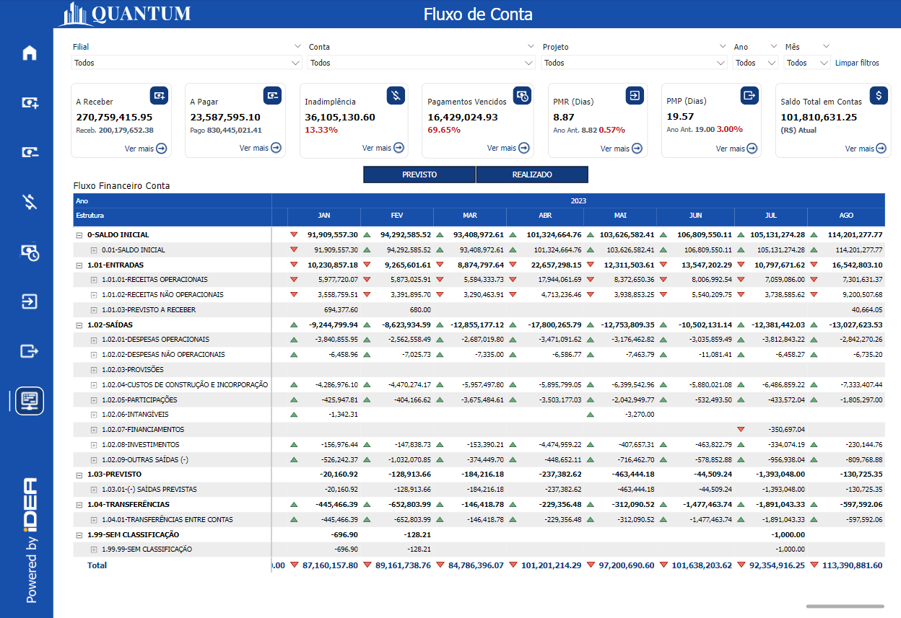
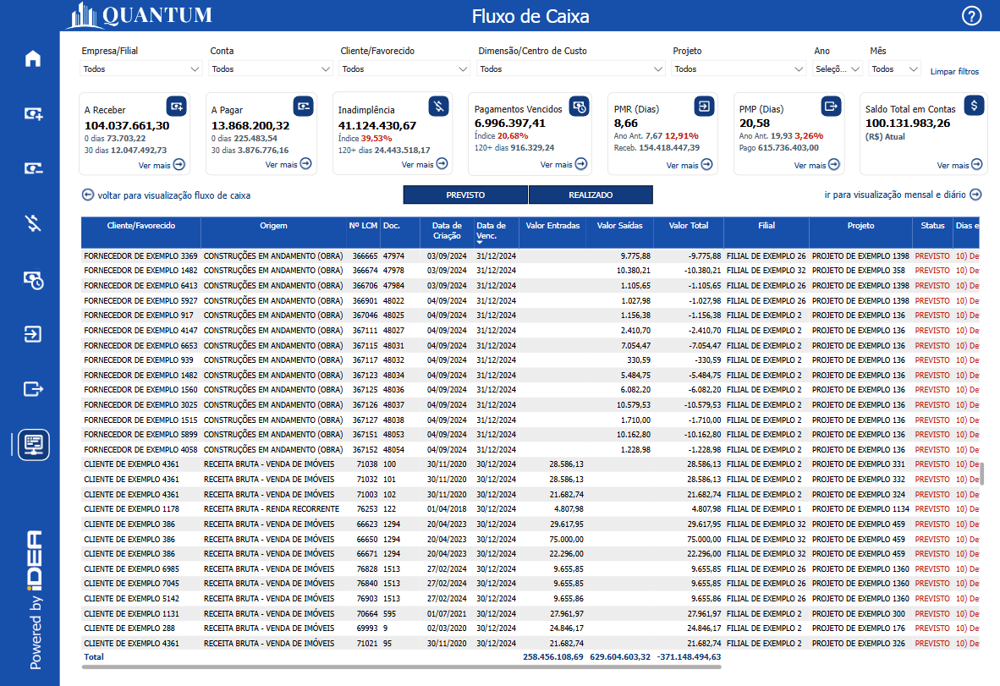
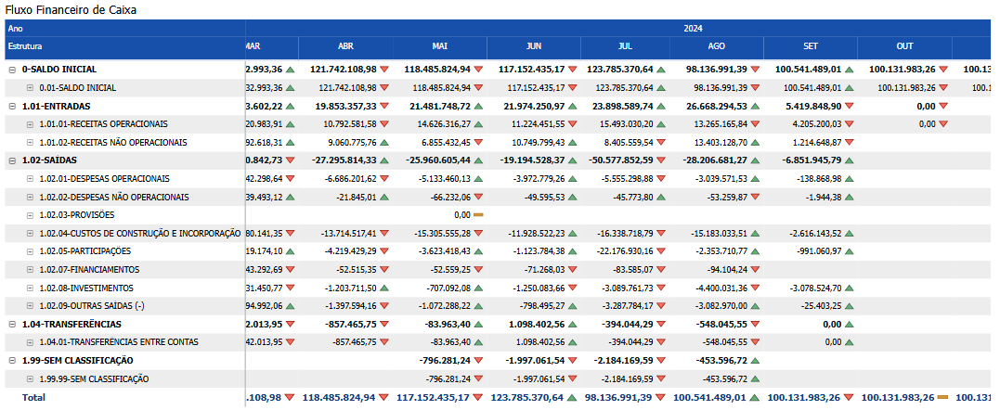

# Painel Fluxo de Caixa

  
  <h6>Imagem 1: Painel Fluxo de Caixa</h6>

  
  <h6>Imagem 2: Painel Fluxo de Caixa Tabela</h6>

Fluxo de Caixa refere-se ao movimento de entrada e saída de dinheiro em uma empresa ao longo de um período específico. É uma das métricas financeiras mais críticas, pois fornece uma visão clara sobre a liquidez da empresa e sua capacidade de cumprir obrigações financeiras imediatas, como pagamentos a fornecedores, salários, e outros custos operacionais.

O fluxo de caixa positivo indica que a empresa está gerando mais dinheiro do que está gastando, o que é essencial para a saúde financeira a longo prazo. Um fluxo de caixa negativo, por outro lado, pode indicar problemas financeiros, como vendas insuficientes, altos custos operacionais, ou dificuldades em receber pagamentos dos clientes. Se não for gerenciado adequadamente, o fluxo de caixa negativo pode levar à insolvência, forçando a empresa a buscar financiamento externo para cobrir as despesas, o que pode aumentar os custos de crédito e afetar negativamente a operação diária da empresa.

Uma gestão eficiente do fluxo de caixa traz inúmeros benefícios para as empresas, começando pela maior previsibilidade e controle sobre as finanças. Ao monitorar de perto o fluxo de caixa, a empresa pode planejar melhor suas operações, evitando surpresas desagradáveis e assegurando que sempre haja recursos disponíveis para cumprir obrigações financeiras. Além disso, um fluxo de caixa saudável permite à empresa aproveitar oportunidades de investimento, financiar o crescimento e negociar melhores condições com fornecedores e parceiros.

Outro benefício importante é a redução da necessidade de financiamento externo, o que diminui os custos de crédito e melhora a rentabilidade da empresa. Um fluxo de caixa positivo também fortalece a posição financeira da empresa, aumentando sua credibilidade no mercado e facilitando a obtenção de condições mais favoráveis em negociações e contratos.

A fórmula para calcular o Fluxo de Caixa é a soma de todos os valores que entram na empresa durante um período, como receita de vendas, contas a receber, etc., menos a soma de todos os valores que saem da empresa durante o período, como pagamentos a fornecedores, despesas operacionais, salários, etc.

## Visão Gráfica

### Fluxo Financeiro Conta

  
  <h6>Imagem 3: Fluxo Financeiro Conta</h6>

Na matriz Fluxo Financeiro Conta, há uma visão detalhada dos movimentos financeiros ao longo do tempo. As linhas na matriz têm uma hierarquia começando com os nomes das contas e duas subcategorias retiradas de um modelo que é projetado em seu banco de dados. Na imagem acima, você pode ver as principais categorias como Saldo Inicial, Entradas, Saídas, Previsto, Transferências e Sem Classificação.

Ao expandir ainda mais para baixo na hierarquia das linhas da matriz, você também poderá visualizar os valores para áreas como Projeto e Cliente. Nossa intenção é que o usuário possa expandir cada categoria para investigar mais profundamente, isso pode ser feito usando os ícones de cabeçalho ou usando os sinais "+" ao lado dos cabeçalhos de linha.

Os valores em cada linha são organizados em colunas por ano e mês. Ícones ao lado dos valores indicam se o desempenho é melhor (verde) ou pior (vermelho) em relação ao mês anterior. Isso facilita a visualização da progressão de cada categoria ao longo do tempo e ajuda a identificar rapidamente quaisquer problemas.

Existe um [filtro]() para transações previstas e realizadas nesta página que você não vê em outras páginas, quando este não tem seleção o visual mostrará o valor de todas as transações, se selecionado, o visual mostrará as transações relacionadas.

## Visão de Tabela

### Tabela de Detalhes

  
  <h6>Imagem 4: Tabela de Detalhes</h6>

Este gráfico exibe uma tabela detalhada de transações, organizada por data do documento, fornecendo uma visão completa das transações em ordem cronológica. A tabela inclui várias colunas que fornecem informações cruciais sobre cada transação, do cliente ao status atual e documentos relacionados. Esta visão tabular permite que a empresa analise cada valor de transação em detalhes, fornecendo todas as informações necessárias para rastrear e gerenciar efetivamente diferentes áreas de negócios. Abaixo, explicamos como interpretar cada coluna na tabela.

Esta tabela é essencial ao procurar detalhes sobre transações específicas. Ela pode ser filtrada usando [filtros](https://idea-technology-it.github.io/docs-idea/financeiro/intro/#filtros).

#### Cliente
Esta coluna identifica o cliente específico que tem um valor a pagar, permitindo que você veja claramente quem são os devedores.
#### Origem
A origem da fatura, como "Encargos Comuns" ou "Aluguel de Imóveis", é indicada nesta coluna. Isso ajuda a entender a natureza da dívida e a sua fonte dentro das operações da empresa.
#### Nº LCM
Esta coluna mostram o número do lançamento contábil relacionado à fatura. Elas são úteis para rastrear documentos específicos e reconciliar com registros contábeis.
#### Doc.
O número do documento associado à fatura encontra-se aqui. Este é o número mais comumente usado ao pesquisar a transação no banco de dados.
#### Data de Criação
Indica quando a fatura foi criada. Essa informação é importante para entender o histórico da transação e verificar quanto tempo se passou desde a emissão da fatura.
#### Data de Venc.
Esta coluna mostra a data de vencimento da fatura. Comparar esta data com a data atual ajuda a identificar faturas que estão próximas de vencer ou já estão atrasadas.
#### Valor
Exibe o valor devido em cada fatura. Esta coluna permite uma visão clara dos montantes que estão em aberto.
#### Filial
Indica a filial da empresa responsável pela fatura. Isso é útil para entender a distribuição geográfica dos recebíveis.
#### Projeto
Relaciona cada fatura a um projeto específico. Esta informação é essencial para empresas que gerenciam múltiplos projetos e precisam monitorar os fluxos de caixa associados a cada um deles.
#### Status
O status da fatura que é "Previsto" ou "Realizado" é mostrado aqui. Este status é para mostrar que o pagamento está pendente ou concluído.
#### Dias em Atraso
Para mostrar o tempo que a transação está atrasada.
#### Processo
Indica o processo associado ao recebimento, como "Recebimento" ou "Carteira de Recebíveis". Essa coluna auxilia na compreensão do fluxo de trabalho relacionado à fatura.
#### Pesquisa de Documentos
Esta coluna contém informações relacionadas à pesquisa de documentos que podem fornecer detalhes adicionais sobre a fatura ou transação. Isso é útil para obter informações mais detalhadas ou resolver dúvidas sobre um determinado recebível.
#### Dimensão
Esta coluna exibe o nome da dimensão que é relevante para a transação. Embora você possa filtrar por dimensão usando o filtro [Dimensão](https://idea-technology-it.github.io/docs-idea/financeiro/intro/#dimensao), isso facilita a análise ao fornecer uma referência direta aos nomes das dimensões, organizando os dados de uma forma intuitiva para identificar e entender as diferentes áreas de análise.
