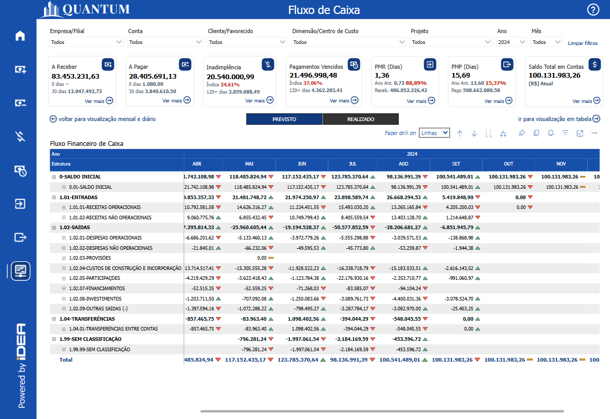
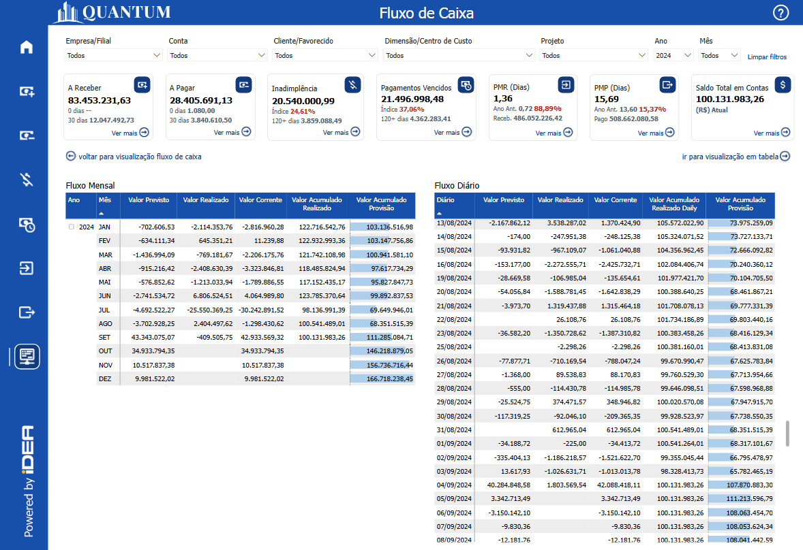
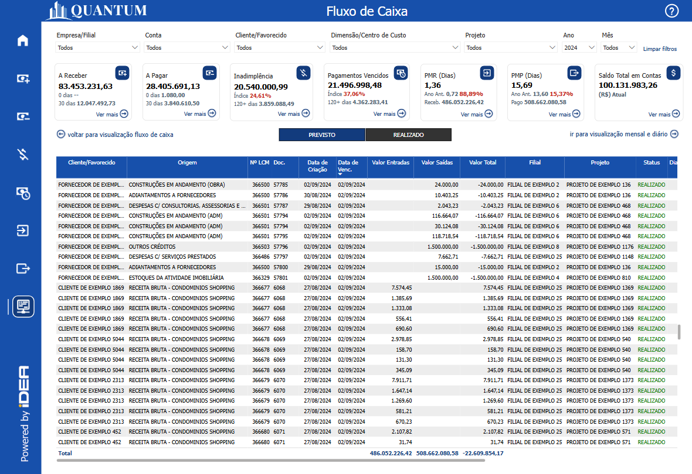
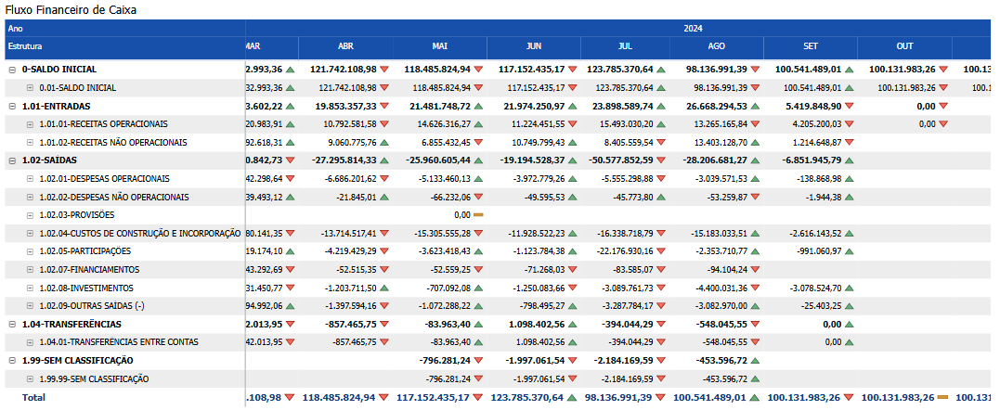
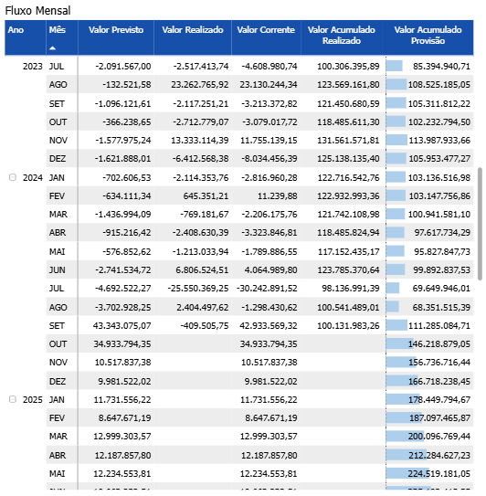
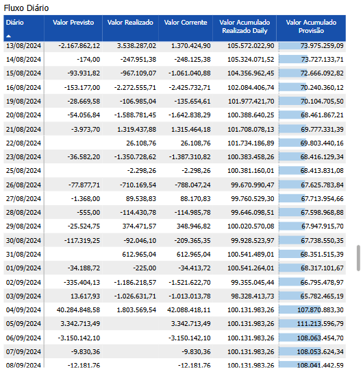
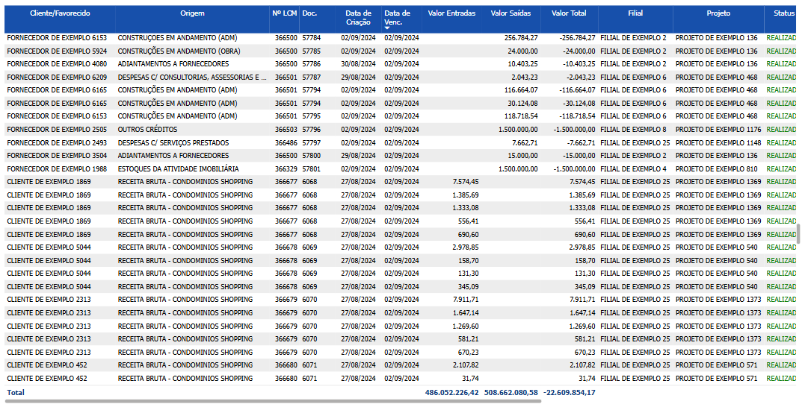

# Painel Fluxo de Caixa

  
  <h6>Imagem 1: Painel Fluxo de Caixa - Visão de Fluxo de Caixa</h6>

  
  <h6>Imagem 2: Painel Fluxo de Caixa - Visão de Mensal e Diário</h6>

  
  <h6>Imagem 3: Painel Fluxo de Caixa - Visão de tabela</h6>

## Navegação

Este painel de relatório está dividido em três visualizações;

- **[Visão de Fluxo de Caixa]()** - pode ser navegada através do [botão](https://idea-technology-it.github.io/docs-idea/financeiro/intro/#botoes-para-diferentes-visoes) "voltar para visualização fluxo de caixa".
- **[Visão de Mensal e Diário]()** - pode ser navegada através dos [botões](https://idea-technology-it.github.io/docs-idea/financeiro/intro/#botoes-para-diferentes-visoes) "voltar para visualização mensal e diário" e "ir para visualização mensal e diário".
- **[Visão de tabela]()** - pode ser navegada através do [botão](https://idea-technology-it.github.io/docs-idea/financeiro/intro/#botoes-para-diferentes-visoes) "ir para visualizar em tabela".

## Informações no Painel de Recebimentos Realizados

### Valor Total

O Valor Total do fluxo de caixa é uma métrica essencial que representa a diferença entre as entradas e saídas de dinheiro de uma empresa. Em termos simples, ele é calculado subtraindo o total das saídas (despesas e pagamentos) do total das entradas (receitas e recebimentos). Este valor total oferece uma visão clara do fluxo de caixa da empresa, refletindo sua capacidade de gerar e gerenciar dinheiro ao longo de um período específico. Um fluxo de caixa positivo indica que a empresa está recebendo mais dinheiro do que está gastando, enquanto um fluxo de caixa negativo sinaliza que as saídas superam as entradas, o que pode exigir ajustes financeiros ou estratégias de financiamento.

O Fluxo de Caixa refere-se ao movimento de entrada e saída de dinheiro em uma empresa ao longo de um período específico, sendo uma das métricas financeiras mais críticas para avaliar a liquidez e a saúde financeira de uma organização. Ele revela a capacidade da empresa de gerar dinheiro suficiente para cobrir suas despesas operacionais e compromissos financeiros, como pagamento de fornecedores, salários e outras obrigações.

O cálculo do Fluxo de Caixa é simples e envolve subtrair as saídas (despesas e pagamentos) das entradas (receitas e recebimentos). 
Esse cálculo é fundamental porque oferece uma visão clara da capacidade da empresa de sustentar suas operações e crescer. Quando o total das entradas (dinheiro recebido de clientes, vendas e outros recebimentos) excede o das saídas (pagamentos de despesas, custos operacionais e investimentos), a empresa gera um fluxo de caixa positivo, o que indica uma situação financeira saudável. Isso permite à organização ter recursos disponíveis para reinvestir no negócio, quitar dívidas, ou até mesmo realizar novos investimentos, como expansão ou aquisição de ativos.

Por outro lado, quando o valor das saídas excede o das entradas, o fluxo de caixa negativo surge, o que pode indicar que a empresa está gastando mais do que está gerando. Embora possa ocorrer temporariamente em certas fases de crescimento ou investimento, um fluxo de caixa consistentemente negativo é um sinal de alerta. Ele pode significar que a empresa está enfrentando dificuldades para receber pagamentos a tempo, tem custos operacionais elevados, ou não está gerando receitas suficientes. Nesses casos, a empresa pode precisar buscar financiamento externo ou ajustar suas operações para reduzir despesas e melhorar o ciclo de recebimentos.

Ao compreender a dinâmica entre entradas e saídas, a empresa ganha maior previsibilidade e controle sobre suas finanças. Isso facilita o planejamento de longo prazo e evita surpresas financeiras. Além disso, manter um fluxo de caixa positivo reduz a dependência de crédito, evitando custos elevados de financiamento e preservando a margem de lucro.

Portanto, a gestão eficiente do fluxo de caixa, focando no equilíbrio entre entradas e saídas, não só assegura que a empresa cumpra suas obrigações imediatas, mas também posiciona o negócio para um crescimento sustentável e uma maior solidez financeira no futuro.

### Valor Entradas

Valor Entradas refere-se ao total de dinheiro que entra na empresa durante um período específico. Isso inclui todas as receitas geradas a partir das operações normais da empresa, como vendas de produtos e serviços, bem como quaisquer outros recebimentos, como pagamentos de clientes, juros de investimentos ou receitas adicionais. Esse valor é crucial para avaliar a capacidade da empresa de gerar fundos necessários para cobrir despesas e investir no crescimento. Um aumento nas entradas pode indicar um bom desempenho comercial e uma sólida base de clientes, enquanto uma diminuição pode sinalizar desafios na geração de receita ou uma redução na atividade econômica.

### Valor Saídas

Valor Saídas representa o total de dinheiro que sai da empresa ao longo do mesmo período. Esse valor engloba todas as despesas e pagamentos, incluindo custos operacionais, salários, pagamentos a fornecedores, despesas de capital e outros custos necessários para manter as operações. Monitorar as saídas é essencial para entender como a empresa está gerenciando seus recursos financeiros e para identificar áreas onde os gastos podem ser reduzidos ou otimizados. Saídas excessivas em relação às entradas podem levar a um fluxo de caixa negativo, indicando a necessidade de ajustes financeiros ou estratégias de financiamento para garantir a sustentabilidade da empresa.

### Valor em Aberto

Valor em Aberto é ao montante de dinheiro que ainda não foi pago ou recebido, representando valores que estão pendentes de liquidação. Para valores de entrada, isso pode incluir faturas emitidas que ainda não foram pagas pelos clientes, enquanto, para valores de saída, pode envolver compromissos financeiros que ainda não foram quitados, como contas a pagar ou salários pendentes. Monitorar o valor em aberto é crucial para a gestão financeira, pois fornece uma visão clara das obrigações e recebíveis da empresa. Um valor em aberto significativo pode indicar problemas de fluxo de caixa, desafios na cobrança ou na gestão de dívidas, e pode exigir atenção para evitar impactos negativos na saúde financeira e na operação da empresa.

### Valor Realizado

Valor Realizado refere-se ao montante efetivamente recebido ou pago pela empresa durante um determinado período. No contexto de entradas, representa o valor total de dinheiro que foi realmente recebido, como pagamentos de clientes ou receitas de vendas, enquanto, para saídas, reflete os valores efetivamente desembolsados, como pagamentos a fornecedores ou despesas operacionais. A análise do valor realizado é crucial para entender a liquidez real da empresa e a eficácia de suas operações financeiras. Ele fornece uma visão precisa da situação financeira ao mostrar o impacto real das transações no fluxo de caixa, ajudando a identificar discrepâncias entre o que foi previsto e o que foi efetivamente realizado.

### Valor Corrente

Valor Corrente representa a diferença entre as entradas e saídas de caixa em um período específico, fornecendo uma visão clara do fluxo de caixa atual da empresa. Para calcular o Valor Corrente, subtrai-se o total das saídas (como pagamentos a fornecedores e despesas operacionais) do total das entradas (como recebimentos de vendas e outras receitas). Esse valor é crucial para avaliar a saúde financeira imediata da empresa, pois indica se há mais dinheiro entrando ou saindo, refletindo a capacidade da empresa de manter operações sem recorrer a financiamento externo. Um Valor Corrente positivo sugere que a empresa está gerando mais dinheiro do que está gastando, enquanto um Valor Corrente negativo pode sinalizar a necessidade de ajustar as operações ou buscar financiamento adicional para cobrir déficits.

### Valor Acumulado Realizado

Valor Acumulado Realizado representa o total de dinheiro efetivamente recebido pela empresa ao longo de um período específico. Esse valor é calculado somando todos os recebimentos realizados, como pagamentos de clientes e outras receitas, e subtraindo quaisquer devoluções ou ajustes. O Valor Acumulado Realizado fornece uma visão abrangente da quantia efetivamente recebida em comparação com o total previsto ou esperado, oferecendo uma perspectiva clara sobre a execução das receitas e a eficiência das operações de recebimento. Monitorar esse valor é essencial para avaliar a precisão das previsões financeiras, a efetividade das estratégias de cobrança e a saúde geral do fluxo de caixa da empresa. Um Valor Acumulado Realizado consistente com as expectativas indica uma boa gestão de recebíveis e contribui para uma base financeira sólida.

### Valor Acumulado Previsão

Valor Acumulado Previsão combina o Valor Acumulado Realizado com o Valor Acumulado Previstos, oferecendo uma visão integrada do desempenho financeiro da empresa em relação às expectativas. Esse valor é calculado somando o Valor Acumulado Realizado (o total de dinheiro efetivamente recebido) com o Valor Previsto (o montante que a empresa esperava receber, com base em suas projeções).

Esse cálculo fornece uma medida abrangente da diferença entre o que foi realmente recebido e o que foi projetado, ajudando a identificar variações e ajustar as previsões financeiras. A análise do Valor Acumulado Previsão é crucial para entender se a empresa está cumprindo suas metas financeiras e para ajustar as estratégias de receitas e cobranças conforme necessário. Uma consistência entre o Valor Acumulado Realizado e o Valor Previsto sugere uma gestão eficaz e previsões precisas, enquanto discrepâncias podem indicar a necessidade de revisão das estratégias ou ajustes nas previsões para melhor alinhar com a realidade financeira.

## Visão de Fluxo de Caixa

### Fluxo Financeiro de Caixa

  
  <h6>Imagem 4: Fluxo Financeiro de Caixa</h6>

Na matriz Fluxo Financeiro Conta, os usuários têm acesso a uma visão detalhada dos movimentos financeiros ao longo do tempo, o que é fundamental para uma gestão financeira eficaz. Esta matriz é estruturada com uma hierarquia de linhas, começando com os nomes das contas principais, e se desdobrando em duas subcategorias que são extraídas de um modelo projetado em seu banco de dados. As categorias principais visíveis na matriz incluem Saldo Inicial, Entradas, Saídas, Previsto, Transferências e Sem Classificação, oferecendo uma visão abrangente das diferentes facetas do fluxo financeiro.

Ao expandir as linhas da matriz, os usuários podem acessar informações mais detalhadas, como valores associados a Projetos e Clientes específicos. Esta funcionalidade de expansão é essencial para uma análise financeira aprofundada, permitindo que os usuários investiguem cada categoria e subcategoria com mais precisão. A capacidade de expandir e colapsar diferentes níveis de hierarquia usando ícones de cabeçalho ou sinais (+) ao lado dos cabeçalhos de linha facilita a navegação e a análise de grandes volumes de dados financeiros.

Os valores são organizados em colunas por ano e mês, proporcionando uma visão temporal clara das variações financeiras. Além disso, ícones coloridos ao lado dos valores indicam o desempenho em comparação com o mês anterior: verde para desempenho melhor e vermelho para desempenho pior. Esse recurso visual é crucial para a análise dinâmica, pois permite que os usuários identifiquem rapidamente tendências e problemas financeiros.

Para os negócios, essa matriz é uma ferramenta vital, pois oferece uma visão detalhada e temporal do fluxo financeiro, essencial para a tomada de decisões estratégicas e operacionais. Com ela, as empresas podem monitorar de perto o desempenho financeiro de diferentes contas e categorias, identificar áreas de melhoria e ajustar suas estratégias conforme necessário. A capacidade de analisar dados financeiros com um nível de detalhe tão fino permite uma gestão mais eficiente dos recursos, ajudando a garantir a saúde financeira da empresa e a maximizar a rentabilidade. Além disso, a visualização clara das tendências e variações financeiras ao longo do tempo ajuda a antecipar problemas e implementar ações corretivas de maneira oportuna, o que é crucial para manter a estabilidade e o crescimento sustentável do negócio.

Existe um filtro para transações previstas e realizadas nesta página que você não vê em outras páginas, quando este não tem seleção o visual mostrará o valor de todas as transações, se selecionado, o visual mostrará as transações relacionadas.

## Visão de Mensal e Diário

### Fluxo Mensal

  
  <h6>Imagem 5: Fluxo Mensal</h6>

A matriz com a hierarquia de ano e mês nas linhas e colunas como "Valor em Aberto," "Valor Realizado," "Valor Corrente," "Valor Acumulado Realizado," e "Valor Acumulado Previsão" proporciona uma visão detalhada e integrada do fluxo financeiro ao longo do tempo, essencial para uma gestão financeira eficaz.

Valor em Aberto exibe os montantes que ainda estão pendentes de pagamento ou recebimento. Esta métrica é fundamental para a gestão de contas a pagar e a receber, permitindo que a empresa identifique rapidamente quais valores ainda estão por liquidar. A partir dessa informação, a empresa pode priorizar cobranças e pagamentos, planejar melhor o fluxo de caixa e evitar surpresas financeiras indesejadas.

Valor Realizado representa o total de dinheiro efetivamente recebido ou pago durante o período analisado. Esta coluna é crucial para avaliar o desempenho real das operações financeiras, comparando o que foi efetivamente realizado com as previsões e obrigações. A análise do Valor Realizado ajuda a entender se a empresa está cumprindo suas metas financeiras e a identificar variações entre o desempenho real e o previsto.

Valor Corrente fornece o saldo líquido das entradas e saídas de dinheiro no período atual, refletindo o impacto imediato das transações financeiras no fluxo de caixa. Essa métrica é importante para acompanhar a liquidez disponível e garantir que a empresa tenha recursos suficientes para cobrir suas despesas operacionais diárias. Monitorar o Valor Corrente ajuda a manter o equilíbrio financeiro e evita a falta de liquidez que poderia comprometer a operação da empresa.

Valor Acumulado Realizado mostra o total acumulado de valores realizados ao longo de um período mais longo, permitindo uma visão global da execução financeira. Essa métrica ajuda a avaliar a consistência das receitas e despesas, e a identificar padrões ou tendências ao longo do tempo. Com o Valor Acumulado Realizado, a empresa pode analisar a eficácia das estratégias financeiras e tomar decisões informadas sobre investimentos e financiamentos.

Valor Acumulado Previsão apresenta uma estimativa acumulada das previsões de fluxo de caixa, oferecendo uma visão sobre como as expectativas futuras se comparam com os valores realizados. Essa coluna é essencial para o planejamento financeiro, pois permite que a empresa antecipe futuras necessidades de caixa e ajuste suas estratégias conforme necessário. Comparar o Valor Acumulado Previsão com o Valor Acumulado Realizado ajuda a avaliar a precisão das previsões e a tomar medidas corretivas para melhorar o planejamento financeiro.

Essa estrutura de matriz permite que a empresa monitore e analise o fluxo de caixa de maneira detalhada e cronológica, facilitando a identificação de variações, a avaliação da precisão das previsões financeiras e o ajuste de estratégias para otimizar o fluxo de caixa. A capacidade de visualizar essas informações de forma integrada e em diferentes períodos é crucial para a gestão eficiente das finanças da empresa, ajudando a manter a liquidez necessária, planejar investimentos, gerenciar riscos financeiros e garantir uma operação sustentável e saudável a longo prazo.

Quando exibido lado a lado com a matriz Fluxo Diário, a matriz oferece uma análise complementar e aprofundada do fluxo financeiro. Enquanto a matriz Fluxo Diário fornece uma visão detalhada das transações e movimentos financeiros em uma base diária, permitindo um acompanhamento minucioso das entradas e saídas diárias, a matriz anual e mensal oferece uma perspectiva mais ampla e acumulativa ao longo do tempo. Usadas em conjunto, essas duas matrizes permitem que a empresa tenha uma visão completa e integrada do fluxo de caixa. A análise diária pode revelar tendências e problemas de curto prazo, enquanto a visão mensal e anual ajuda a contextualizar esses dados dentro de um quadro temporal mais amplo. Essa combinação facilita uma compreensão mais precisa da liquidez e da saúde financeira da empresa, permitindo uma gestão mais eficaz e uma tomada de decisão mais informada. A capacidade de alternar entre uma visão detalhada e uma perspectiva acumulativa permite uma gestão financeira mais ágil e estratégica, essencial para manter a operação da empresa fluida e sustentável.

### Fluxo Diário

  
  <h6>Imagem 6: Fluxo Diário</h6>

A matriz com a data como linha e colunas como "Valor em Aberto," "Valor Realizado," "Valor Corrente," "Valor Acumulado Realizado," e "Valor Acumulado Previsão" proporciona uma visão detalhada e integrada do fluxo financeiro ao longo do tempo, essencial para uma gestão financeira eficaz.

Valor em Aberto mostra os montantes pendentes de pagamento ou recebimento em cada data específica. Esta métrica é crucial para a gestão de contas a pagar e a receber, permitindo que a empresa identifique rapidamente quais valores ainda estão por liquidar. Com essa informação, a empresa pode priorizar cobranças e pagamentos diários, ajustar o planejamento do fluxo de caixa e evitar surpresas financeiras inesperadas.

Valor Realizado representa o total de dinheiro efetivamente recebido ou pago em cada data. Essa coluna é fundamental para avaliar o desempenho real das operações financeiras diárias, comparando o valor efetivamente realizado com as previsões e obrigações. Analisar o Valor Realizado ajuda a entender se a empresa está atingindo suas metas financeiras diárias e a identificar qualquer variação entre o desempenho real e o esperado.

Valor Corrente fornece o saldo líquido das entradas e saídas de dinheiro para cada data, refletindo o impacto imediato das transações financeiras no fluxo de caixa. Esta métrica é importante para monitorar a liquidez disponível e garantir que a empresa tenha recursos suficientes para cobrir suas despesas operacionais diárias. Acompanhar o Valor Corrente ajuda a manter o equilíbrio financeiro e a evitar a falta de liquidez que poderia comprometer as operações da empresa.

Valor Acumulado Realizado mostra o total acumulado de valores realizados ao longo de um período, fornecendo uma visão consolidada da execução financeira diária. Essa métrica ajuda a avaliar a consistência das receitas e despesas ao longo do tempo e a identificar padrões ou tendências emergentes. Com o Valor Acumulado Realizado, a empresa pode analisar a eficácia das estratégias financeiras e tomar decisões informadas sobre investimentos e financiamentos.

Valor Acumulado Previsão apresenta uma estimativa acumulada das previsões de fluxo de caixa, oferecendo uma visão de como as expectativas futuras se comparam com os valores realmente realizados. Essa coluna é essencial para o planejamento financeiro, pois permite que a empresa antecipe futuras necessidades de caixa e ajuste suas estratégias conforme necessário. Comparar o Valor Acumulado Previsão com o Valor Acumulado Realizado ajuda a avaliar a precisão das previsões e a tomar medidas corretivas para aprimorar o planejamento financeiro.

Essa estrutura de matriz permite à empresa monitorar e analisar o fluxo de caixa de maneira detalhada e diária, facilitando a identificação de variações, a avaliação da precisão das previsões financeiras e o ajuste das estratégias para otimizar o fluxo de caixa. A capacidade de visualizar essas informações de forma integrada e ao longo do tempo é crucial para a gestão eficiente das finanças da empresa, ajudando a manter a liquidez necessária, planejar investimentos, gerenciar riscos financeiros e garantir uma operação sustentável e saudável a longo prazo.

Quando exibida lado a lado com a matriz Mensal, a matriz Fluxo Diário oferece uma análise complementar e detalhada do fluxo financeiro. Enquanto a matriz Mensal fornece uma visão acumulativa das transações e movimentos financeiros ao longo do mês, permitindo uma avaliação ampla das tendências e do impacto financeiro em uma escala mais ampla, a matriz Diária detalha as transações diárias e os movimentos financeiros em um nível granular. Usadas em conjunto, essas duas matrizes oferecem uma visão completa e integrada do fluxo de caixa. A análise diária pode revelar variações e problemas de curto prazo, enquanto a visão mensal ajuda a contextualizar essas flutuações dentro de um quadro temporal mais extenso. Essa combinação facilita uma compreensão mais profunda da liquidez e da saúde financeira da empresa, permitindo uma gestão mais eficaz e uma tomada de decisão mais informada. Alternar entre uma perspectiva detalhada diária e uma visão acumulativa mensal promove uma gestão financeira mais estratégica e adaptável, essencial para manter a operação da empresa fluida e sustentável.

## Visão de Tabela

### Tabela de Detalhes

  
  <h6>Imagem 7: Tabela de Detalhes</h6>

Este gráfico exibe uma tabela detalhada de transações, organizada por data do documento, fornecendo uma visão completa das transações em ordem cronológica. A tabela inclui várias colunas que fornecem informações cruciais sobre cada transação, do cliente ao status atual e documentos relacionados. Esta visão tabular permite que a empresa analise cada valor de transação em detalhes, fornecendo todas as informações necessárias para rastrear e gerenciar efetivamente diferentes áreas de negócios. Abaixo, explicamos como interpretar cada coluna na tabela.

Esta tabela é essencial ao procurar detalhes sobre transações específicas. Ela pode ser filtrada usando [filtros](https://idea-technology-it.github.io/docs-idea/financeiro/intro/#filtros).

#### Cliente/Favorecido
Esta coluna identifica o cliente específico que tem um valor a pagar, permitindo que você veja claramente quem são os devedores.
#### Origem
A origem da fatura, como "Encargos Comuns" ou "Aluguel de Imóveis", é indicada nesta coluna. Isso ajuda a entender a natureza da dívida e a sua fonte dentro das operações da empresa.
#### Nº LCM
Esta coluna mostram o número do lançamento contábil relacionado à fatura. Elas são úteis para rastrear documentos específicos e reconciliar com registros contábeis.
#### Doc.
O número do documento associado à fatura encontra-se aqui. Este é o número mais comumente usado ao pesquisar a transação no banco de dados.
#### Data de Criação
Indica quando a fatura foi criada. Essa informação é importante para entender o histórico da transação e verificar quanto tempo se passou desde a emissão da fatura.
#### Data de Venc.
Esta coluna mostra a data de vencimento da fatura. Comparar esta data com a data atual ajuda a identificar faturas que estão próximas de vencer ou já estão atrasadas.
#### Valor Entradas
Exibe o valor de entradas em cada transação. Esta coluna permite uma visão clara dos montantes recebidos.
#### Valor Saídas
Exibe o valor de saídas em cada transação. Esta coluna permite uma visão clara dos montantes pagos.
#### Valor Total
Apresenta o valor das entradas menos saídas. Esta coluna fornece uma visão clara do valor total ao analisar entradas e saídas.
#### Filial
Indica a filial da empresa responsável pela fatura. Isso é útil para entender a distribuição geográfica dos recebíveis.
#### Projeto
Relaciona cada fatura a um projeto específico. Esta informação é essencial para empresas que gerenciam múltiplos projetos e precisam monitorar os fluxos de caixa associados a cada um deles.
#### Status
O status da fatura que é "Previsto" ou "Realizado" é mostrado aqui. Este status é para mostrar que o pagamento está pendente ou concluído.
#### Dias em Atraso
Para mostrar o tempo que a transação está atrasada.
#### Processo
Indica o processo associado ao recebimento, como "Recebimento" ou "Carteira de Recebíveis". Essa coluna auxilia na compreensão do fluxo de trabalho relacionado à fatura.
#### Pesquisa de Documentos
Esta coluna contém informações relacionadas à pesquisa de documentos que podem fornecer detalhes adicionais sobre a fatura ou transação. Isso é útil para obter informações mais detalhadas ou resolver dúvidas sobre um determinado recebível.
#### Dimensão
Esta coluna exibe o nome da dimensão que é relevante para a transação. Embora você possa filtrar por dimensão usando o filtro [Dimensão](https://idea-technology-it.github.io/docs-idea/financeiro/intro/#dimensao), isso facilita a análise ao fornecer uma referência direta aos nomes das dimensões, organizando os dados de uma forma intuitiva para identificar e entender as diferentes áreas de análise.

  
***Aviso Legal:** Os números e informações apresentados nesta documentação são baseados em um conjunto de dados fictício. Eles são destinados exclusivamente para fins educacionais e de demonstração. Os dados não refletem condições do mundo real ou métricas de negócios reais e não devem ser usados ​​para tomada de decisão ou análise. Qualquer semelhança com entidades, eventos ou dados reais é mera coincidência.*
