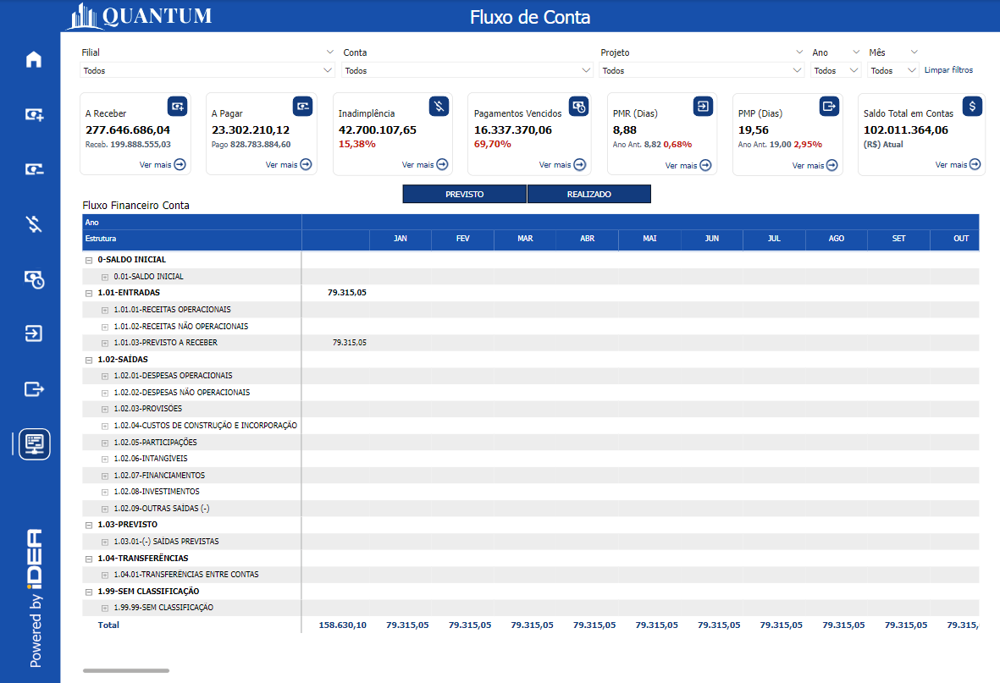
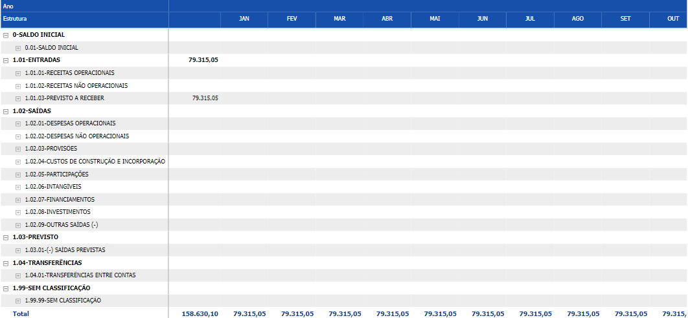

# Painel Fluxo de Caixa

<h6 align = "center"> Imagem 1: Painel Fluxo de Caixa</h6>

Fluxo de Caixa refere-se ao movimento de entrada e saída de dinheiro em uma empresa ao longo de um período específico. É uma das métricas financeiras mais críticas, pois fornece uma visão clara sobre a liquidez da empresa e sua capacidade de cumprir obrigações financeiras imediatas, como pagamentos a fornecedores, salários, e outros custos operacionais.

O fluxo de caixa positivo indica que a empresa está gerando mais dinheiro do que está gastando, o que é essencial para a saúde financeira a longo prazo. Um fluxo de caixa negativo, por outro lado, pode indicar problemas financeiros, como vendas insuficientes, altos custos operacionais, ou dificuldades em receber pagamentos dos clientes. Se não for gerenciado adequadamente, o fluxo de caixa negativo pode levar à insolvência, forçando a empresa a buscar financiamento externo para cobrir as despesas, o que pode aumentar os custos de crédito e afetar negativamente a operação diária da empresa.

Uma gestão eficiente do fluxo de caixa traz inúmeros benefícios para as empresas, começando pela maior previsibilidade e controle sobre as finanças. Ao monitorar de perto o fluxo de caixa, a empresa pode planejar melhor suas operações, evitando surpresas desagradáveis e assegurando que sempre haja recursos disponíveis para cumprir obrigações financeiras. Além disso, um fluxo de caixa saudável permite à empresa aproveitar oportunidades de investimento, financiar o crescimento e negociar melhores condições com fornecedores e parceiros.

Outro benefício importante é a redução da necessidade de financiamento externo, o que diminui os custos de crédito e melhora a rentabilidade da empresa. Um fluxo de caixa positivo também fortalece a posição financeira da empresa, aumentando sua credibilidade no mercado e facilitando a obtenção de condições mais favoráveis em negociações e contratos.

## **Fórmula para calcular o Fluxo de Caixa:**
**_Fluxo de Caixa = Entradas de Caixa - Saídas de Caixa_**

**Onde:**
- **Entradas de Caixa:** Soma de todos os valores que entram na empresa durante um período, como receitas de vendas, recebimentos de contas a receber, etc.
- **Saídas de Caixa:** Soma de todos os valores que saem da empresa durante o período, como pagamentos a fornecedores, despesas operacionais, salários, etc.

**Exemplo:**
Se uma empresa recebeu R$ 500.000,00 em um mês e pagou R$ 300.000,00 em suas despesas, o fluxo de caixa seria calculado assim:
**_Fluxo de Caixa = 500.000 - 300.000 = R$ 200.000,00_**

Isso significa que, ao final do mês, a empresa teria um fluxo de caixa positivo de R$ 200.000,00.

## Tabela Fluxo de Caixa

<h6 align = "center"> Imagem 2: Tabela Fluxo de Caixa</h6>

O gráfico apresenta uma visão detalhada do fluxo financeiro por categoria de conta:

 ### Saldo Inicial:
- Mostra o saldo inicial no início do período considerado.

### Entradas:
- Detalha as receitas operacionais e não operacionais, e o previsto a receber, com valores específicos. Neste exemplo, parece que há um valor específico de R$ 79.315,05 listado para "PREVISTO A RECEBER".

### Saídas:
- Categoriza todas as saídas de caixa, incluindo despesas operacionais, não operacionais, provisões, custos de construção, participações, entre outras. Essas categorias são detalhadas, mas neste exemplo específico, os valores para cada categoria não estão preenchidos (exceto "ENTRADAS"). 

### Colunas Mensais:
- A tabela é distribuída ao longo de colunas que representam meses do ano. Aqui, vemos que o valor "PREVISTO A RECEBER" de R$ 79.315,05 é o mesmo ao longo de todos os meses listados (de janeiro a outubro).

### Totais
- Esta linha demonstra o valor total do fluxo em determinado mês.

<h6 align = "center"> Imagem 3: Filtra Fluxo Previsto e Realizado</h6>

### Previsto:
Mostra o saldo previsto que a empresa espera realizar.

### Realizado:
Mostra o saldo realizado que a empresa já concluiu.
