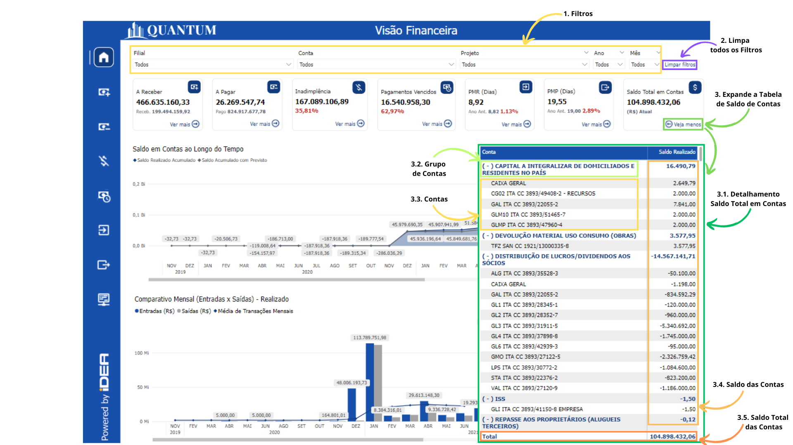

# Fluxo de Caixa

## O que é Fluxo de Caixa?

O fluxo de caixa refere-se ao movimento de entradas e saídas de dinheiro dentro de uma empresa, especificamente relacionado às operações de receita (entradas) e despesas (saídas). Este fluxo é um indicador essencial da saúde financeira de uma empresa, pois influencia diretamente a capacidade da empresa de cumprir suas obrigações financeiras, pagar fornecedores, e manter operações sustentáveis.

## Impactos da Ausência de um Fluxo de Caixa

Um fluxo de caixa bem gerido é crucial para assegurar que a empresa tenha os recursos necessários para honrar seus compromissos no prazo correto. Falhas no gerenciamento do fluxo de caixa podem levar a problemas de liquidez, forçando a empresa a buscar financiamento externo em condições desfavoráveis, o que pode aumentar os custos operacionais e comprometer a estabilidade financeira.

## Objetivo do Relatório de Fluxo de Caixa
Para proporcionar uma visão clara e detalhada do fluxo de caixa, a IDEA TECHNOLOGY desenvolveu um relatório utilizando o Power BI. Este relatório foi projetado para monitorar o movimento de entradas e saídas de caixa, permitindo que os gestores identifiquem rapidamente gargalos e oportunidades para otimizar a gestão financeira.

### Benefícios 

- **Tomada de Decisões Informadas:** Auxilia na identificação de períodos críticos onde o fluxo de caixa pode estar em risco, permitindo ações proativas.
- **Monitoramento Contínuo:** Oferece uma visão contínua e atualizada da situação financeira, permitindo ajustes em tempo real.
- **Personalização de Análises:** Permite personalizar os filtros e visualizações para focar em filiais, projetos, contas ou períodos específicos, adaptando-se às necessidades da gestão.

<h6 align = "center"> Imagem 1: Descrição visual de cada indicador.</h6>

## Principais Perguntas que o Relatório Responde
- **Como posso filtrar as informações para visualizar os fluxos de contas de um ano/mês, filial, conta ou projeto específico?**
    - **Seção 1:** Filtros.
        - **Resposta:** O relatório permite aplicar filtros por ano, mês, conta, filial ou projeto, facilitando a análise de períodos específicos ou segmentos específicos dentro do fluxo de caixa.
- **Como limpar todos os filtros aplicados para retornar à visão geral dos dados?**
    - **Seção 2:** Limpar Filtros.
        - **Resposta:** Um botão de "Limpar filtros" permite remover todos os filtros aplicados, voltando à visualização completa dos dados financeiros.
- **Qual é a diferença entre os fluxos previstos e os realizados?**
    - **Seção 3:** Filtro para Identificar Fluxos Previsto e Realizado.
        - **Resposta:** O relatório oferece a possibilidade de alternar entre visualizações de fluxos de caixa previstos e realizados, ajudando a comparar o que foi planejado com o que realmente aconteceu.
- **Como está o saldo das contas mês a mês ao longo dos anos?**
    - **Seção 4.1:** Mês/Ano do Fluxo.
        - **Resposta:** A tabela exibe os saldos mês a mês e ano a ano, permitindo uma análise detalhada de como as contas foram movimentadas ao longo do tempo.
- **Quais contas específicas estão contribuindo para o fluxo de caixa atual?**
    - **Seção 4.2:** Contas.
        - **Resposta:** O relatório lista as contas específicas, tanto de receitas quanto de despesas, mostrando como cada uma contribui para o saldo total do caixa.
- **Qual é o saldo total do Fluxo de Caixa?**
    - **Seção 4.3:** Saldo Total do Fluxo.
        - **Resposta:** O relatório fornece o saldo acumulado, que é a diferença entre as entradas e saídas, indicando o montante total disponível ou em débito no caixa.
- **Qual é o tipo de fluxo financeiro (Entradas ou Saídas) mais relevante no período analisado?**
    - **Seção 4.4:** Tipo de Fluxo.
        - **Resposta:** O relatório categoriza os fluxos como Saldo Inicial, Entradas, Saídas, Previstos, Transferências e Sem Classificação, permitindo identificar qual tipo de fluxo está predominando no período analisado.
- **Qual é o impacto das entradas e saídas sobre o saldo inicial ao longo do tempo?**
    - **Seção 4.1 e 4.4:** Tipo de Fluxo e Mês/Ano.
        - **Resposta:** Analisando o saldo inicial em comparação com as entradas e saídas subsequentes, o relatório ajuda a entender como as transações impactaram o saldo de caixa ao longo do tempo.

## Importância do Monitoramento Regular do Fluxo de Caixa

### Monitoramento Contínuo

Monitorar regularmente o fluxo de caixa utilizando relatórios como este no Power BI é crucial para preservar a saúde financeira da empresa e mitigar riscos potenciais. O uso eficiente desses relatórios permite identificar e solucionar problemas de liquidez antes que se agravem, garantindo assim a estabilidade financeira contínua da empresa.
