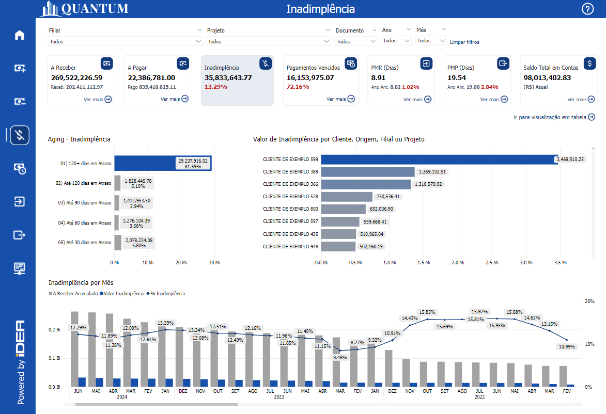
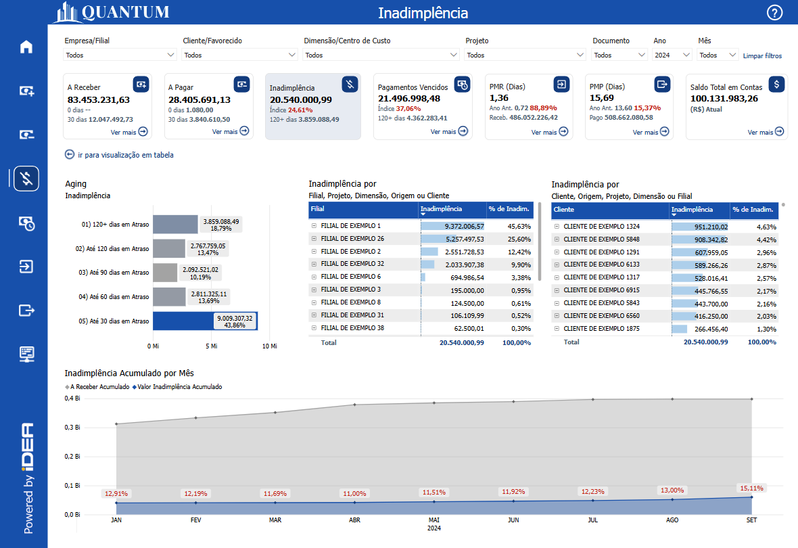
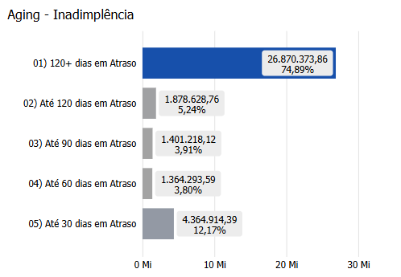
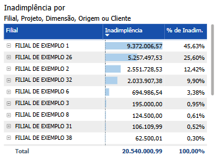
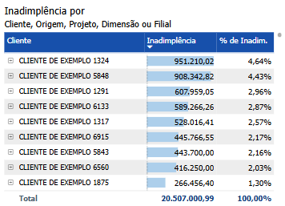
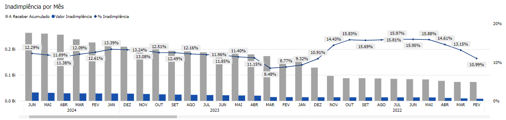
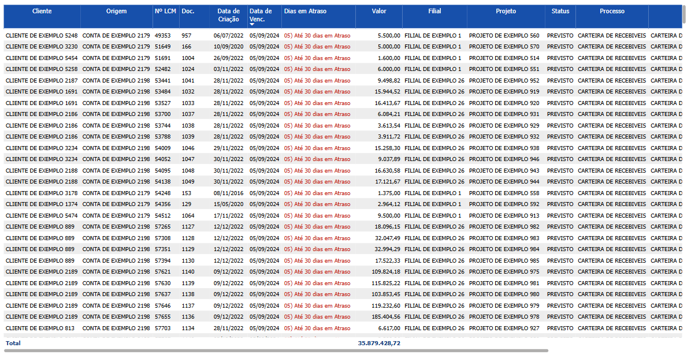

# Painel Inadimplência

  
  <h6>Imagem 1: Painel Inadimplência - Visão Gráfico</h6>

  
  <h6>Imagem 2: Painel Inadimplência - Visão de Tabela</h6>

## Navegação

Este painel de relatório está dividido em duas visualizações;

- **[Visão Gráfica](https://idea-technology-it.github.io/docs-idea/financeiro/inadimplencia/#visao-grafica)** - pode ser navegada através do [botão](https://idea-technology-it.github.io/docs-idea/financeiro/intro/#botoes-para-diferentes-visoes) "ir para visualização em gráfico".
- **[Visão de tabela](https://idea-technology-it.github.io/docs-idea/financeiro/inadimplencia/#visao-de-tabela)** - pode ser navegada através do [botão](https://idea-technology-it.github.io/docs-idea/financeiro/intro/#botoes-para-diferentes-visoes) "ir para visualização em tabela".

## Informações no Painel Inadimplência

### Valor Inadimplência

A inadimplência ocorre quando uma obrigação financeira não é cumprida dentro do prazo estabelecido para o pagamento. Isso significa que a empresa ou o indivíduo não realizou o pagamento conforme acordado com fornecedores, credores ou outras partes envolvidas.

Esse problema representa um risco significativo para a saúde financeira e operacional de uma empresa. O não pagamento dentro do prazo pode desencadear uma série de consequências negativas, afetando tanto as finanças imediatas quanto as relações comerciais e a reputação no mercado. Entre os impactos, estão o acréscimo de multas e juros, a deterioração da classificação de crédito e o comprometimento de relacionamentos comerciais essenciais. Além disso, a inadimplência pode gerar sérios problemas de fluxo de caixa, dificultando o cumprimento de outras obrigações financeiras.

Diante desses riscos, é essencial que as empresas adotem práticas eficazes de monitoramento e gestão da inadimplência. Isso ajuda a evitar impactos financeiros negativos, proteger as operações e garantir a continuidade dos negócios. Uma gestão proativa da inadimplência é fundamental para minimizar seus efeitos adversos e manter a saúde financeira da empresa.

**Multas e Juros:** Quando os pagamentos não são realizados dentro do prazo, isso geralmente resulta em multas, juros e outras penalidades, conforme estabelecido nos termos contratuais. Esses custos adicionais podem se acumular rapidamente, transformando uma dívida inicialmente gerenciável em um fardo financeiro significativo. Quanto mais tempo o atraso persiste, maiores podem ser as penalidades, exercendo pressão sobre os recursos da empresa e, em alguns casos, levando a disputas legais que podem agravar ainda mais a situação financeira.

**Impacto no Crédito:** Pagamentos pontuais são essenciais para manter uma boa classificação de crédito. A inadimplência pode impactar severamente a credibilidade, tanto de empresas quanto de indivíduos. Uma classificação de crédito prejudicada pode dificultar a obtenção de empréstimos ou a negociação de termos favoráveis em transações futuras. Isso não só dificulta a obtenção de crédito, mas também afeta a reputação geral e a confiança perante instituições financeiras e parceiros de negócios.

**Relacionamento com Fornecedores:** Dívidas inadimplentes podem prejudicar o relacionamento com os fornecedores, que podem responder impondo restrições de crédito ou até mesmo interrompendo o fornecimento de bens ou serviços. Isso pode interromper cadeias de suprimento, levando a atrasos operacionais e custos adicionais enquanto as empresas procuram fornecedores alternativos. Manter bons relacionamentos com os fornecedores é crucial para a continuidade dos negócios, e a inadimplência pode rapidamente minar essas relações.

**Impacto no Fluxo de Caixa:** O acúmulo de inadimplência pode criar problemas significativos de fluxo de caixa, colocando em risco a capacidade da empresa de cumprir suas outras obrigações financeiras. Sem um fluxo constante e previsível de recursos, as empresas podem ter dificuldade em pagar salários, reinvestir em suas operações ou cobrir despesas essenciais. Com o tempo, essa pressão no fluxo de caixa pode levar a dificuldades financeiras mais severas, potencialmente ameaçando a sobrevivência da empresa.

**Monitoramento e Gestão:** É vital que as empresas monitorem e gerenciem de perto a inadimplência para evitar consequências financeiras e operacionais graves. O monitoramento proativo permite uma intervenção precoce, como a negociação de planos de pagamento ou a tomada de medidas legais, se necessário. A gestão eficaz da inadimplência garante que a empresa mantenha sua saúde financeira, sustente suas operações e preserve seus relacionamentos com credores, fornecedores e outras partes interessadas. Revisões regulares e planejamento estratégico podem ajudar a mitigar os riscos associados à inadimplência e proteger a viabilidade a longo prazo da empresa.

Em resumo, a inadimplência indica que a empresa não está cumprindo suas obrigações financeiras de forma adequada, o que pode ter várias consequências negativas. Muitas vezes, isso ocorre porque o gestor não possui uma ferramenta eficaz para monitorar esses pagamentos. O BI Financeiro auxilia o gestor na identificação de inadimplências e na tomada de decisões apropriadas.

### % de Inadimplência

A porcentagem (%) de Inadimplência é uma métrica crucial para a gestão financeira, pois oferece uma visão clara da representatividade de cada categoria (como Filial, Cliente, Projeto, Dimensão ou Origem) em relação ao total de valores inadimplentes. Essa métrica permite que as empresas identifiquem quais áreas ou clientes estão contribuindo mais para os problemas de inadimplência, facilitando a definição de prioridades para cobranças e ajustes no fluxo de caixa. Além de exibir os valores absolutos, a porcentagem de inadimplência destaca a importância relativa de cada componente, ajudando a tomar decisões estratégicas sobre renegociação de dívidas, ajustes nas políticas de crédito e otimização dos processos de cobrança. A análise percentual também é valiosa para monitorar o comportamento das inadimplências ao longo do tempo, permitindo identificar tendências, como o aumento ou a redução da participação de determinados clientes ou projetos nos valores inadimplentes, o que ajuda a empresa a se planejar de maneira mais eficaz e manter um controle financeiro mais rigoroso.

### Índice de Inadimplência (%)

O Índice de Inadimplência (%) é uma métrica crucial para a gestão financeira e a saúde econômica de uma empresa. Este índice reflete a porcentagem de contas a receber que estão em atraso em relação ao total de contas emitidas, oferecendo uma visão clara da eficácia na gestão de crédito e cobrança. Um índice de inadimplência elevado pode indicar problemas na qualidade dos créditos concedidos ou na eficiência dos processos de cobrança, potencialmente afetando o fluxo de caixa e a estabilidade financeira da empresa. Monitorar e analisar esse índice permite identificar padrões de inadimplência, ajustar políticas de crédito e melhorar estratégias de cobrança. Além disso, um controle eficaz da inadimplência contribui para uma melhor previsão de fluxo de caixa e ajuda na tomada de decisões estratégicas, como a revisão de termos de crédito e a alocação de recursos para a recuperação de dívidas. Em resumo, o Índice de Inadimplência (%) é essencial para manter a saúde financeira da empresa, minimizar riscos e garantir a sustentabilidade financeira a longo prazo.

No contexto deste relatório, o valor de referência para o Índice de Inadimplência é inferior a 5%, uma vez que este é frequentemente considerado favorável. Você verá a cor do texto deste [Indicador]() ficar vermelho quando estiver acima de 5% e verde quando estiver abaixo. Esta baixa percentagem indica que uma pequena proporção das contas a receber está vencida, sugerindo uma gestão de crédito eficaz e uma base de clientes fiável. Manter um índice baixo é benéfico porque reflete um fluxo de caixa saudável, risco reduzido de dívidas inadimplentes e práticas de cobrança eficientes.

Ao utilizar filtros ou clicar em pontos de dados nas visualizações neste painel, o Índice de Inadimplência (%) será ajustado automaticamente para refletir apenas os dados relevantes à seleção feita. Isso permite uma análise mais detalhada e personalizada, ajudando a focar em segmentos específicos, como determinados períodos, clientes ou origens. Com essa interatividade, você pode explorar como diferentes variações ou índices e obter insights mais precisos sobre a inadimplência em diferentes contextos.

## Visão Gráfica e Tabela

### Aging - Inadimplência

  
  <h6>Imagem 4: Aging - Inadimplência</h6>

O gráfico de barras divide a inadimplência em 5 categorias, a primeira das quais é o valor que está em atraso por mais de 120 dias, diminuindo em intervalos de 30 dias e terminando com qualquer coisa que esteja em atraso por até 30 dias. Ele também tem um rótulo de detalhes mostrando a porcentagem do total de inadimplência que se enquadra em cada categoria.

Este visual fornece uma ótima visão geral do que está em atraso (que foi mostrado no gráfico [Aging - Contas a Receber](https://idea-technology-it.github.io/docs-idea/financeiro/contas_a_receber/#aging-contas-a-receber)). Facilitando a identificação das áreas de preocupação mais críticas. Ao categorizar os valores em atraso nesses intervalos de tempo, o gráfico permite que a gerência avalie rapidamente quais segmentos de seus recebíveis estão em maior risco de se tornarem incobráveis. Os rótulos de detalhes mostrando a porcentagem do total de valores em atraso em cada categoria fornecem mais insights sobre a distribuição de risco.

Por exemplo, uma grande porcentagem da inadimplência total que se enquadra na categoria "mais de 120 dias" indicaria um problema significativo de cobrança que precisa de atenção imediata, enquanto uma concentração maior na categoria "até 30 dias" pode sugerir atrasos recentes mais administráveis. Essa repartição não apenas ajuda a priorizar os esforços de cobrança, mas também oferece suporte à tomada de decisões estratégicas sobre políticas de crédito, gerenciamento de relacionamento com o cliente e possíveis ajustes nos termos de pagamento.

No geral, o visual destaca efetivamente onde mais atenção é necessária e permite ações mais direcionadas para melhorar o fluxo de caixa e reduzir o risco financeiro associado a contas a receber vencidas.

Sem usar nenhum filtro, o gráfico representa o valor total em atraso, mas usando os filtros de filial ou projeto, é possível gerenciar áreas específicas dentro do negócio também. Além disso, a interação entre os gráficos é bidirecional: ao clicar em outro visual na página, como uma tabela de receber, este gráfico de barras será automaticamente filtrado com base na seleção feita. Da mesma forma, ao selecionar uma barra neste gráfico, ele filtrará os outros visuais, permitindo uma análise interativa e detalhada que facilita a compreensão dos dados e a tomada de decisões informadas.

Embora pequeno, este gráfico tem muitas funções, especialmente quando acoplado ao gráfico [Aging - Pagamentos Vencidos](https://idea-technology-it.github.io/docs-idea/financeiro/pagamentos_vencidos/#aging-pagamentos-vencidos), permitindo ações como;

- Identificar contas problemáticas e priorizar intervenções para lidar com os pagamentos em atraso mais significativos, reduzindo o impacto geral da inadimplência no negócio,
- Aprimorar estratégias de cobrança concentrando esforços nas categorias de maior risco, aumentando assim a probabilidade de recuperar valores em atraso e melhorando o fluxo de caixa,
- Avaliar a solvência dos clientes com base em seu comportamento de pagamento, permitindo o ajuste dos termos de crédito para mitigar riscos futuros associados a pagamentos atrasados,
- Aprimorar a previsão e o planejamento financeiro analisando tendências de inadimplência e pagamentos em atraso, ajudando a antecipar melhor os desafios de fluxo de caixa e alocar recursos de forma eficaz,
- Reduzir o risco financeiro gerenciando a inadimplência proativamente, o que pode levar a relacionamentos mais fortes com os clientes e potencialmente encorajar pagamentos mais pontuais no futuro, reduzindo assim a incidência de dívidas incobráveis.

### Inadimplência por Filial, Projeto, Dimensão, Origem ou Cliente

  
  <h6>Imagem 3: Inadimplência por Filial, Projeto, Dimensão, Origem ou Cliente</h6>

Uma matriz exibindo os valores de Inadimplência por Filial, Projeto, Dimensão, Origem ou Cliente é uma ferramenta fundamental para análise financeira e tomada de decisões estratégicas. Ao organizar os valores de inadimplência conforme essas categorias específicas, a matriz permite que os stakeholders identifiquem rapidamente onde os níveis de inadimplência estão concentrados e monitorem quais clientes, origens ou projetos apresentam maiores riscos. Essa visualização detalhada é essencial para uma gestão eficaz do fluxo de caixa, destacando as áreas que estão enfrentando problemas de pagamento e ajudando a direcionar ações corretivas para minimizar impactos financeiros.

A matriz exibe o valor total de inadimplência e a porcentagem (%) de inadimplência em relação ao total, proporcionando uma visão clara da contribuição de cada categoria para o total de inadimplência. Esses indicadores ajudam a priorizar áreas que necessitam de maior atenção, permitindo ajustes rápidos e eficazes nas estratégias de recuperação de crédito. As barras de dados em azul claro atrás dos valores na matriz atuam como um auxílio visual importante para a comparação. Elas oferecem um contexto visual imediato para os valores exibidos, destacando a magnitude relativa de cada categoria. Esse contraste entre as barras de dados e os valores facilita a visualização das diferenças e semelhanças entre os itens, permitindo que os stakeholders identifiquem rapidamente quais categorias apresentam maiores ou menores níveis de inadimplência em relação ao total. A representação visual aprimorada ajuda a interpretar os dados de maneira mais intuitiva, transformando informações complexas em insights visualmente acessíveis e compreensíveis.

Além disso, a interação entre os gráficos é **bidirecional**: ao clicar em outro visual na página, como o gráfico [Aging - Contas a Receber](https://idea-technology-it.github.io/docs-idea/financeiro/contas_a_receber/#aging-contas-a-receber), esta matriz será automaticamente filtrada com base na seleção feita. Da mesma forma, ao selecionar um item nesta matriz, ela filtrará os outros visuais, como gráficos de barras ou tabelas, permitindo uma análise interativa e detalhada que facilita a compreensão dos dados e a tomada de decisões informadas. Esse comportamento dinâmico cria uma experiência integrada, onde os usuários podem explorar os dados de forma fluida, investigando correlações e entendendo como diferentes categorias impactam a inadimplência.

A matriz também oferece a funcionalidade de expandir ou recolher hierarquias. Ao clicar no sinal de mais (+) ao lado de uma Filial ou Projeto, por exemplo, a tabela se expande para mostrar os valores de inadimplência associados às Dimensões, Origens ou Clientes correspondentes. Essa visão hierárquica permite uma análise mais detalhada e segmentada, facilitando o acompanhamento das contribuições individuais para a inadimplência. Da mesma forma, os usuários podem recolher a hierarquia clicando no sinal de menos (-), facilitando a navegação quando uma visão mais geral for suficiente.

Além disso, a seleção de cabeçalhos de linha nesta matriz permite criar várias combinações com outra matriz de [Inadimplência por Filial, Projeto, Dimensão, Origem ou Cliente](https://idea-technology-it.github.io/docs-idea/financeiro/inadimplencia/#inadimplencia-por-cliente-origem-projeto-dimensão-ou-filial), aumentando ainda mais a flexibilidade da análise. A possibilidade de escolher diferentes cabeçalhos de linha em cada matriz facilita a identificação de combinações relevantes, ajudando a visualizar as relações mais importantes para a análise de inadimplência. Por exemplo, o usuário pode optar por visualizar **Filial** nesta matriz e **Cliente** na segunda, ou **Projeto** aqui e **Origem** na outra, ajustando as tabelas conforme o contexto da análise.

Com a exibição clara dos valores absolutos de inadimplência e suas respectivas porcentagens, além da capacidade de explorar essas relações hierárquicas e combinações de forma interativa, a matriz de **Inadimplência por Filial, Projeto, Dimensão, Origem ou Cliente** se torna uma ferramenta indispensável para a gestão financeira. Ela proporciona uma navegação eficiente em grandes volumes de dados e facilita interações entre múltiplos visuais, ajudando os tomadores de decisão a focar nos pontos críticos e a otimizar a saúde financeira da organização.

Para navegar entre os níveis, você pode usar os [ícones de cabeçalho](https://idea-technology-it.github.io/docs-idea/financeiro/intro/#ícones_de_cabeçalho) que estão disponíveis quando você passa o mouse ou clica no gráfico.

  
  <h6>Ícones de Cabeçalho</h6>

Aqui, você pode navegar entre diferentes níveis hierárquicos, como Projeto, Filial ou Dimensão, para analisar a área desejada.

### Inadimplência por Cliente, Origem, Projeto, Dimensão ou Filial

  
  <h6>Imagem 5: Inadimplência por Cliente, Origem, Projeto, Dimensão ou Filial</h6>

Uma matriz exibindo os valores de **Inadimplência por Cliente, Origem, Projeto, Dimensão ou Filial** é uma ferramenta essencial para análise financeira e tomada de decisões estratégicas. Ao organizar a inadimplência com base nessas categorias específicas, a matriz permite que os stakeholders identifiquem rapidamente onde os níveis de inadimplência estão concentrados e monitorem os pagamentos pendentes de diferentes clientes, origens de receita ou projetos. Esse nível de detalhamento é crucial para uma gestão eficaz do fluxo de caixa, destacando as áreas que enfrentam maiores problemas de pagamento e ajudando a identificar riscos ou oportunidades de otimização financeira.

A matriz exibe tanto o valor total de inadimplência quanto a porcentagem (%) que cada cliente, origem, projeto, dimensão ou filial representa no total, fornecendo uma visão clara da contribuição relativa de cada categoria para a inadimplência geral. Esses indicadores facilitam a priorização das áreas que demandam mais atenção, possibilitando ajustes mais rápidos e eficazes nas estratégias de cobrança e recuperação de crédito. As barras de dados em azul claro atrás dos valores na matriz atuam como um auxílio visual importante para a comparação. Elas oferecem um contexto visual imediato para os valores exibidos, destacando a magnitude relativa de cada categoria. Esse contraste entre as barras de dados e os valores facilita a visualização das diferenças e semelhanças entre os itens, permitindo que os stakeholders identifiquem rapidamente quais categorias têm maiores ou menores valores de inadimplência em comparação com o total. Ao criar uma base de referência visual, as barras de fundo ajudam a interpretar os dados de maneira mais intuitiva, tornando mais fácil detectar padrões, variações e tendências significativas. Essa representação visual aprimorada apoia a análise financeira ao transformar dados complexos em informações visualmente acessíveis e compreensíveis.

Além disso, a interação entre os gráficos é **bidirecional**: ao clicar em outro visual na página, como o gráfico [Aging - Contas a Receber](https://idea-technology-it.github.io/docs-idea/financeiro/contas_a_receber/#aging-contas-a-receber), esta matriz será automaticamente filtrada com base na seleção feita. Da mesma forma, ao selecionar um item nesta matriz, ela filtrará os outros visuais, como gráficos de barras ou tabelas, permitindo uma análise interativa e detalhada que facilita a compreensão dos dados e a tomada de decisões informadas. Esse comportamento dinâmico cria uma experiência integrada, onde os usuários podem explorar os dados de forma fluida, investigando correlações e entendendo como diferentes categorias impactam a inadimplência.

A matriz também oferece a funcionalidade de expandir e recolher hierarquias. Ao clicar no sinal de mais (+) ao lado de um Cliente ou Origem, por exemplo, a tabela se expande para revelar os valores de inadimplência detalhados por Projeto, Dimensão ou Filial. Essa visão hierárquica permite uma análise mais aprofundada, facilitando o acompanhamento de cada cliente ou projeto e sua respectiva contribuição para a inadimplência. Os usuários podem também recolher a hierarquia clicando no sinal de menos (-), permitindo uma navegação mais simplificada quando uma visão mais geral é suficiente.

A seleção de cabeçalhos de linha nesta matriz também permite combinações poderosas com a matriz de **Inadimplência por Filial, Projeto, Dimensão, Origem ou Cliente**, proporcionando ainda mais flexibilidade na análise. A capacidade de alternar entre diferentes combinações de cabeçalhos de linha em ambas as matrizes facilita a visualização de conexões relevantes entre clientes, projetos, filiais e dimensões. Por exemplo, o usuário pode optar por visualizar **Cliente** nesta matriz e **Filial** na [outra](https://idea-technology-it.github.io/docs-idea/financeiro/contas_a_receber/#recebimento-por-filial-projeto-dimensao-origem-ou-cliente), ou explorar **Origem** aqui e **Projeto** na outra, ajustando as tabelas conforme as necessidades da análise.

Com a exibição clara dos valores absolutos de inadimplência e suas respectivas porcentagens, além da capacidade de explorar as relações hierárquicas e combinações de forma interativa, a matriz de **Inadimplência por Cliente, Origem, Projeto, Dimensão ou Filial** se torna uma ferramenta essencial para a gestão financeira. Ela oferece uma navegação eficiente em grandes volumes de dados e facilita interações com múltiplos visuais, ajudando os tomadores de decisão a focar nos principais pontos críticos e a otimizar o desempenho financeiro da organização.

Para navegar entre os níveis, você pode usar os [ícones de cabeçalho](https://idea-technology-it.github.io/docs-idea/financeiro/intro/#ícones_de_cabeçalho) que estão disponíveis quando você passa o mouse ou clica no gráfico.

  
  <h6>Ícones de Cabeçalho</h6>

Aqui, você pode mover para cima ou para baixo entre Cliente ou Origem para analisar a área necessária.

## Visão Gráfica

### Inadimplência por Mês

  
  <h6>Imagem 6: Inadimplência por Mês</h6>

O gráfico ilustra inadimplências por mês e ano, destacando três elementos principais:

- **A Receber Acumulado:** Este representa o valor total acumulado que a empresa espera receber ao longo dos meses. Essa métrica é crucial, pois fornece uma visão geral das entradas de caixa potenciais. Ao rastrear as contas a receber acumuladas, a empresa pode monitorar a saúde geral de seus fluxos de receita e antecipar o momento dos fundos recebidos. Isso é essencial para o planejamento financeiro, garantindo que o negócio tenha a liquidez necessária para cumprir com suas obrigações.

- **Valor Inadimplência:** Esta barra representa o valor acumulado de inadimplências em cada mês, indicando o valor total que não foi pago dentro do prazo acordado. Monitorar o valor de inadimplência acumulado é vital para identificar tendências em atrasos de pagamento e possíveis problemas com clientes ou períodos específicos. Uma tendência crescente de inadimplências pode sinalizar problemas subjacentes, como desafios econômicos enfrentados pelos clientes, ineficiências no processo de cobrança ou a necessidade de revisar as políticas de crédito. Ao entender quando e por que ocorrem inadimplências, a empresa pode tomar medidas proativas para lidar com essas questões, como melhorar os esforços de cobrança ou renegociar os termos com os clientes.

- **% Inadimplência:** A linha azul mostra a taxa de inadimplência percentual em relação aos recebíveis acumulados. Essa porcentagem fornece uma visão clara e imediata da proporção de recebíveis que estão em risco. Ao rastrear essa taxa ao longo do tempo, a gerência pode avaliar a eficácia de suas medidas de controle de crédito e tomar decisões informadas sobre o ajuste dos termos de crédito ou a tomada de ações preventivas para reduzir o risco de inadimplência. Uma alta porcentagem de inadimplência pode levar a empresa a restringir as políticas de crédito, enquanto uma porcentagem baixa pode sugerir que as estratégias atuais são eficazes.

Esses três elementos, em conjunto, oferecem uma visão completa da saúde financeira da empresa em relação aos recebíveis. O gráfico permite que a empresa identifique padrões de inadimplência, avalie seu impacto no fluxo de caixa e tome decisões baseadas em dados para mitigar riscos financeiros. Por exemplo, se o gráfico mostrar um aumento significativo nas inadimplências em um determinado mês, a empresa pode investigar as causas e implementar ações corretivas para evitar recorrências. Além disso, ao comparar a porcentagem de inadimplências com o valor total dos recebíveis, a gerência pode priorizar os clientes ou contas que exigem atenção imediata, garantindo que os recursos sejam utilizados de maneira eficaz para reduzir a inadimplência. Em última análise, esse gráfico é uma ferramenta estratégica fundamental para aprimorar o planejamento financeiro, melhorar a gestão do fluxo de caixa e assegurar a estabilidade e saúde das operações comerciais da empresa.

## Visão de Tabela

### Tabela de Detalhes de Inadimplência

  
  <h6>Imagem 7: Tabela de Detalhes de Inadimplência</h6>

Este gráfico exibe uma tabela detalhada das inadimplências, organizada por data de vencimento, oferecendo uma visão completa das transações em ordem cronológica. A tabela inclui várias colunas que fornecem informações cruciais sobre cada inadimplência, desde o cliente até o status atual e os documentos relacionados. Essa visão tabular permite à empresa analisar minuciosamente cada valor inadimplente, fornecendo todas as informações necessárias para o acompanhamento e a gestão eficaz dos recebíveis em atraso. Com esta estrutura, a empresa pode monitorar detalhadamente os pagamentos não realizados, identificar padrões de inadimplência e tomar decisões informadas para mitigar riscos financeiros, garantindo que medidas apropriadas sejam tomadas para recuperar valores em atraso e manter a saúde financeira da empresa. A seguir, explicamos como interpretar cada coluna da tabela.

Esta tabela é essencial quando se busca detalhes sobre inadimplências específicas. Ele pode ser filtrado usando [filtros](https://idea-technology-it.github.io/docs-idea/financeiro/intro/#filtros).

#### Cliente
Esta coluna identifica o cliente específico que tem um valor a pagar, permitindo que você veja claramente quem são os devedores.
#### Origem
A origem da fatura, como "Encargos Comuns" ou "Aluguel de Imóveis", é indicada nesta coluna. Isso ajuda a entender a natureza da dívida e a sua fonte dentro das operações da empresa.
#### Nº LCM
Esta coluna mostram o número do lançamento contábil relacionado à fatura. Elas são úteis para rastrear documentos específicos e reconciliar com registros contábeis.
#### Doc.
O número do documento associado à fatura encontra-se aqui. Este é o número mais comumente usado ao pesquisar a transação no banco de dados.
#### Data de Criação
Indica quando a fatura foi criada. Essa informação é importante para entender o histórico da transação e verificar quanto tempo se passou desde a emissão da fatura.
#### Data de Venc.
Esta coluna mostra a data de vencimento da fatura. Comparar esta data com a data atual ajuda a identificar faturas que estão próximas de vencer ou já estão atrasadas.
#### Dias em Atraso
Para mostrar o tempo que a transação está atrasada.
#### Valor
Exibe o valor devido em cada fatura. Esta coluna permite uma visão clara dos montantes que estão em aberto.
#### Filial
Indica a filial da empresa responsável pela fatura. Isso é útil para entender a distribuição geográfica dos recebíveis.
#### Projeto
Relaciona cada fatura a um projeto específico. Esta informação é essencial para empresas que gerenciam múltiplos projetos e precisam monitorar os fluxos de caixa associados a cada um deles.
#### Status
O status da fatura que é "Previsto" é mostrado aqui. Este status serve para mostrar que o pagamento ainda está pendente e evita confusão com transações mostradas no [Painel de Recebimentos Realizados](https://idea-technology-it.github.io/docs-idea/financeiro/painel_recebimentos_realizados/)
#### Processo
Indica o processo associado ao recebimento, como "Recebimento" ou "Carteira de Recebíveis". Essa coluna auxilia na compreensão do fluxo de trabalho relacionado à fatura.
#### Pesquisa de Documentos
Esta coluna contém informações relacionadas à pesquisa de documentos que podem fornecer detalhes adicionais sobre a fatura ou transação. Isso é útil para obter informações mais detalhadas ou resolver dúvidas sobre um determinado recebível.
#### Dimensão
Esta coluna exibe o nome da dimensão que é relevante para a transação. Embora você possa filtrar por dimensão usando o filtro [Dimensão](https://idea-technology-it.github.io/docs-idea/financeiro/intro/#dimensao), isso facilita a análise ao fornecer uma referência direta aos nomes das dimensões, organizando os dados de uma forma intuitiva para identificar e entender as diferentes áreas de análise.

  
***Aviso Legal:** Os números e informações apresentados nesta documentação são baseados em um conjunto de dados fictício. Eles são destinados exclusivamente para fins educacionais e de demonstração. Os dados não refletem condições do mundo real ou métricas de negócios reais e não devem ser usados ​​para tomada de decisão ou análise. Qualquer semelhança com entidades, eventos ou dados reais é mera coincidência.*
