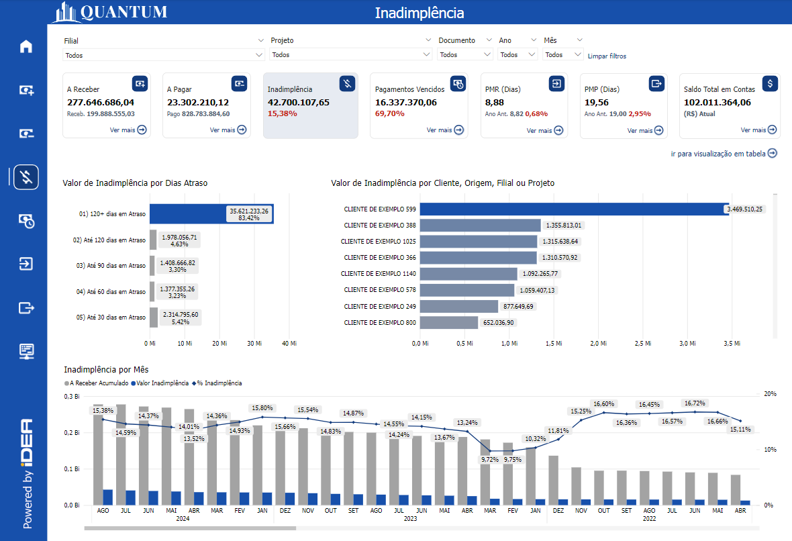
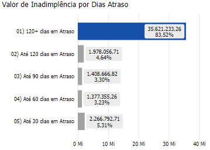
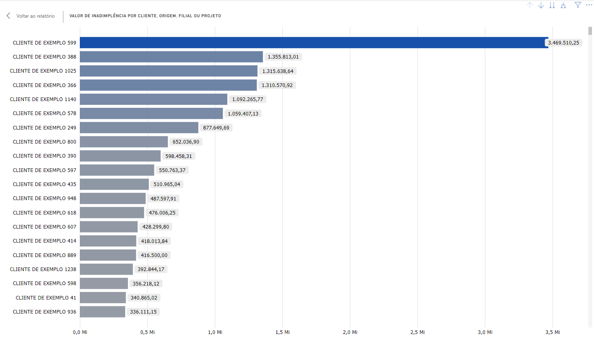
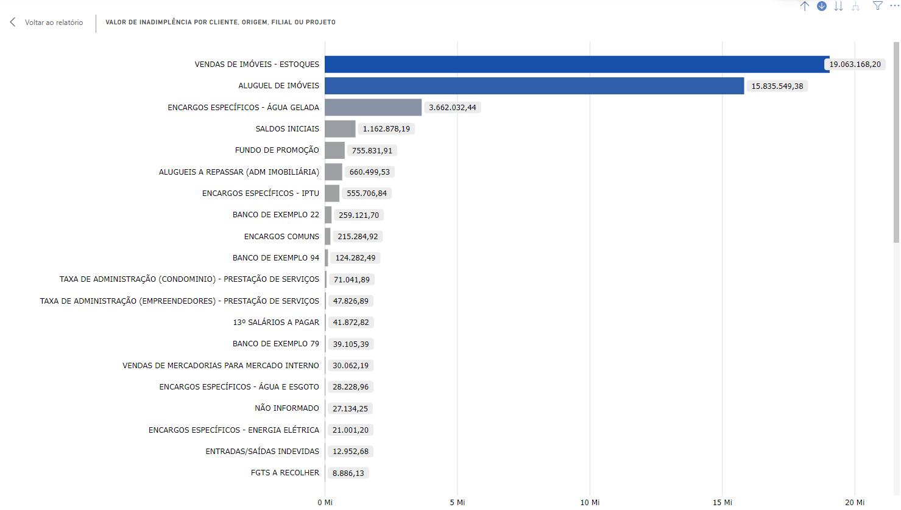
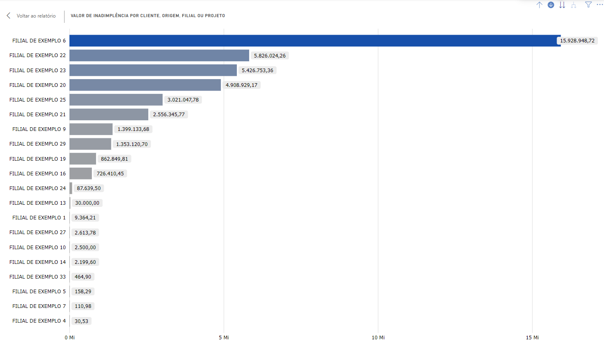
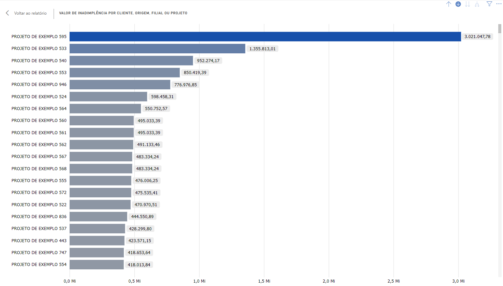
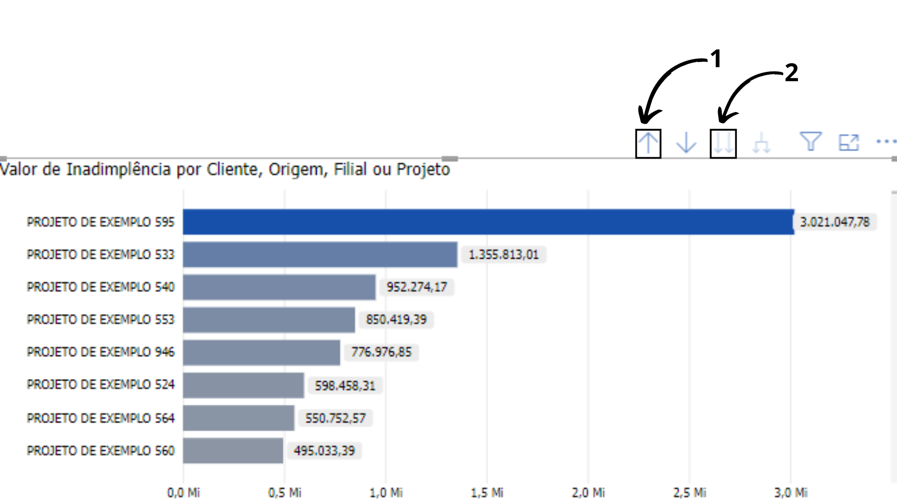
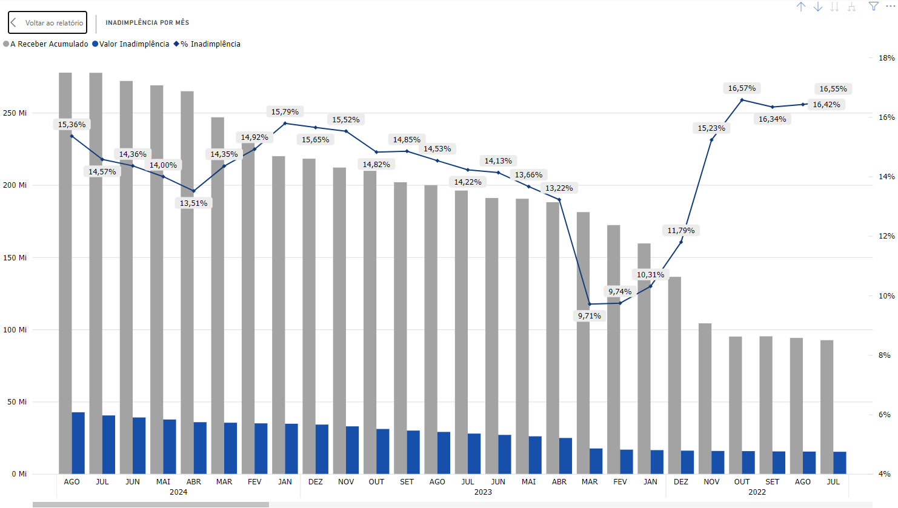

# Painel Inadimplência

<h6 align = "center"> Imagem 1: Painel Inadimplência</h6>

Inadimplência refere-se à falha de um devedor (seja pessoa física ou jurídica) em cumprir suas obrigações financeiras dentro do prazo acordado, o que pode ter sérias repercussões para a saúde financeira de uma empresa. Essa situação pode levar à redução do fluxo de caixa, aumento do risco financeiro e deterioração das relações comerciais.

Quando uma empresa enfrenta inadimplência, os valores esperados não são recebidos como previsto, afetando diretamente o fluxo de caixa e possivelmente levando à necessidade de buscar financiamento externo, o que aumenta os custos de crédito e pode prejudicar a operação diária. Além disso, a inadimplência pode deteriorar as relações comerciais, afetando a percepção de parceiros de negócios e dificultando o cumprimento de compromissos com fornecedores, empregados e investidores.

Uma gestão eficiente da inadimplência oferece vários benefícios para as empresas. Ela melhora o fluxo de caixa ao garantir que os pagamentos sejam recebidos pontualmente, o que proporciona maior disponibilidade de recursos financeiros para cumprir obrigações como pagamentos a fornecedores e salários, além de possibilitar investimentos em crescimento. A redução das perdas financeiras é outro benefício significativo, pois minimiza os valores não recebidos e fortalece a posição financeira da empresa. A rentabilidade também melhora, pois a redução de valores em atraso permite um melhor aproveitamento dos recursos e um planejamento mais preciso de investimentos e despesas. Além disso, uma boa gestão da inadimplência contribui para fortalecer o relacionamento com os clientes por meio de acompanhamento constante e comunicação transparente, resultando em maior satisfação, fidelização e menor probabilidade de futuros atrasos ou inadimplência.

A fórmula para calcular a Inadimplência é:

**_Taxa de Inadimplência = (Total de Dívidas em Atraso / Total de Crédito Concedido) x 100_**

**Onde:**

- **Total de Dívidas em Atraso:** Soma de todos os valores que estão em atraso, ou seja, que não foram pagos dentro do prazo acordado.
- **Total de Crédito Concedido:** Soma de todos os créditos concedidos pela empresa no período considerado (vendas a prazo, financiamentos, etc.).

**Exemplo:**
Se uma empresa concedeu R$ 1.000.000,00 em crédito durante um mês e, desse total, R$ 50.000,00 estão em atraso, a taxa de inadimplência seria calculada assim:

**_Taxa de Inadimplência = (100.000 / 1.000.000) x 100 = 5%_**

Isso significa que, a taxa de Inadimplência da empresa seria de 5%.

## Gráfico "Aging - Valor Inadimplência"

<h6 align = "center"> Imagem 2: Gráfico "Aging - Valor Inadimplência"</h6>

O gráfico apresenta a distribuição dos valores de inadimplência categorizados por faixas de dias de atraso. Aqui estão os detalhes:

01) 120+ dias em Atraso:
   
- **Valor de Inadimplência:** R$ 35.621.233,26
- **Percentual do Total:** 83,52%
- Esta categoria representa a maior parte do valor total em atraso, com mais de 120 dias de inadimplência.

02) Até 120 dias em Atraso:
   
- **Valor de Inadimplência:** R$ 1.978.056,71
- **Percentual do Total:** 4,64%
- A inadimplência nesta faixa representa uma parcela menor em comparação com a categoria anterior.

03) Até 90 dias em Atraso:
   
- **Valor de Inadimplência:** R$ 1.408.666,82
- **Percentual do Total:** 3,30%
- A inadimplência nesta faixa é ainda menor, mas significativa.

04) Até 60 dias em Atraso:
   
- **Valor de Inadimplência:** R$ 1.377.355,26
- **Percentual do Total:** 3,23%
- Valores nessa faixa de atraso representam uma pequena parte do total.

05) Até 30 dias em Atraso:
   
- **Valor de Inadimplência:** R$ 2.266.792,71
- **Percentual do Total:** 5,31%
- Embora representando a menor faixa de atraso, ainda é relevante com mais de 5% do total.

## Gráfico "Inadimplência por Cliente, Origem, Filial ou Projeto"

O gráfico apresenta o valor de inadimplência categorizado por diferentes segmentos, como cliente, origem, filial ou projeto. Cada barra no gráfico representa uma categoria específica, mostrando o valor total inadimplente associado a ela.

<h6 align = "center"> Imagem 3: Gráfico "Inadimplência por Cliente"</h6>

### Nível 1: Cliente
**Descrição:** No nível de cliente, o gráfico exibe o valor total inadimplente associado a cada cliente específico. Cada barra representa um cliente ou grupo de clientes e ilustra o montante que ainda não foi pago à empresa, destacando os valores em atraso que esses clientes devem quitar.

**Interpretação:** Este gráfico permite identificar quais clientes ou grupos de clientes possuem os maiores valores de inadimplência, o que pode indicar a necessidade de uma revisão das condições de crédito, um acompanhamento mais rigoroso desses clientes ou a implementação de políticas de cobrança mais eficazes para reduzir o risco financeiro e melhorar o fluxo de caixa da empresa.

<h6 align = "center"> Imagem 4: Gráfico "Inadimplência por Origem"</h6>

### Nível 2: Origem
**Descrição:** No nível de origem, o gráfico exibe o valor total inadimplente associado a cada fonte específica de receita ou operação. Cada barra representa uma origem e mostra o montante total de inadimplência que deriva dessa fonte.

**Interpretação:** Este gráfico permite identificar quais origens estão contribuindo mais para a inadimplência geral. Com essa informação, a empresa pode focar em revisar políticas e procedimentos específicos para essas origens, a fim de reduzir os valores inadimplentes e melhorar a eficiência da cobrança.

<h6 align = "center"> Imagem 5: Gráfico "Inadimplência por Filial"</h6>

### Nível 3: Filial
**Descrição:** No nível de filial, o gráfico exibe o valor total inadimplente vinculado a cada unidade ou filial da empresa. Cada barra representa uma filial específica e demonstra o montante total de valores em atraso associados a ela.

**Interpretação:** Este gráfico possibilita identificar quais filiais estão acumulando mais inadimplência. Com essa visão, a empresa pode direcionar esforços para essas unidades, ajustando processos locais, reforçando políticas de crédito ou intensificando as estratégias de cobrança para mitigar riscos financeiros.

<h6 align = "center"> Imagem 7: Gráfico "Inadimplência por Projeto"</h6>

### Nível 4: Projeto
**Descrição:** No nível de projeto, o gráfico exibe o valor total inadimplente relacionado a cada projeto específico. Cada barra representa um projeto e destaca o montante total de inadimplência vinculado a ele.

**Interpretação:** Este gráfico ajuda a identificar quais projetos estão gerando mais inadimplência, o que pode sinalizar problemas específicos no gerenciamento ou execução desses projetos. A empresa pode então reavaliar a viabilidade, as condições de pagamento ou até mesmo a gestão de riscos desses projetos para minimizar a inadimplência e otimizar o retorno financeiro.

<h6 align = "center"> Imagem 7: Navegação no Gráfico "Inadimplência por Cliente, Origem, Filial ou Projeto"</h6>

### Navegação Entre os Níveis
A ferramenta de BI permite que você navegue facilmente entre os diferentes níveis de hierarquia para obter insights mais detalhados. Para mudar de nível, siga as instruções abaixo:

- **Para ir para o próximo nível de hierarquia (Indicador 1)**: Clique na opção "Ir para o próximo nível de hierarquia" na interface do BI. Isso levará você para o próximo nível, onde os dados serão detalhados de acordo com a nova categoria (por exemplo, de Cliente para Origem).
- **Para retornar ao nível anterior (Indicador 2)**: Caso queira voltar a um nível mais agregador, clique em "Subir um nível na hierarquia". Isso levará você de volta ao nível anterior de categorização.

## Gráfico "Inadimplência por Mês"

<h6 align = "center"> Imagem 8: Gráfico "Inadimplência por Mês e Ano"</h6>

O gráfico ilustra a inadimplência por mês e Ano, mostrando três principais elementos:

- **A Receber Acumulado (Barras Cinzas):** Este representa o valor total acumulado que a empresa espera receber ao longo dos meses. Esse valor parece diminuir gradualmente ao longo do tempo, o que pode indicar uma redução no volume de vendas a crédito ou um aumento na recuperação de valores devidos.

- **Valor de Inadimplência (Barras Azuis):** Esta barra representa o valor absoluto de inadimplência em cada mês, ou seja, o total de valores que não foram pagos dentro do prazo acordado. Observa-se que, apesar das variações ao longo do tempo, esse valor permanece relativamente estável, mas com uma leve tendência de queda em alguns períodos.

- **(%) Inadimplência (Linha Azul com Marcadores):** A linha azul mostra a taxa de inadimplência percentual em relação ao valor a receber acumulado. Nota-se que essa taxa apresenta flutuações ao longo dos meses, com alguns picos e vales significativos. Em um determinado ponto, há uma queda acentuada, seguida por uma recuperação e aumento da taxa de inadimplência.

