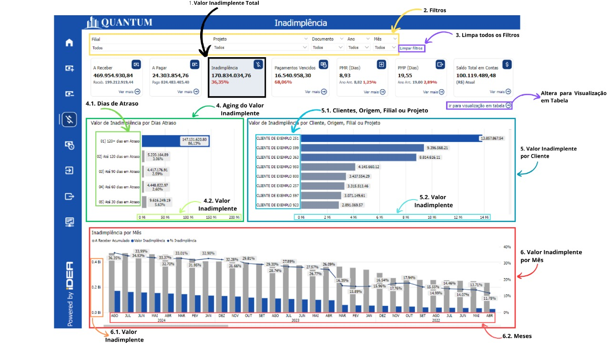

# Inadimplência

## O que é Inadimplência?

Inadimplência é a falha no cumprimento de obrigações financeiras por parte de um devedor,
seja uma pessoa física ou jurídica, que não realiza o pagamento de uma dívida dentro do prazo
estabelecido em um contrato ou acordo. Este comportamento pode trazer sérios impactos para
a saúde financeira de uma empresa, como a redução de fluxo de caixa, aumento do risco
financeiro, e até mesmo a deterioração das relações comerciais.

## Impactos da Inadimplência

### Efeitos no Fluxo de Caixa

A inadimplência impacta diretamente o fluxo de caixa da empresa, uma vez que os valores
esperados não são recebidos conforme previsto. Isso pode levar à necessidade de buscar
financiamento externo, o que aumenta os custos de crédito e pode afetar a operação diária da
empresa.

### Consequências para as Relações Comerciais

Relações comerciais podem ser deterioradas devido à inadimplência, tanto pela percepção
negativa que outros parceiros de negócios podem desenvolver, quanto pela dificuldade de
honrar compromissos financeiros com fornecedores, empregados, e investidores.

## Objetivo do Relatório de Inadimplência

Para proporcionar uma visão clara e detalhada da inadimplência, a IDEA TECHNOLOGY
desenvolveu um relatório utilizando o Power BI. Este relatório foi projetado para identificar
rapidamente os principais fatores que contribuem para a inadimplência, facilitando a tomada de
decisões estratégicas e a implementação de ações corretivas.

### Benefícios
- **Tomada de Decisões Informadas:** Auxilia na identificação de áreas críticas e na priorização
de ações.
- **Monitoramento Contínuo:** Oferece uma visão contínua e atualizada da situação financeira
da empresa.
- **Personalização de Análises:** Permite personalizar os filtros e visualizações para focar em
filiais, projetos, ou períodos específicos.

<h6 align = "center"> Imagem 1: Descrição visual de cada indicador.</h6>

## Principais Perguntas que o Relatório Responde

- **Qual o valor total de inadimplência da empresa atualmente?**
    - **Seção 1:** Valor inadimplente Total.
        - O relatório fornece o valor total de todas as dívidas em atraso, permitindo uma visão clara e imediata do montante de inadimplência.
- **Como posso refinar minha análise de inadimplência para focar em um período ou projeto
específico?**
    - **Seção 2:** Filtros. 
        - Os filtros permitem ajustar a visualização do relatório para analisar a inadimplência
em períodos específicos, filiais, projetos ou documentos específicos.
- **Como a inadimplência está distribuída por faixas de dias de atraso?**
    - **Seção 4:** Classifica as dívidas por faixa de Atraso (Aging do Valor Inadimplente). 
        - O relatório mostra a distribuição do valor inadimplente em diferentes faixas de dias
de atraso, ajudando a identificar em qual faixa de atraso a inadimplência é mais
crítica.
- **Qual(is) Clientes, Origem, Filial ou Projeto têm os maiores valores inadimplentes?**
    - **Seção 5:** Valor Inadimplente por Clientes, Origem, Filial ou Projeto. 
        - Identifica a concentração de inadimplência em diferentes segmentos, ajudando a
direcionar as estratégias de gerenciamento de risco e recuperação de crédito.
- **Qual é a porcentagem da inadimplência em relação ao total das contas a receber ao longo
dos meses?**
    - **Seção 6:** Inadimplência por Mês. 
        - A análise percentual no gráfico mensal mostra a relação entre inadimplência e o total de contas a receber, indicando variações na proporção de inadimplência ao longo do tempo.
  
## Importância do Monitoramento Regular dos Valores Inadimplentes

Monitorar regularmente a inadimplência utilizando relatórios como este no Power BI é
fundamental para manter a saúde financeira da empresa e mitigar riscos. O uso eficiente 
do relatório pode prevenir que problemas de inadimplência se agravem e garantem a
estabilidade financeira da empresa.
