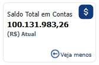

# Indicadores Financeiros

  
  <h6>Imagem 1: Indicadores Financeiro</h6>

Em cada página do nosso relatório no Power BI, os indicadores financeiros estão estrategicamente posicionados no topo. Esses indicadores não são meros marcadores; são ferramentas essenciais, projetadas para aprimorar sua experiência de análise, ao exibir consistentemente os valores-chave mais relevantes para cada página. Eles oferecem uma referência rápida, garantindo que você possa monitorar os dados críticos de forma contínua, sem a necessidade de navegar entre diferentes páginas do relatório.

Uma das principais vantagens desses indicadores é a sua consistência. Os valores exibidos permanecem uniformes ao longo do relatório, proporcionando um fluxo contínuo de informações à medida que você explora diferentes seções. Isso significa que, independentemente da página em que você estiver, sempre terá acesso aos mesmos pontos de dados essenciais, facilitando a manutenção de uma visão clara das principais métricas. Esse recurso é especialmente útil em análises detalhadas, eliminando a necessidade de realinhamento constante com os dados.

Além disso, esses indicadores estão dinamicamente vinculados aos filtros aplicados no relatório. À medida que você ajusta os filtros para refinar sua análise, os valores dos indicadores se atualizam automaticamente, refletindo os dados filtrados. Essa interação dinâmica torna a análise mais eficiente e precisa, pois os indicadores fornecem uma visão instantânea e ajustada dos dados conforme as variáveis aplicadas, seja por períodos, regiões ou outras dimensões. Isso simplifica o processo analítico e oferece uma visão clara de como os filtros impactam os resultados gerais.

Em resumo, os indicadores posicionados no topo de cada página do relatório no Power BI são fundamentais para garantir continuidade e clareza durante sua análise. Eles oferecem métricas consistentes, ajustadas de acordo com os filtros, o que facilita o acompanhamento e a comparação dos principais números ao longo de todo o relatório, aprimorando sua experiência analítica.

## Indicador A Receber

  
  <h6>Imagem 2: A Receber</h6>

### A Receber

A Receber refere-se ao valor total de pagamentos pendentes que a empresa ainda não recebeu. Esse valor inclui tanto os montantes em inadimplência, que são aqueles pagamentos ou dívidas que já estão atrasados, quanto os valores que ainda não venceram, mas que a empresa tem o direito de receber. Assim, a conta A Receber engloba todas as entradas financeiras futuras, independentemente de estarem ou não em atraso.

### A Receber em 0 dias

Este indicador (0 dias) mostra o valor que deve ser recebido imediatamente. Ao destacar os fundos que estão previstos para serem coletados no curto prazo, ele permite uma melhor gestão de fluxo de caixa e planejamento financeiro. Compreender os recebíveis imediatos possibilita à empresa antecipar a liquidez disponível, tomar decisões informadas sobre investimentos ou despesas, e garantir que as necessidades operacionais sejam atendidas sem interrupções. Esse nível de insight é crucial para manter a estabilidade financeira e apoiar os objetivos estratégicos da organização.

### A Receber em 30 dias

O indicador (30 dias) para os valores que devem ser recebidos nos próximos 30 dias permite monitorar os recebíveis que estão por vencer, ajudando a empresa a prever entradas de caixa com mais precisão e facilitando o planejamento financeiro de curto prazo. Essa previsão é crucial para garantir que a organização possa cumprir suas obrigações financeiras, aproveitar oportunidades de investimento em tempo hábil e manter níveis saudáveis de liquidez. Além disso, acompanhar os recebíveis a vencer em breve possibilita uma comunicação proativa com os clientes, reduzindo o risco de atrasos nos pagamentos e melhorando a gestão geral do fluxo de caixa.

### Botão Ver mais

O botão "Ver mais" direciona o usuário para a página de A Receber quando clicado. No entanto, quando o usuário já está na página de A Receber, o botão "Ver mais" não é exibido, e o cartão correspondente é destacado visualmente.

Conheça mais sobre essa caixa de indicadores no [Painel A Receber](https://idea-technology-it.github.io/docs-idea/financeiro/contas_a_receber/)

## Indicador A Pagar

  
  <h6>Imagem 3: A Pagar</h6>

### A Pagar

A Pagar representa o valor total de pagamentos pendentes. Isso inclui tanto os Pagamentos Vencidos, referentes a dívidas ou obrigações em atraso, quanto os valores que ainda estão dentro do prazo de vencimento, mas ainda não foram pagos.

### A Pagar em 0 dias

Este indicador (0 dias) mostra o valor que deve ser pago imediatamente. Ao destacar os pagamentos que precisam ser realizados no curto prazo, ele permite uma melhor gestão do fluxo de caixa e planejamento financeiro. Compreender os pagamentos imediatos possibilita à empresa antecipar as saídas de caixa, tomar decisões informadas sobre a alocação de recursos e garantir que as obrigações financeiras sejam cumpridas sem interrupções. Esse nível de detalhe é crucial para manter a estabilidade financeira e apoiar os objetivos estratégicos da organização.

### A Pagar em 30 dias

O indicador (30 dias) para os valores que devem ser pagos nos próximos 30 dias permite monitorar as obrigações financeiras que estão por vencer, ajudando a empresa a prever saídas de caixa com mais precisão e facilitando o planejamento financeiro de curto prazo. Essa previsão é essencial para garantir que a organização possa cumprir suas obrigações financeiras de forma oportuna, aproveitar oportunidades de investimento e manter níveis saudáveis de liquidez. Além disso, acompanhar os pagamentos a vencer em breve possibilita uma gestão proativa dos fornecedores, reduzindo o risco de atrasos e melhorando a eficiência geral do fluxo de caixa.

### Botão Ver mais

O botão "Ver mais" direciona o usuário para a página de A Pagar ao ser clicado. No entanto, se o cartão já estiver associado à página atual, ou seja, o usuário já estiver na página de A Pagar, o botão "Ver mais" se torna invisível, e o cartão é destacado, facilitando a visualização das informações diretamente na tela atual.

Conheça mais sobre essa caixa de indicadores no [Painel A Pagar](https://idea-technology-it.github.io/docs-idea/financeiro/contas_a_pagar/)

## Indicador de Inadimplência

  
  <h6>Imagem 4: Inadimplência</h6>

### Inadimplência

A inadimplência ocorre quando um devedor não cumpre suas obrigações financeiras, resultando em pagamentos atrasados ou dívidas não quitadas. Este indicador reflete o valor total de pagamentos em atraso que a empresa ainda tem a receber. Monitorar a inadimplência é fundamental, pois ela afeta diretamente o fluxo de caixa e a saúde financeira do negócio. Ao acompanhar esse indicador, a empresa pode identificar riscos, adotar medidas corretivas e garantir uma posição financeira mais sólida e estável.

### Índice de Inadimplência %

O Índice de Inadimplência % (Índice) em recebíveis indica a porcentagem de valores que não foram pagos dentro do prazo acordado em relação ao total de créditos concedidos pela empresa. O valor do visual ficará destacado em vermelho sempre que estiver acima de 5% e em verde quando estiver abaixo. Quando o Índice de Inadimplência está acima de 5%, isso indica que uma parcela significativa dos pagamentos devidos está em atraso, o que pode sinalizar problemas graves, como dificuldades financeiras dos clientes, ineficiências na gestão de crédito ou estratégias de cobrança inadequadas. Um índice elevado pode levar a impactos negativos, como:

- **Diminuição da Liquidez:** Altos níveis de inadimplência podem reduzir a liquidez da empresa, dificultando sua capacidade de cumprir com suas próprias obrigações financeiras e investir em novas oportunidades.
  
- **Risco Aumentado:** Um índice elevado pode sinalizar problemas com a solvência dos clientes, levando a um aumento no risco de perdas financeiras para a empresa.
  
- **Impacto na Rentabilidade:** A inadimplência alta pode afetar diretamente a rentabilidade, já que valores que deveriam ter sido recebidos não são convertidos em receita.

Por outro lado, um Índice de Inadimplência abaixo de 5% é geralmente considerado um sinal positivo. Isso indica que a empresa tem um bom controle sobre suas contas a receber e uma gestão eficaz das relações com os clientes. Portanto, manter o Índice de Inadimplência abaixo de 5% é crucial para garantir a estabilidade e o crescimento sustentável da empresa.

### Inadimplência em Atraso por 120+ dias

Este indicador (120+ dias) mostra o valor dos pagamentos que estão inadimplentes há mais de 120 dias. Ao identificar as obrigações financeiras que estão significativamente atrasadas, ele permite à empresa focar na recuperação de créditos e na gestão de riscos associados a pagamentos não realizados. Compreender a inadimplência prolongada ajuda a empresa a implementar estratégias eficazes de cobrança, avaliar o impacto das dívidas vencidas sobre a liquidez e ajustar o planejamento financeiro para minimizar impactos negativos. Esse acompanhamento é crucial para manter a saúde financeira da organização, garantir a continuidade dos negócios e proteger o fluxo de caixa contra a deterioração causada por atrasos prolongados.

### Botão Ver mais

O botão "Ver mais", quando clicado, direciona o usuário para a página de Inadimplência. Se o cartão já estiver associado à página atual, ou seja, o usuário já estiver na página de Inadimplência, o botão "Ver mais" não será exibido, e o cartão será automaticamente destacado, proporcionando uma navegação mais intuitiva.

Conheça mais sobre essa caixa de indicadores no [Painel Inadimplência](https://idea-technology-it.github.io/docs-idea/financeiro/inadimplencia/)

## Indicador de Pagamentos Vencidos

  
  <h6>Imagem 5: Pagamentos Vencidos</h6>

### Pagamentos Vencidos

Pagamentos Vencidos são valores que ultrapassaram a data de vencimento e ainda não foram quitados, representando obrigações financeiras em atraso. Acompanhar esses pagamentos é crucial para a gestão dos passivos da empresa, evitando multas, encargos por atraso e mantendo relacionamentos positivos com fornecedores e credores, além de assegurar a pontualidade nos compromissos financeiros.

### Índice de Pagamentos Vencidos %

O Índice de Pagamentos Vencidos % (Índice) indica a porcentagem de valores devidos que não foram pagos dentro do prazo acordado, em relação ao total de obrigações financeiras da empresa. O valor do visual ficará destacado em vermelho sempre que estiver acima de 10% e em verde quando estiver abaixo. Quando esse índice está acima de 10%, isso sugere que uma parte significativa dos pagamentos está atrasada, o que pode indicar problemas sérios, como:

- **Redução da Liquidez:** Altos níveis de inadimplência podem comprometer a liquidez da empresa, dificultando sua capacidade de honrar compromissos financeiros e investir em novas oportunidades.

- **Aumento do Risco:** Um índice elevado pode refletir problemas com a gestão de pagamentos ou com a capacidade financeira dos fornecedores, resultando em um maior risco de penalidades ou restrições de crédito.

- **Impacto na Rentabilidade:** Pagamentos vencidos podem acarretar custos adicionais, como multas e juros, que impactam diretamente a rentabilidade da empresa.

Em contraste, um Índice de Pagamentos Vencidos abaixo de 10% é geralmente considerado um sinal positivo. Isso indica que a empresa está gerenciando suas obrigações financeiras de maneira eficiente e mantendo um bom relacionamento com seus fornecedores. Portanto, manter o Índice de Inadimplência abaixo de 10% é fundamental para garantir a saúde financeira da empresa, evitar custos adicionais e assegurar uma boa gestão de pagamentos.

### Pagamentos Vencidos em Atraso por 120+ dias

Este indicador (120+ dias) mostra o valor dos pagamentos que ainda precisam ser realizados e que estão vencidos há mais de 120 dias. Identificar esses pagamentos em atraso ajuda a empresa a priorizar ações para regularizar essas pendências, além de avaliar o impacto que esses atrasos podem ter sobre o fluxo de caixa e a saúde financeira da organização. Compreender a magnitude dos pagamentos vencidos por um longo período permite implementar estratégias de gestão de dívidas, negociar prazos com fornecedores e ajustar o planejamento financeiro para mitigar os efeitos negativos. Monitorar os pagamentos vencidos é crucial para assegurar a continuidade das operações e proteger a estabilidade financeira da empresa.

### Botão Ver mais

O botão "Ver mais", ao ser clicado, direciona o usuário para a página de Pagamentos Vencidos. Se o usuário já estiver na página correspondente, o botão "Ver mais" não é exibido, e o cartão é automaticamente destacado para indicar que ele está visualizando as informações corretas.

Conheça mais sobre essa caixa de indicadores no [Painel Pagamentos Vencidos](https://idea-technology-it.github.io/docs-idea/financeiro/pagamentos_vencidos/)

## Indicador de Período Médio de Recebimento (PMR)

  
  <h6>Imagem 6: Período Médio de Recebimento (PMR)</h6>

### Período Médio de Recebimento (PMR)

O Período Médio de Recebimento (PMR) é a quantidade média de dias que uma empresa leva para receber o pagamento dos seus clientes após a realização de uma venda ou emissão de uma fatura. Esse indicador é fundamental para avaliar a eficiência dos processos de crédito e cobrança da empresa, entender o ciclo de conversão de caixa e gerenciar o capital de giro. Ao monitorar o PMR, a empresa pode garantir que tem liquidez suficiente para manter suas operações e tomar decisões informadas sobre o fluxo de caixa.

### Período Médio de Recebimento (PMR) Ano Anterior

O Período Médio de Recebimento (PMR) do Ano Anterior (Ano Ant.) reflete o número médio de dias que uma empresa levou para receber pagamentos dos clientes no ano anterior. Comparar o PMR atual com o do ano anterior é crucial para avaliar mudanças na eficiência da gestão de recebíveis ao longo do tempo. Essa análise ajuda a identificar tendências de melhoria ou deterioração nos processos de cobrança e permite ajustes estratégicos, otimizando o fluxo de caixa e fortalecendo a saúde financeira da empresa.

### Período Médio de Recebimento (PMR) %

O Período Médio de Recebimento (PMR) %, encontrado próximo ao indicador ano anterior, representa a variação percentual no tempo médio que a empresa leva para receber pagamentos, comparado ao ano anterior. Acompanhar essa métrica é fundamental para avaliar melhorias ou retrocessos na eficiência de gestão de recebíveis ao longo do tempo. Identificar essas tendências permite que as empresas tomem decisões estratégicas, ajustem suas políticas de crédito e cobrança, e otimizem o fluxo de caixa de forma mais eficaz.

Para mostrar alterações indesejadas de ano para ano, este valor será mostrado em vermelho quando estiver acima de 1% e em verde quando estiver abaixo disso.

### Recebimento

Recebimento (Receb.) refere-se ao valor total dos pagamentos já recebidos pela empresa. Ao comparar esses valores com o montante a receber, as empresas podem gerenciar de forma mais eficaz seu fluxo de caixa, garantindo liquidez suficiente para cobrir despesas, realizar investimentos e implementar outras estratégias financeiras com maior segurança.

### Botão Ver mais

Botão "Ver mais" ao ser clicado, este botão direciona o usuário para a página do Painel de Recebimentos Realizados. Se o cartão já estiver vinculado à página atual, ou seja, o usuário já estiver na página do Painel de Recebimentos Realizados, o botão "Ver mais" desaparece, destacando o cartão para indicar que essa é a página em questão.

Conheça mais sobre essa caixa de indicadores no [Painel de Recebimentos Realizados](https://idea-technology-it.github.io/docs-idea/financeiro/painel_recebimentos_realizados/)

## Indicador de Período Médio de Pagamento (PMP)

  
  <h6>Imagem 7: Período Médio de Pagamento (PMP)</h6>

### Período Médio de Pagamento (PMP)

O Período Médio de Pagamento (PMP) representa o número médio de dias que uma empresa leva para quitar suas obrigações com fornecedores ou credores após o recebimento de uma fatura. Acompanhar o PMP é essencial para uma gestão eficaz do fluxo de caixa, pois ajuda a garantir a pontualidade nos pagamentos, preservar bons relacionamentos com fornecedores, além de otimizar o capital de giro e possibilitar melhores condições de negociação.

### Período Médio de Pagamento (PMP) Ano Anterior

O Período Médio de Pagamento (PMP) Ano Anterior (Ano Ant.) refere-se ao número médio de dias que a empresa levou para pagar seus fornecedores ou credores no ano anterior. Comparar o PMP atual com o PMP do ano anterior é fundamental para avaliar mudanças na eficiência de pagamento, identificar tendências de melhoria ou deterioração na gestão de contas a pagar, e ajustar estratégias para otimizar o fluxo de caixa e fortalecer os relacionamentos com fornecedores.

### Período Médio de Pagamento (PMP) %

O Período Médio de Pagamento (PMP) %, encontrado próximo ao indicador ano anterior, representa a variação percentual no número médio de dias que a empresa leva para pagar seus fornecedores, em comparação ao ano anterior. Monitorar o PMP % em relação ao ano anterior é essencial para avaliar se as práticas de pagamento estão melhorando ou se há atrasos, além de entender seu impacto no fluxo de caixa e nos relacionamentos com fornecedores. Isso permite à empresa tomar decisões informadas para otimizar seus processos de contas a pagar.

Para mostrar alterações indesejadas de ano para ano, este valor será mostrado em vermelho quando estiver acima de 1% e em verde quando estiver abaixo disso.

### Pagamento

Pagamento (Pago) refere-se ao valor total dos pagamentos já realizados. Comparar os valores pagos com os valores pendentes a pagar é fundamental para assegurar que haja recursos suficientes para cobrir as obrigações futuras, evitando problemas de liquidez. Com uma visão clara dos pagamentos realizados e das obrigações futuras, as empresas podem tomar decisões mais informadas sobre o gerenciamento de despesas, renegociação de prazos de pagamento e planejamento de investimentos estratégicos.

### Botão Ver mais

Botão "Ver mais" quando clicado, este botão direciona o usuário para a página de Caixa do Painel de Pagamentos Realizados. Se o usuário já estiver na página de Caixa do Painel de Pagamentos Realizados, o botão "Ver mais" não será exibido e o cartão correspondente será destacado.

Conheça mais sobre essa caixa de indicadores no [Painel de Pagamentos Realizados](https://idea-technology-it.github.io/docs-idea/financeiro/painel_pagamentos_realizados/)

## Caixa de Saldo Total em Contas

  

    
    <h6>Imagem 8: Caixa de Saldo Total em Contas - Ver mais</h6>
  

  

    
    <h6>Imagem 9: Caixa de Saldo Total em Contas - Veja menos</h6>
  

### Saldo Total em Contas

Saldo Total em Contas refere-se ao montante agregado disponível em todas as contas financeiras de uma empresa, abrangendo contas bancárias, dinheiro em caixa e outras contas semelhantes. Esse indicador é fundamental para avaliar a liquidez geral e a saúde financeira da empresa, assegurando que haja fundos adequados para operações diárias, investimentos e imprevistos. Além disso, proporciona uma visão clara para o gerenciamento eficiente de caixa e a tomada de decisões financeiras estratégicas.

### Botão Ver mais e Veja menos

Botão "Ver mais" Ao ser clicado, este botão abre uma tabela detalhada do Saldo Total em Contas, mostrando o saldo atual por conta. Esta visualização está disponível em todas as páginas do relatório. Quando a tabela está aberta, o botão "Ver mais" é substituído por um botão Veja menos, permitindo fechar a tabela e retornar à visualização anterior.

Conheça mais sobre essa caixa de indicadores no [Visão Saldo Total em Contas](https://idea-technology-it.github.io/docs-idea/financeiro/saldo_contas/)

  
***Aviso Legal:** Os números e informações apresentados nesta documentação são baseados em um conjunto de dados fictício. Eles são destinados exclusivamente para fins educacionais e de demonstração. Os dados não refletem condições do mundo real ou métricas de negócios reais e não devem ser usados ​​para tomada de decisão ou análise. Qualquer semelhança com entidades, eventos ou dados reais é mera coincidência.*
