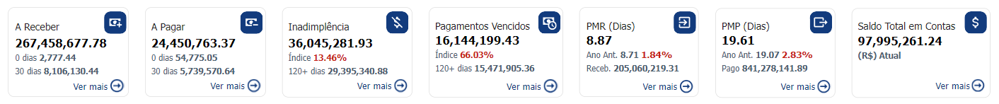
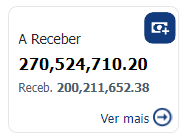
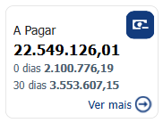
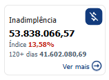
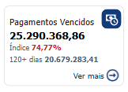
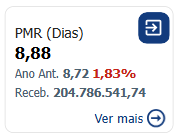
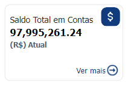

# Indicadores Financeiro

  
  <h6>Imagem 1: Indicadores Financeiro</h6>

Em cada página do nosso relatório no Power BI, os indicadores financeiros estão estrategicamente posicionados no topo. Esses indicadores não são meros marcadores; são ferramentas essenciais, projetadas para aprimorar sua experiência de análise, ao exibir consistentemente os valores-chave mais relevantes para cada página. Eles oferecem uma referência rápida, garantindo que você possa monitorar os dados críticos de forma contínua, sem a necessidade de navegar entre diferentes páginas do relatório.

Uma das principais vantagens desses indicadores é a sua consistência. Os valores exibidos permanecem uniformes ao longo do relatório, proporcionando um fluxo contínuo de informações à medida que você explora diferentes seções. Isso significa que, independentemente da página em que você estiver, sempre terá acesso aos mesmos pontos de dados essenciais, facilitando a manutenção de uma visão clara das principais métricas. Esse recurso é especialmente útil em análises detalhadas, eliminando a necessidade de realinhamento constante com os dados.

Além disso, esses indicadores estão dinamicamente vinculados aos filtros aplicados no relatório. À medida que você ajusta os filtros para refinar sua análise, os valores dos indicadores se atualizam automaticamente, refletindo os dados filtrados. Essa interação dinâmica torna a análise mais eficiente e precisa, pois os indicadores fornecem uma visão instantânea e ajustada dos dados conforme as variáveis aplicadas, seja por períodos, regiões ou outras dimensões. Isso simplifica o processo analítico e oferece uma visão clara de como os filtros impactam os resultados gerais.

Em resumo, os indicadores posicionados no topo de cada página do relatório no Power BI são fundamentais para garantir continuidade e clareza durante sua análise. Eles oferecem métricas consistentes, ajustadas de acordo com os filtros, o que facilita o acompanhamento e a comparação dos principais números ao longo de todo o relatório, aprimorando sua experiência analítica.

## Indicador A Receber

  
  <h6>Imagem 2: A Receber</h6>

### A Receber

<b>A Receber</b> refere-se ao valor total de pagamentos pendentes que a empresa ainda não recebeu. Esse valor inclui tanto os montantes em inadimplência, que são aqueles pagamentos ou dívidas que já estão atrasados, quanto os valores que ainda não venceram, mas que a empresa tem o direito de receber. Assim, a conta <b>A Receber</b> engloba todas as entradas financeiras futuras, independentemente de estarem ou não em atraso.

### Recebimento

<b>Recebimento (Receb.)</b> refere-se ao valor total dos pagamentos já recebidos pela empresa. Ao comparar esses valores com o montante a receber, as empresas podem gerenciar de forma mais eficaz seu fluxo de caixa, garantindo liquidez suficiente para cobrir despesas, realizar investimentos e implementar outras estratégias financeiras com maior segurança.

### Botão Ver mais

O botão <b>Ver mais</b> direciona o usuário para a página de A Receber quando clicado. No entanto, quando o usuário já está na página de A Receber, o botão "Ver mais" não é exibido, e o cartão correspondente é destacado visualmente.

## Indicador A Pagar

  
  <h6>Imagem 3: A Pagar</h6>

### A Pagar

<b>A Pagar</b> representa o valor total de pagamentos pendentes. Isso inclui tanto os Pagamentos Vencidos, referentes a dívidas ou obrigações em atraso, quanto os valores que ainda estão dentro do prazo de vencimento, mas ainda não foram pagos.

### Pagamento

<b>Pagamento (Pago)</b> refere-se ao valor total dos pagamentos já realizados. Comparar os valores pagos com os valores pendentes a pagar é fundamental para assegurar que haja recursos suficientes para cobrir as obrigações futuras, evitando problemas de liquidez. Com uma visão clara dos pagamentos realizados e das obrigações futuras, as empresas podem tomar decisões mais informadas sobre o gerenciamento de despesas, renegociação de prazos de pagamento e planejamento de investimentos estratégicos.

### Botão Ver mais

O botão <b>Ver mais</b> direciona o usuário para a página de A Pagar ao ser clicado. No entanto, se o cartão já estiver associado à página atual (ou seja, o usuário já estiver na página de A Pagar), o botão <b>Ver Mais</b> se torna invisível, e o cartão é destacado, facilitando a visualização das informações diretamente na tela atual.

## Caixa de Inadimplência

  
  <h6>Imagem 4: Caixa de Inadimplência</h6>

### Inadimplência

Inadimplência refers to the situation where a debtor fails to meet their financial obligations, resulting in overdue payments or unpaid debts. This indicator shows the total value of overdue payments to recieve. Monitoring inadimplência is crucial because it directly impacts a company’s cash flow and financial stability, enabling businesses to identify risks, take corrective actions, and maintain a healthy financial position.

### Inadimplência %

Inadimplência % é a porcentagem do total de contas a receber que estão vencidas ou não pagas, refletindo a proporção de dívidas que não foram liquidadas no prazo. Acompanhar a Inadimplência % é importante porque ajuda as empresas a avaliar a eficácia de seus processos de crédito e cobrança, identificar potenciais problemas de fluxo de caixa e tomar decisões informadas para minimizar o risco financeiro.

### Botão Ver mais

Botão "Ver mais", quando clicado, este botão leva o usuário à página de Inadimplência. Quando o cartão já corresponde à página atual (ou seja, o usuário já está na página de Inadimplência), o botão "Ver Mais" não é visível, e o cartão é destacado.

## Caixa de Pagamentos Vencidos

  
  <h6>Imagem 5: Caixa de Pagamentos Vencidos</h6>

### Pagamentos Vencidos

Pagamentos Vencidos referem-se a pagamentos que já passaram da data de vencimento e ainda não foram feitos, indicando obrigações financeiras pendentes. Monitorar Pagamentos Vencidos é essencial porque ajuda uma empresa a gerenciar seus passivos, evitar taxas de atraso ou encargos de juros e manter bons relacionamentos com fornecedores e credores, garantindo pagamentos pontuais.

### Pagamentos Vencidos %

Pagamentos Vencidos % é a porcentagem do total de pagamentos que estão em atraso, representando a proporção de obrigações financeiras que não foram liquidadas nas datas de vencimento. Acompanhar os Pagamentos Vencidos % é crucial para avaliar a capacidade de uma empresa de gerenciar suas dívidas, identificar potenciais problemas de liquidez e implementar estratégias para melhorar a pontualidade dos pagamentos e manter a estabilidade financeira.

### Botão Ver mais

Botão "Ver mais", quando clicado, este botão leva o usuário à página de Pagamentos Vencidos. Quando o cartão já corresponde à página atual (ou seja, o usuário já está na página de Pagamentos Vencidos), o botão "Ver Mais" não é visível, e o cartão é destacado.

## Caixa de Período Médio de Recebimento (PMR)

  
  <h6>Imagem 6: Caixa de Período Médio de Recebimento (PMR)</h6>

### Período Médio de Recebimento (PMR)

O Período Médio de Recebimento (PMR) é o número médio de dias que uma empresa leva para coletar pagamentos de seus clientes após uma venda ou faturamento. É importante porque ajuda as empresas a entender seu ciclo de conversão de caixa, avaliar a eficiência de seus processos de crédito e cobrança e gerenciar o capital de giro de forma eficaz para garantir liquidez adequada.

### Período Médio de Recebimento (PMR) Ano Anterior

O Período Médio de Recebimento (PMR) Ano Anterior (Ano Ant.) do ano anterior é o número médio de dias que uma empresa levou para receber pagamentos de clientes no ano passado. Comparar o PMR atual com o PMR do ano anterior é essencial para avaliar mudanças na eficiência da gestão de recebíveis, identificar tendências de melhoria ou deterioração na cobrança de pagamentos e ajustar estratégias de crédito e cobrança para otimizar o fluxo de caixa.

### Período Médio de Recebimento (PMR) %

O Período Médio de Recebimento (PMR) % é a mudança percentual no número médio de dias que leva para receber pagamentos em comparação ao ano anterior. Acompanhar o PMR % em relação ao ano passado ajuda as empresas a avaliar melhorias ou declínios na eficiência de gerenciamento de recebíveis, identificar tendências e tomar as medidas necessárias para melhorar o fluxo de caixa e otimizar as políticas de crédito.

### Botão Ver mais

Botão "Ver mais", quando clicado, este botão leva o usuário à página de Caixa de Período Médio de Recebimento (PMR). Quando o cartão já corresponde à página atual (ou seja, o usuário já está na página de Caixa de Período Médio de Recebimento (PMR)), o botão "Ver Mais" não é visível, e o cartão é destacado.

## Caixa de Período Médio de Pagamento (PMP)

  
  <h6>Imagem 7: Caixa de Período Médio de Pagamento (PMP)</h6>

### Período Médio de Pagamento (PMP)

O Período Médio de Pagamento (PMP) é o número médio de dias que uma empresa leva para pagar seus fornecedores ou credores após receber uma fatura. Monitorar o PMP é crucial para gerenciar o fluxo de caixa, garantir pagamentos pontuais aos fornecedores e manter bons relacionamentos com os credores, ao mesmo tempo em que otimiza o capital de giro e negocia termos de pagamento favoráveis.

### Período Médio de Recebimento (PMR) Ano Anterior

O Período Médio de Pagamento (PMP) Ano Anterior (Ano Ant.) do ano anterior é o número médio de dias que a empresa levou para pagar seus fornecedores ou credores no ano passado. Comparar o APP atual com o APP do ano anterior permite que você avalie mudanças na eficiência de pagamento, identifique tendências de melhoria ou deterioração na gestão de contas a pagar e ajuste estratégias para otimizar o fluxo de caixa e os relacionamentos com fornecedores.

### Período Médio de Pagamento (PMP) %

O Período Médio de Pagamento (PMP) % é a mudança percentual no número médio de dias que leva para pagar fornecedores em comparação ao ano anterior. Acompanhar o PMP % em relação ao ano passado ajuda as empresas a avaliar melhorias ou atrasos em suas práticas de pagamento, avaliar o impacto no fluxo de caixa e nos relacionamentos com fornecedores e tomar decisões informadas para otimizar seus processos de contas a pagar.

### Botão Ver mais

Botão "Ver mais", quando clicado, este botão leva o usuário à página de Caixa de Período Médio de Pagamento (PMP). Quando o cartão já corresponde à página atual (ou seja, o usuário já está na página de Caixa de Período Médio de Pagamento (PMP)), o botão "Ver Mais" não é visível, e o cartão é destacado.

## Caixa de Saldo Total em Contas

  
  <h6>Imagem 8: Caixa de Saldo Total em Contas</h6>

### Saldo Total em Contas

Saldo Total em Contas refere-se ao saldo total realizado em todas as contas que uma empresa mantém, incluindo contas bancárias, dinheiro e outras contas financeiras. Este indicador é crucial para entender a liquidez geral e a saúde financeira da empresa, garantindo que fundos suficientes estejam disponíveis para operações, investimentos e despesas inesperadas, e facilitando o gerenciamento eficaz de caixa.

### Botão Ver mais

Botão "Ver mais", quando clicado, este botão abre a tabela para Saldo Total em Contas que detalha o saldo realizado atual por conta. Esta visualização está disponível em todas as páginas do relatório e uma vez aberta haverá outro botão exibido para fechar a tabela "Veja menos".
