# Introdução ao BI Financeiro

  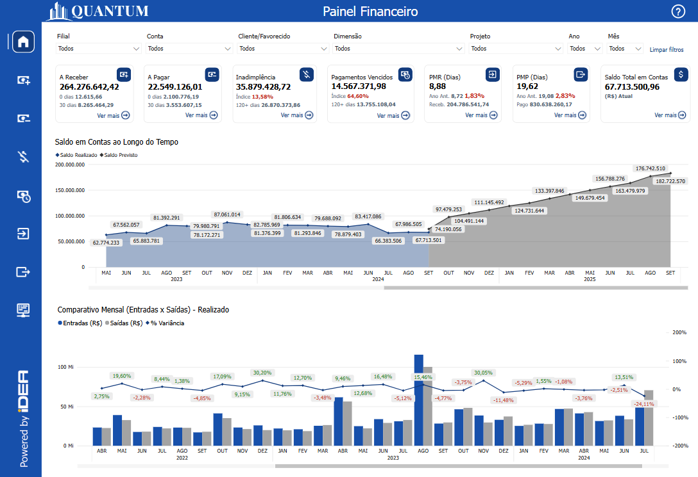
  <h6>Imagem 1: Painel Financeiro</h6>

Um relatório de Business Intelligence (BI) focado em Fluxo de Caixa é fundamental para oferecer uma visão clara e detalhada da saúde financeira de uma empresa. Esse tipo de relatório proporciona uma análise aprofundada das entradas e saídas de caixa, permitindo uma gestão eficaz do fluxo de caixa, comparações detalhadas entre receitas e despesas e a avaliação do desempenho financeiro ao longo do tempo. Com visualizações precisas e detalhadas, é possível identificar tendências, monitorar variações e tomar decisões informadas para otimizar a gestão de caixa e melhorar a rentabilidade da empresa.

Uma das principais vantagens dos relatórios de Fluxo de Caixa é a sua capacidade de atualização contínua. Isso garante que os dados estejam sempre atualizados, refletindo a realidade financeira atual da empresa. A atualização em tempo real ou com uma frequência definida permite que os gestores respondam rapidamente a mudanças no mercado ou nas operações da empresa, ajustando estratégias e ações conforme necessário.

Além disso, esses relatórios integram dados de várias fontes em um único painel, oferecendo uma visão holística e consolidada das finanças. Isso facilita a análise comparativa e a identificação de padrões e anomalias que podem não ser evidentes ao analisar dados isoladamente.

Os relatórios de Fluxo de Caixa também aprimoram a precisão e a consistência das informações financeiras, reduzindo o risco de erros manuais e inconsistências frequentemente encontrados em relatórios baseados em planilhas. Ferramentas de análise avançadas, como gráficos interativos e filtros dinâmicos, permitem explorar os dados de maneira mais detalhada e gerar insights mais profundos.

Em resumo, um relatório de Fluxo de Caixa bem estruturado oferece uma visão detalhada e atualizada da saúde financeira da empresa, facilitando a tomada de decisões estratégicas, melhorando a eficiência operacional e fortalecendo a capacidade da empresa de se adaptar e prosperar em um ambiente de negócios em constante mudança.

## Navegação

Existem várias maneiras de navegar pelo BI Financeiro. Botões estrategicamente posicionados e rotulados são colocados em todos os painéis, otimizando a experiência do usuário ao permitir uma navegação clara e intuitiva. Esses botões fornecem acesso direto às principais áreas, permitindo que os usuários explorem dados de forma eficiente sem se perderem em menus complexos. Seja retornando a uma página anterior, buscando insights mais específicos ou alternando entre diferentes visões financeiras, o layout garante que os usuários possam se mover suavemente pelo relatório, melhorando sua interação geral e produtividade.

### Botões de Menu

A primeira opção é a [barra de menu](https://idea-technology-it.github.io/docs-idea/financeiro/intro/#barra-de-menu), sempre no lado esquerdo do relatório, não importa qual painel você esteja visualizando. Cada botão navega para um painel específico no relatório. Ao passar o mouse, uma instrução descritiva aparecerá como esta;

  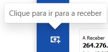

### Botões de Ver mais

A segunda maneira de navegar é através dos botões "Ver mais" localizados nos [Indicadores Financeiros](https://idea-technology-it.github.io/docs-idea/financeiro/indicadores_caixas/) - as caixas que aparecem na parte superior de cada página. Eles também têm uma descrição quando o mouse passa sobre eles, no entanto, para maior clareza, as imagens na caixa correspondente correspondem à imagem usada na barra de menu.

  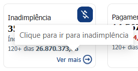

Há um botão exclusivo "Ver mais" que tem sua própria ação, e ele é encontrado na caixa intitulada [Saldo Total em Contas](). Ele é encontrado na extrema direita de cada painel e abrirá uma tabela para o [Saldo por Conta](https://idea-technology-it.github.io/docs-idea/financeiro/saldo_contas/#tabela-de-saldo-total-em-contas). Quando esta tabela é aberta, o botão "Ver mais" é substituído por "Veja menos", permitindo que a tabela seja fechada.

  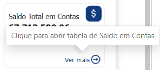
  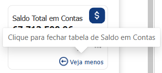

### Botões de Tabela ou Gráfico

O terceiro método é usar botões para alternar entre diferentes visualizações dentro de um painel. Em certos painéis, há duas visualizações, gráfico ou tabela. Abaixo dos [Indicadores Financeiros](https://idea-technology-it.github.io/docs-idea/financeiro/indicadores_caixas/) pode haver um desses botões, se disponível, o botão alternará a visualização e o botão oposto aparecerá.

  
  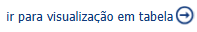

### Botão para Documentação

Finalmente, há um botão em cada painel do relatório que está vinculado à documentação daquele painel específico, o que facilita a navegação direta para explicações sobre os recursos visuais ou recursos.

## Barra de Menu

  
  <h6>Imagem 2: Barra de Menu</h6>

A barra de menu é uma ferramenta de navegação situada no lado esquerdo de todas as páginas do relatório. Ela oferece acesso direto e conveniente a diferentes seções e páginas detalhadas do relatório, facilitando a navegação eficiente entre várias áreas de análise e insights. A barra de menu é projetada para ajudar os usuários a encontrar rapidamente as informações desejadas, e o botão da página atual será destacado para indicar a seção em que o usuário está localizado.

Aqui está uma visão geral dos botões disponíveis na barra de menu:

### Botão Painel Financero

<h6>Esquerda: Página atual, Direita: Página disponível</h6>
Este botão retorna os usuários à página principal, chamada "Painel Financeiro". Esta página serve como o ponto central de partida, proporcionando uma visão geral abrangente e facilitando a navegação para outras seções do relatório.
  
### Botão A Receber

<h6>Esquerda: Página atual, Direita: Página disponível</h6>
Ao clicar neste botão, os usuários são direcionados para a página "A Receber". Esta página oferece visualizações e análises detalhadas sobre os valores que a empresa ainda precisa receber.
  
### Botão A Pagar

<h6>Esquerda: Página atual, Direita: Página disponível</h6>
Ao clicar neste botão, os usuários são levados à página "A Pagar". Nesta seção, eles podem visualizar e analisar as obrigações financeiras que a empresa ainda precisa quitar.
  
###  Botão Inadimplência

<h6>Esquerda: Página atual, Direita: Página disponível</h6>
Ao selecionar este botão, os usuários são direcionados para a página "Inadimplência". Nesta seção, eles encontrarão insights detalhados sobre pagamentos em atraso que ainda não foram recebidos.
  
### Botão Pagamentos Vencidos

<h6>Esquerda: Página atual, Direita: Página disponível</h6>
Selecionar este botão direciona os usuários para a página "Pagamentos Vencidos". Nesta seção, são fornecidos insights detalhados sobre pagamentos que já passaram da data de vencimento e ainda não foram quitados.
  
### Botão Painel de Recebimentos Realizados

<h6>Esquerda: Página atual, Direita: Página disponível</h6>
Clicar neste botão leva os usuários à página "Painel de Recebimentos Realizados". Nessa página, é possível visualizar a média de dias necessários para receber os pagamentos dos clientes.
  
### Botão Painel de Pagamentos Realizados

<h6>Esquerda: Página atual, Direita: Página disponível</h6>
Este botão direciona os usuários para a página "Painel de Pagamentos Realizados", onde podem visualizar o número médio de dias necessários para realizar os pagamentos aos fornecedores.
  
### Botão Fluxo de Caixa

<h6>Esquerda: Página atual, Direita: Página disponível</h6>
Selecionar este botão direciona o usuário para a página "Fluxo de Caixa", onde é possível visualizar a movimentação financeira detalhada de cada conta, organizada por mês e ano.

## Filtros

  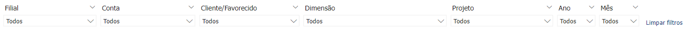
  <h6>Imagem 3: Filtros Visão 1</h6>

  
  <h6>Imagem 4: Filtros Visão 2</h6>

Os filtros são ferramentas essenciais que permitem ajustar a visualização dos dados em todas as páginas do relatório de forma dinâmica e sincronizada.

Ao modificar qualquer filtro, todos os gráficos, tabelas e outros elementos visuais do relatório são atualizados automaticamente para mostrar apenas os dados que correspondem ao critério selecionado.

Esses filtros são configurados com base nos dados da empresa, permitindo filtragens por áreas específicas, como projeto ou filial. Por exemplo, se você deseja analisar os dados de um projeto específico, como "Novo Edifício", basta selecioná-lo no filtro. A partir desse momento, todas as visualizações em cada página do relatório serão atualizadas para mostrar apenas os dados relacionados a esse projeto.

###	Filial

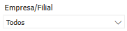

Este filtro permite refinar os dados com base em uma filial específica da empresa. Ao selecionar uma filial, todos os visuais em todas as páginas do relatório serão atualizados para exibir informações exclusivamente relacionadas a essa unidade. Isso facilita a análise detalhada do desempenho e dos resultados de diferentes unidades de negócios ou localizações, permitindo uma visão mais clara e direcionada dos dados de cada filial.

###	Conta

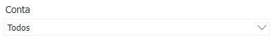

Este filtro está disponível apenas nas páginas Home e Fluxo de Conta e permite visualizar os resultados de acordo com contas específicas. Ele oferece um acesso facilitado a dados detalhados de cada conta, sendo especialmente útil para o planejamento e análise das movimentações financeiras de contas individuais.

###	Cliente/Favorecido

Este filtro ajusta automaticamente as opções exibidas com base no painel em visualização, apresentando 'Cliente' ou 'Favorecido' conforme o contexto. Ao selecionar a opção apropriada, todos os visuais nas páginas correspondentes do relatório são atualizados para refletir as informações pertinentes. Isso agiliza o processo de análise, proporcionando uma visão mais clara e focada, permitindo uma navegação rápida e eficaz entre diferentes contextos de dados.

###	Dimensão

Este filtro permite refinar os dados selecionando entre várias dimensões e suas respectivas subcategorias, organizadas em uma hierarquia definida pelo cliente. Ao escolher uma dimensão, como a dimensão '2,' ou ao expandi-la para visualizar e selecionar subcategorias específicas como 'Água,' 'Eletricidade,' ou 'Gás,' todos os visuais no relatório são atualizados para refletir essas escolhas. Isso facilita a análise detalhada, permitindo uma visão mais estruturada e personalizada dos dados conforme as necessidades do usuário.

###	Projeto

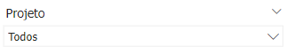

O filtro de projeto permite a seleção e filtragem dos dados por projetos específicos. Ao escolher um projeto, o relatório ajusta todos os visuais para exibir somente as informações relacionadas a esse projeto. Isso facilita uma análise detalhada dos custos, receitas e outros indicadores associados, oferecendo uma visão clara e focada do desempenho e dos resultados de cada projeto.

### Documento

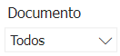

Para tornar os documentos mais fáceis de encontrar, há um filtro para o número do documento incluído nas páginas relevantes. Isso é útil quando há um documento específico que requer atenção e permite fácil rastreamento em diferentes áreas de processo do fluxo de caixa.

###	Ano

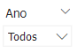

O filtro de ano permite escolher o ano específico para análise. Ao aplicar esse filtro, todos os visuais nas páginas do relatório são ajustados para exibir dados exclusivamente do ano selecionado. Isso facilita a comparação e análise de tendências anuais, proporcionando uma visão clara das variações e padrões ao longo do tempo.

###	Mês

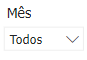

Este filtro permite selecionar um mês específico para análise. Ao escolher um mês, todos os visuais no relatório são atualizados para exibir exclusivamente os dados desse período. Isso facilita a análise mensal e a identificação de variações sazonais, proporcionando uma visão detalhada das tendências e mudanças ao longo do ano.

###	Limpar filtros

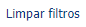

Para restabelecer a visualização completa dos dados e remover todos os filtros aplicados, use o botão "Limpar filtros", que está localizado no lado direito dos filtros. Este botão remove todos os critérios de filtragem, permitindo uma visão geral completa e não filtrada dos dados.

## Ícones de Cabeçalho

  
  <h6>Imagem 4: Ícones de Cabeçalho</h6>

Quando um visual é selecionado ou o mouse passa sobre ele, ícones de cabeçalho aparecem no canto superior direito. Esses ícones variam conforme o tipo e o conteúdo do visual, além das opções configuradas durante a criação.

Neste relatório, os ícones de cabeçalho mais úteis são "Fazer drill up" e "Ir para o próximo nível na hierarquia", que permitem alternar facilmente entre diferentes níveis de dados, como cliente ou projeto.

Abaixo estão as opções que um usuário pode visualizar, o significado de cada uma delas e como utilizá-las.

### Fazer drill on Linhas ou Colunas

Isso ajusta o drill down para linhas ou colunas em uma tabela. Por exemplo, se os cabeçalhos das colunas incluem anos e meses, você pode selecionar colunas, permitindo que faça drill up para visualizar apenas os anos, drill down para ver apenas os meses, ou expandir para exibir ambos, ano e mês, como cabeçalhos de coluna. Da mesma forma, ao selecionar linhas, você pode navegar pela hierarquia das linhas, subindo ou descendo conforme necessário.

### Fazer drill up

O botão "Fazer drill up" permite que você suba um nível na hierarquia de dados. Por exemplo, se o visual estiver detalhando informações por cliente, origem, filial e projeto, e você estiver visualizando os dados por filial, ao clicar no botão, ele exibirá os dados do nível superior, como origem.

### Clique aqui parahabilitar o Drill down

Este botão não é necessário para nossos relatórios, ele habilita os recursos de detalhamento, mas eles são predefinidos na criação.

### Ir para o próximo nível na hierarquia

Este botão é diferente do botão "Expandir". Ao utilizá-lo, você avança para o próximo nível da hierarquia, substituindo completamente o nível atual. Por exemplo, se sua hierarquia for composta de cliente, origem, filial e projeto, e você estiver visualizando dados por cliente, clicar neste botão exibirá a origem, ocultando os dados por cliente. Se estiver visualizando uma hierarquia de ano e mês, clicar no botão mostrará apenas o mês, sem associá-lo ao ano. Quando no nível mais alto, clicar neste botão desativará a opção de "Expandir todo o campo um nível abaixo na hierarquia" nos níveis subsequentes.

### Expandir todo o campo um nível abaixo ne hierarquia

Este botão permite expandir os dados no visual sem substituir o nível atual da hierarquia. Em vez de avançar para o próximo nível, ele exibe as subcategorias dentro do nível selecionado. Por exemplo, em uma hierarquia de ano e mês, se você estiver no nível de ano e clicar neste botão, verá o ano e os meses correspondentes dentro daquele ano. Da mesma forma, em uma hierarquia de cliente, origem, filial e projeto, se estiver no nível de cliente, ao clicar, verá a origem exibida como subcategorias de cada cliente.

Ao usar este botão no nível superior, a opção de "Ir para o próximo nível na hierarquia" ficará desativada para os níveis subsequentes.

### Filtros e segmentações afetando este visual

Informa quais filtros estão impactando o visual no momento.

### Modo de foco

Abre o modo de foco, que é uma nova página com apenas o visual selecionado, dando mais espaço ao visual.

### Mais opções

Este botão exibe um menu com várias opções, como Pesquisar, Exportar dados, Mostrar como tabela, Remover, Destacar e Classificar. A disponibilidade dessas opções varia de acordo com o tipo de visual selecionado e as configurações aplicadas.
