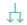

# Introdução ao BI Financeiro

  
  <h6>Imagem 1: Painel Financeiro</h6>

Um relatório de Business Intelligence (BI) focado em Fluxo de Caixa é fundamental para oferecer uma visão clara e detalhada da saúde financeira de uma empresa. Esse tipo de relatório proporciona uma análise aprofundada das entradas e saídas de caixa, permitindo uma gestão eficaz do fluxo de caixa, comparações detalhadas entre receitas e despesas e a avaliação do desempenho financeiro ao longo do tempo. Com visualizações precisas e detalhadas, é possível identificar tendências, monitorar variações e tomar decisões informadas para otimizar a gestão de caixa e melhorar a rentabilidade da empresa.

Uma das principais vantagens dos relatórios de Fluxo de Caixa é a sua capacidade de atualização contínua. Isso garante que os dados estejam sempre atualizados, refletindo a realidade financeira atual da empresa. A atualização em tempo real ou com uma frequência definida permite que os gestores respondam rapidamente a mudanças no mercado ou nas operações da empresa, ajustando estratégias e ações conforme necessário.

Além disso, esses relatórios integram dados de várias fontes em um único painel, oferecendo uma visão holística e consolidada das finanças. Isso facilita a análise comparativa e a identificação de padrões e anomalias que podem não ser evidentes ao analisar dados isoladamente.

Os relatórios de Fluxo de Caixa também aprimoram a precisão e a consistência das informações financeiras, reduzindo o risco de erros manuais e inconsistências frequentemente encontrados em relatórios baseados em planilhas. Ferramentas de análise avançadas, como gráficos interativos e filtros dinâmicos, permitem explorar os dados de maneira mais detalhada e gerar insights mais profundos.

Em resumo, um relatório de Fluxo de Caixa bem estruturado oferece uma visão detalhada e atualizada da saúde financeira da empresa, facilitando a tomada de decisões estratégicas, melhorando a eficiência operacional e fortalecendo a capacidade da empresa de se adaptar e prosperar em um ambiente de negócios em constante mudança.

## Barra de Menu

  
  <h6>Imagem 2: Barra de Menu</h6>

A barra de menu é uma ferramenta de navegação situada no lado esquerdo de todas as páginas do relatório. Ela oferece acesso direto e conveniente a diferentes seções e páginas detalhadas do relatório, facilitando a navegação eficiente entre várias áreas de análise e insights. A barra de menu é projetada para ajudar os usuários a encontrar rapidamente as informações desejadas, e o botão da página atual será destacado para indicar a seção em que o usuário está localizado.

Aqui está uma visão geral dos botões disponíveis na barra de menu:

### Botão Painel Financero

<h6>Esquerda: Página atual, Direita: Página disponível</h6>
Este botão retorna os usuários à página principal, chamada "Painel Financeiro". Esta página serve como o ponto central de partida, proporcionando uma visão geral abrangente e facilitando a navegação para outras seções do relatório.

  
### Botão A Receber

<h6>Esquerda: Página atual, Direita: Página disponível</h6>
Ao clicar neste botão, os usuários são direcionados para a página "A Receber". Esta página oferece visualizações e análises detalhadas sobre os valores que a empresa ainda precisa receber.
  
### Botão A Pagar

<h6>Esquerda: Página atual, Direita: Página disponível</h6>
Ao clicar neste botão, os usuários são levados à página "A Pagar". Nesta seção, eles podem visualizar e analisar as obrigações financeiras que a empresa ainda precisa quitar.
  
###  Botão Inadimplência

<h6>Esquerda: Página atual, Direita: Página disponível</h6>
Ao selecionar este botão, os usuários são direcionados para a página "Inadimplência". Nesta seção, eles encontrarão insights detalhados sobre pagamentos em atraso que ainda não foram recebidos.
  
### Botão Pagamentos Vencidos

<h6>Esquerda: Página atual, Direita: Página disponível</h6>
Selecionar este botão direciona os usuários para a página "Pagamentos Vencidos". Nesta seção, são fornecidos insights detalhados sobre pagamentos que já passaram da data de vencimento e ainda não foram quitados.
  
### Botão Painel de Recebimentos Realizados

<h6>Esquerda: Página atual, Direita: Página disponível</h6>
Clicar neste botão leva os usuários à página "Painel de Recebimentos Realizados". Nessa página, é possível visualizar a média de dias necessários para receber os pagamentos dos clientes.

  
### Botão Painel de Pagamentos Realizados

<h6>Esquerda: Página atual, Direita: Página disponível</h6>
Este botão direciona os usuários para a página "Painel de Pagamentos Realizados", onde podem visualizar o número médio de dias necessários para realizar os pagamentos aos fornecedores.
  
### Botão Fluxo de Caixa

<h6>Esquerda: Página atual, Direita: Página disponível</h6>
Selecionar este botão direciona o usuário para a página "Fluxo de Caixa", onde é possível visualizar a movimentação financeira detalhada de cada conta, organizada por mês e ano.

## Filtros

  
  <h6>Imagem 3: Filtros Visão 1</h6>

  
  <h6>Imagem 4: Filtros Visão 2</h6>

Os filtros são ferramentas essenciais que permitem ajustar a visualização dos dados em todas as páginas do relatório de forma dinâmica e sincronizada.

Ao modificar qualquer filtro, todos os gráficos, tabelas e outros elementos visuais do relatório são atualizados automaticamente para mostrar apenas os dados que correspondem ao critério selecionado.

Esses filtros são configurados com base nos dados da empresa, permitindo filtragens por áreas específicas, como projeto ou filial. Por exemplo, se você deseja analisar os dados de um projeto específico, como "Novo Edifício", basta selecioná-lo no filtro. A partir desse momento, todas as visualizações em cada página do relatório serão atualizadas para mostrar apenas os dados relacionados a esse projeto.

###	Filial

Este filtro permite refinar os dados com base em uma filial específica da empresa. Ao selecionar uma filial, todos os visuais em todas as páginas do relatório serão atualizados para exibir informações exclusivamente relacionadas a essa unidade. Isso facilita a análise detalhada do desempenho e dos resultados de diferentes unidades de negócios ou localizações, permitindo uma visão mais clara e direcionada dos dados de cada filial.

###	Projeto

O filtro de projeto permite a seleção e filtragem dos dados por projetos específicos. Ao escolher um projeto, o relatório ajusta todos os visuais para exibir somente as informações relacionadas a esse projeto. Isso facilita uma análise detalhada dos custos, receitas e outros indicadores associados, oferecendo uma visão clara e focada do desempenho e dos resultados de cada projeto.

###	Ano

O filtro de ano permite escolher o ano específico para análise. Ao aplicar esse filtro, todos os visuais nas páginas do relatório são ajustados para exibir dados exclusivamente do ano selecionado. Isso facilita a comparação e análise de tendências anuais, proporcionando uma visão clara das variações e padrões ao longo do tempo.

###	Mês

Este filtro permite selecionar um mês específico para análise. Ao escolher um mês, todos os visuais no relatório são atualizados para exibir exclusivamente os dados desse período. Isso facilita a análise mensal e a identificação de variações sazonais, proporcionando uma visão detalhada das tendências e mudanças ao longo do ano.

###	Conta

Este filtro está disponível apenas nas páginas Home e Fluxo de Conta e permite visualizar os resultados de acordo com contas específicas. Ele oferece um acesso facilitado a dados detalhados de cada conta, sendo especialmente útil para o planejamento e análise das movimentações financeiras de contas individuais.

###	Limpar filtros

Para restabelecer a visualização completa dos dados e remover todos os filtros aplicados, use o botão "Limpar filtros", que está localizado no lado direito dos filtros. Este botão remove todos os critérios de filtragem, permitindo uma visão geral completa e não filtrada dos dados.

## Ícones de Cabeçalho

  
  <h6>Imagem 4: Ícones de Cabeçalho</h6>

Quando um visual é selecionado ou o mouse passa sobre ele, ícones de cabeçalho podem aparecer no canto superior direito da janela visual. Esses ícones dependem do tipo de visual, do conteúdo do visual e das opções selecionadas em relação aos ícones de cabeçalho na criação.

Neste relatório, os ícones de cabeçalho mais úteis são "Fazer drill up" e "Ir para o próximo nível na hierarquia", que ajudam a facilitar a troca entre níveis como cliente ou projeto.

Abaixo estão as opções que um usuário pode ver, o que elas significam e como usá-las.

### Fazer drill on Linhas ou Colunas

Isso altera o drill down para as linhas ou colunas em uma tabela, por exemplo, os cabeçalhos das colunas têm anos e meses, você pode selecionar colunas, permitindo que você faça drill up apenas para os anos, down apenas para os meses ou expanda para ver o ano e o mês como cabeçalhos de coluna. Da mesma forma, se você selecionar linhas, poderá navegar pela hierarquia das linhas.

### Fazer drill up

Usar o botão fazer drill up move você para cima um degrau na hierarquia. Se o visual tiver opções como cliente, origem, filial e projeto e você estiver na filial, ao clicar neste botão ele exibirá a origem.

### Clique aqui parahabilitar o Drill down

Este botão não é necessário para nossos relatórios, ele habilita os recursos de detalhamento, mas eles são predefinidos na criação.

### Ir para o próximo nível na hierarquia

Há uma grande diferença entre este botão e o botão de expansão. Para este botão, você irá para o próximo nível da hierarquia. Por exemplo, se tiver uma hierarquia de cliente, origem, filial e projeto e você estiver em cliente, quando clicar neste botão, você exibirá origem no visual e não verá mais cliente. Se você tinha uma hierarquia de ano, mês e estava em ano no visual, clicar neste botão exibirá apenas o mês - sem dividi-lo por ano.
Clicar aqui quando estiver no nível superior desabilitará a opção de usar o botão "Expandir todo o campo um nível abaixo ne hierarquia" nos próximos níveis.

### Expandir todo o campo um nível abaixo ne hierarquia

Este botão habilita a expansão dos dados no visual. Em vez de mover para baixo na hierarquia, usar este botão fará com que o próximo nível apareça como subcategorias do nível acima. Por exemplo, se você tiver uma hierarquia de ano e mês e estiver no ano, ao clicar neste botão, você exibirá o ano e os meses dentro daquele ano no visual. Ou se você tivesse uma hierarquia de cliente, origem, filial e projeto e estivesse no cliente, você veria a origem exibida como subcategorias para cada cliente. 
Clicar aqui quando estiver no nível superior desabilitará a opção de usar o botão "Ir para o próximo nível na hierarquia" nos próximos níveis.

### Filtros e segmentações afetando este visual

Informa quais filtros estão impactando o visual no momento.

### Modo de foco

Abre o modo de foco, que é uma nova página com apenas o visual selecionado, dando mais espaço ao visual.

### Mais opções

Este botão abre um menu com mais opções como Pesquisar, Exportar dados, Mostrar como tabela, Remover, Destacar e Classificar.
Nem todas essas opções estarão disponíveis em todos os visuais.
