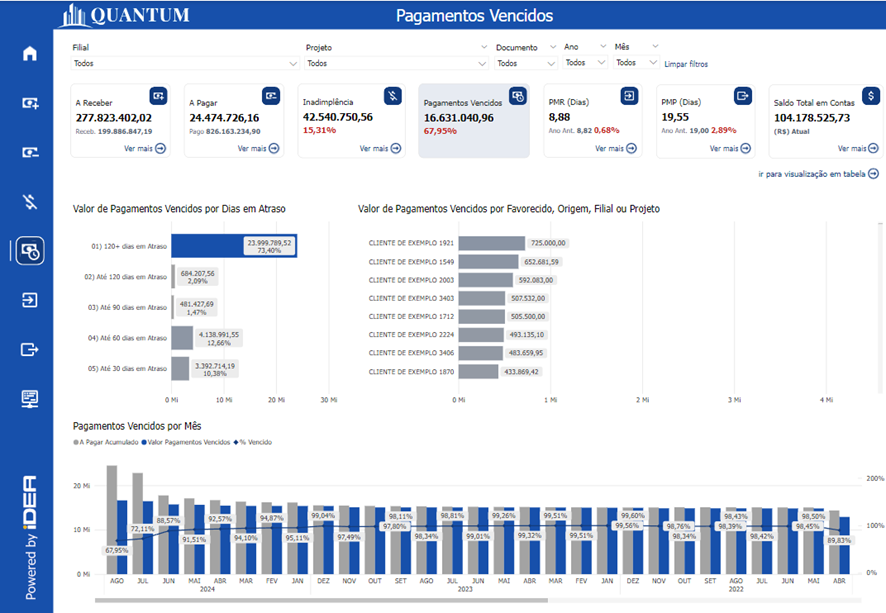
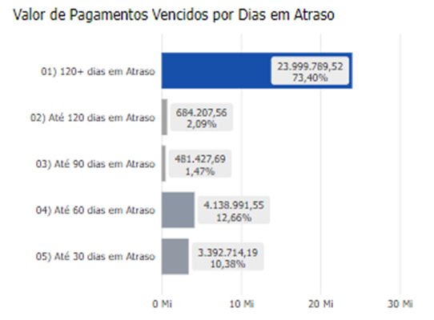
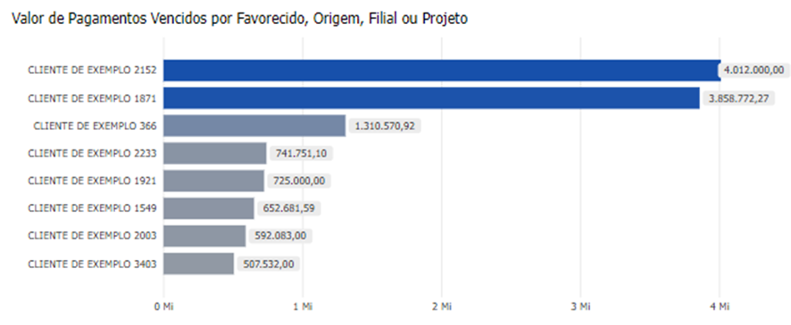
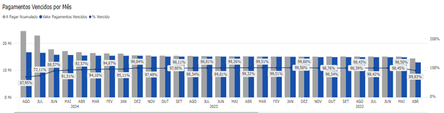

# Painel Pagamentos Vencidos

<h6 align = "center"> Imagem 1: Painel Visão geral do relatório</h6>

## O que são Pagamentos Vencidos?

Pagamentos vencidos são obrigações financeiras que ultrapassaram a data de vencimento estabelecida para o pagamento. Isso indica que a empresa ou o indivíduo não efetuou o pagamento no prazo acordado com o fornecedor, credor ou qualquer outra parte envolvida.

No BI, esses pagamentos podem ser monitorados para garantir que a empresa esteja ciente das dívidas em atraso e possa tomar as medidas necessárias para regularizá-las.

## Características dos Pagamentos Vencidos:

- **Multas e Juros:** Pagamentos vencidos podem gerar multas, juros e outras penalidades, conforme os termos contratuais acordados.
- **Impacto no Crédito**: O não pagamento pontual pode afetar a credibilidade e a classificação de crédito de empresas e indivíduos, dificultando futuras negociações ou a obtenção de crédito.
- **Relações com Fornecedores**: Dívidas em atraso podem prejudicar relações com fornecedores, resultando em restrições de crédito, interrupção de serviços ou fornecimento de produtos.
- **Impacto no Fluxo de Caixa**: A acumulação de pagamentos vencidos pode criar problemas de fluxo de caixa, afetando a capacidade da empresa de cumprir outras obrigações financeiras.
- **Monitoramento e Gestão**: É crucial que as empresas monitorem de perto os pagamentos vencidos para evitar consequências financeiras e operacionais graves.

Em resumo, pagamentos vencidos indicam que a empresa não está cumprindo com suas obrigações financeiras de forma adequada, o que pode ter várias consequências negativas. Muitas vezes, isso ocorre porque o gestor não possui uma ferramenta eficaz para monitorar esses pagamentos. O BI Financeiro, com seus gráficos, auxilia o gestor na identificação de pagamentos vencidos e na tomada de decisões apropriadas.

## Gráfico Aging

<h6 align = "center"> Imagem 2: Gráfico de Aging</h6>

O Gráfico Aging é uma ferramenta visual que organiza e exibe as contas a pagar da empresa, com foco específico nas obrigações financeiras em atraso. Esse gráfico é amplamente utilizado para monitorar a idade das dívidas e priorizar os pagamentos com base no tempo de atraso.

### Importância do Gráfico Aging nos Pagamentos Vencidos

**-	Priorizar Pagamentos**: Facilita a identificação rápida dos pagamentos vencidos mais urgentes, permitindo uma gestão eficiente do fluxo de caixa.
**-	Análise de Risco**: Avalia o risco associado aos pagamentos vencidos, especialmente se houver grandes montantes em atraso por períodos prolongados.
**-	Melhoria das Relações com Fornecedores**: Monitorar e regularizar pagamentos vencidos melhora as relações com fornecedores, evitando interrupções no fornecimento ou termos desfavoráveis em negociações futuras.
**-	Decisões Estratégicas**: Oferece informações críticas para decisões estratégicas, como renegociação de prazos de pagamento, busca de crédito adicional ou ajustes no planejamento financeiro.

## Gráfico Valor de Pagamentos Vencidos por Favorecido, Origem, Filial ou Projeto

<h6 align = "center"> Imagem 3: Gráfico Valor de Pagamentos Vencidos por Favorecido, Origem, Filial ou Projeto</h6>

Este gráfico detalha os pagamentos em atraso, categorizando-os conforme variáveis como favorecido, origem, filial ou projeto. Oferece uma visão específica e segmentada dos valores devidos, facilitando a análise e a priorização de ações corretivas.

### Importância e Uso

-	**Análise Detalhada**: Permite uma análise detalhada das dívidas vencidas, identificando áreas críticas e ajudando a priorizar pagamentos.
-	**Tomada de Decisão**: Fornece informações para decisões mais informadas sobre como lidar com pagamentos vencidos, seja por renegociação, priorização de recursos ou ajustes no fluxo de caixa.
-	**Gestão de Relacionamento**: Facilita o gerenciamento de fornecedores ou projetos com grandes valores em atraso, evitando impactos negativos nas operações ou nas relações comerciais.

## Gráfico de Pagamentos Vencidos por Mês

<h6 align = "center"> Imagem 4: Gráfico de Pagamentos Vencidos por mês</h6>

O Gráfico de Pagamentos Vencidos por Mês organiza dados de pagamentos atrasados em uma tabela que combina elementos gráficos tradicionais. Esse formato permite uma análise detalhada, com dados distribuídos em células para uma visualização mensal das obrigações financeiras vencidas.

Esse gráfico é uma ferramenta poderosa para análise financeira, permitindo à equipe ou ao gestor monitorar e gerenciar pagamentos em atraso de forma organizada e eficiente. Ao visualizar os dados em uma estrutura de grid, os gestores podem tomar decisões mais precisas e focadas na resolução de problemas de inadimplência.
