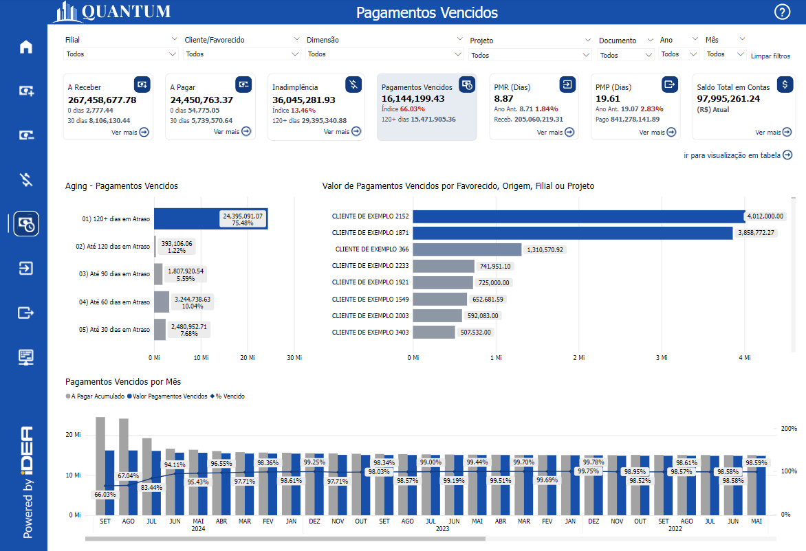
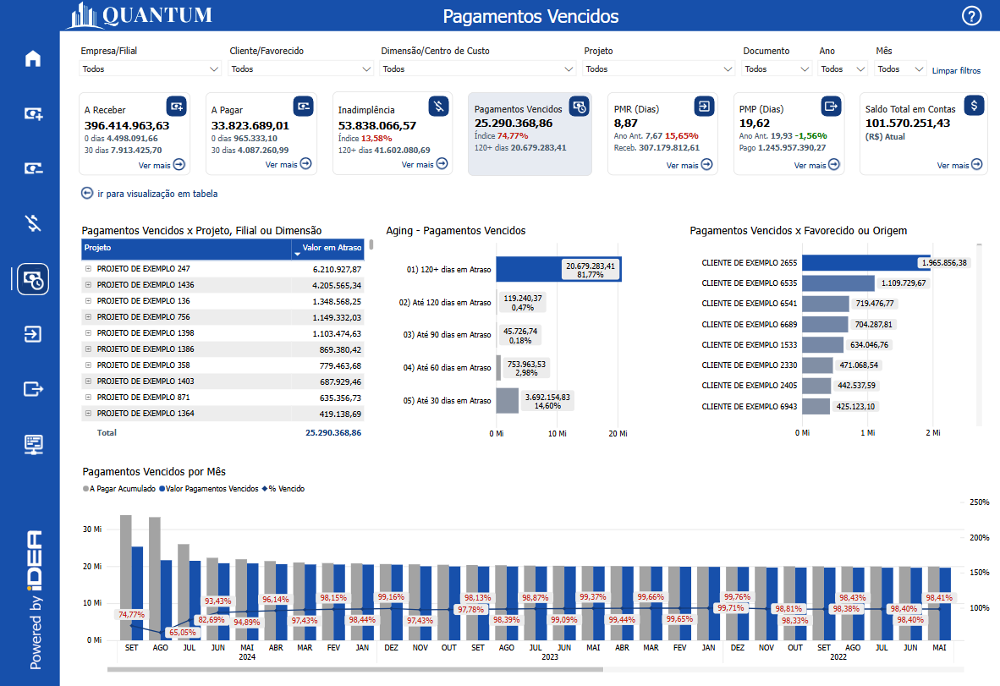
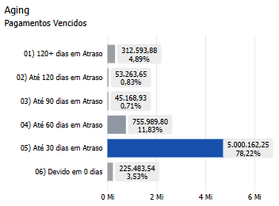
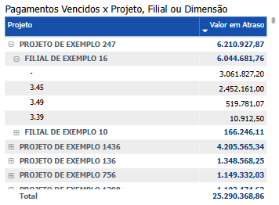
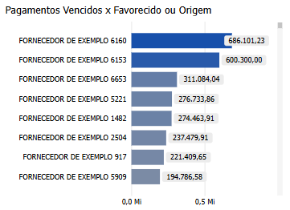
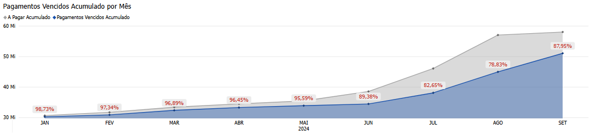
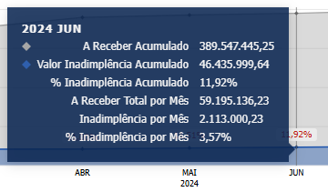

# Painel Pagamentos Vencidos

  
  <h6>Imagem 1: Painel Pagamentos Vencidos - Visão Gráfico</h6>

  
  <h6>Imagem 2: Painel Pagamentos Vencidos - Visão de Tabela</h6>

## Navegação

Este painel de relatório está dividido em duas visualizações;

- **[Visão Gráfica](https://idea-technology-it.github.io/docs-idea/financeiro/pagamentos_vencidos/#visao-grafica)** - pode ser navegada através do [botão](https://idea-technology-it.github.io/docs-idea/financeiro/intro/#botoes-para-diferentes-visoes) "ir para visualização em gráfico".
- **[Visão de tabela](https://idea-technology-it.github.io/docs-idea/financeiro/pagamentos_vencidos/#visao-de-tabela)** - pode ser navegada através do [botão](https://idea-technology-it.github.io/docs-idea/financeiro/intro/#botoes-para-diferentes-visoes) "ir para visualização em tabela".

## Informações no Painel Pagamentos Vencidos

### Valor de Pagamentos Vencidos

Pagamentos vencidos são obrigações financeiras que ultrapassaram a data de vencimento estabelecida para o pagamento. Isso indica que a empresa ou o indivíduo não efetuou o pagamento no prazo acordado com o fornecedor, credor ou qualquer outra parte envolvida.

Os pagamentos vencidos representam um desafio significativo para a saúde financeira e operacional de qualquer empresa. Quando um pagamento não é realizado no prazo acordado, as consequências podem se espalhar por várias áreas do negócio, afetando não apenas as finanças imediatas, mas também a relação com fornecedores e a reputação da empresa no mercado. O atraso nos pagamentos pode levar a acréscimos em multas e juros, prejudicar a classificação de crédito, e deteriorar relações comerciais essenciais. Além disso, a acumulação de dívidas vencidas pode causar problemas graves de fluxo de caixa, comprometendo a capacidade da empresa de atender a outras obrigações financeiras. Diante desses riscos, é crucial que as empresas implementem práticas eficazes de monitoramento e gestão dos pagamentos vencidos para evitar impactos negativos e garantir a continuidade e a saúde de suas operações. A seguir, detalhamos as implicações dos pagamentos vencidos e a importância de uma gestão proativa para minimizar seus efeitos adversos.

**Multas e Juros:** Quando os pagamentos não são realizados no prazo, eles frequentemente geram multas, juros e outras penalidades, conforme estipulado pelos termos contratuais acordados. Esses custos adicionais podem aumentar rapidamente, transformando uma dívida administrável em um ônus financeiro significativo. Quanto mais prolongado o atraso, maiores podem se tornar essas penalidades, pressionando ainda mais os recursos da empresa e potencialmente levando a disputas legais.

**Impacto no Crédito:** Pagamentos pontuais são essenciais para manter uma boa classificação de crédito. O não cumprimento dos prazos de pagamento pode impactar severamente a credibilidade, tanto de empresas quanto de indivíduos. Uma classificação de crédito prejudicada pode dificultar a obtenção de empréstimos ou a negociação de termos favoráveis em transações futuras. Isso não só dificulta a obtenção de crédito, mas também afeta a reputação geral e a confiança perante instituições financeiras e parceiros de negócios.

**Relacionamento com Fornecedores:** Dívidas em atraso podem prejudicar o relacionamento com os fornecedores, que podem responder impondo restrições de crédito ou até mesmo interrompendo o fornecimento de bens ou serviços. Isso pode interromper cadeias de suprimento, levando a atrasos operacionais e custos adicionais enquanto as empresas procuram fornecedores alternativos. Manter bons relacionamentos com os fornecedores é crucial para a continuidade dos negócios, e os pagamentos em atraso podem rapidamente minar essas relações.

**Impacto no Fluxo de Caixa:** O acúmulo de pagamentos em atraso pode criar problemas significativos de fluxo de caixa, colocando em risco a capacidade da empresa de cumprir suas outras obrigações financeiras. Sem um fluxo constante e previsível de recursos, as empresas podem ter dificuldade em pagar salários, reinvestir em suas operações ou cobrir despesas essenciais. Com o tempo, essa pressão no fluxo de caixa pode levar a dificuldades financeiras mais severas, potencialmente ameaçando a sobrevivência da empresa.

**Monitoramento e Gestão:** É vital que as empresas monitorem e gerenciem de perto os pagamentos em atraso para evitar consequências financeiras e operacionais graves. O monitoramento proativo permite uma intervenção precoce, como a negociação de planos de pagamento ou a tomada de medidas legais, se necessário. A gestão eficaz dos pagamentos em atraso garante que a empresa mantenha sua saúde financeira, sustente suas operações e preserve seus relacionamentos com credores, fornecedores e outras partes interessadas. Revisões regulares e planejamento estratégico podem ajudar a mitigar os riscos associados aos pagamentos em atraso e proteger a viabilidade a longo prazo da empresa.

Em resumo, pagamentos vencidos indicam que a empresa não está cumprindo com suas obrigações financeiras de forma adequada, o que pode ter várias consequências negativas. Muitas vezes, isso ocorre porque o gestor não possui uma ferramenta eficaz para monitorar esses pagamentos. O BI Financeiro, auxilia o gestor na identificação de pagamentos vencidos e na tomada de decisões apropriadas.

### % de Pagamentos Vencidos

A porcentagem (%) de Pagamentos Vencidos é uma métrica essencial para a gestão financeira, pois oferece uma visão clara da representatividade de cada categoria (como Filial, Fornecedor, Projeto, Dimensão ou Origem) em relação ao total de pagamentos que estão em atraso. Essa métrica ajuda as empresas a identificar quais áreas ou fornecedores estão gerando os maiores volumes de pagamentos vencidos, facilitando a priorização de quitações e a melhor gestão do fluxo de caixa. Além de mostrar os valores absolutos, a porcentagem de pagamentos vencidos destaca a relevância de cada componente, permitindo decisões estratégicas sobre renegociações de prazos, alocação de recursos e ajustes nos processos de pagamento. A análise percentual também é valiosa para acompanhar o comportamento dos pagamentos em atraso ao longo do tempo, ajudando a identificar tendências, como o aumento ou a redução da participação de determinados fornecedores ou áreas nos valores vencidos, o que permite à empresa se planejar melhor e manter um controle financeiro mais eficiente.

### Índice de Pagamentos Vencidos (%)

O Índice de Pagamentos Vencidos (%) é uma métrica essencial para a gestão financeira e a saúde econômica de uma empresa. Este índice reflete a porcentagem de pagamentos que estão vencidos em relação ao total de pagamentos devidos, oferecendo uma visão clara da eficácia na gestão de contas a pagar e no controle de obrigações financeiras. Um índice de pagamentos vencidos elevado pode indicar problemas na capacidade de cumprir com as obrigações financeiras dentro dos prazos estabelecidos, o que pode afetar o fluxo de caixa e a estabilidade financeira da empresa. Monitorar e analisar esse índice permite identificar padrões de atraso, ajustar políticas de pagamento e melhorar a gestão das contas a pagar. Além disso, um controle eficaz dos pagamentos vencidos contribui para uma melhor previsão de fluxo de caixa e ajuda na tomada de decisões estratégicas, como a revisão de prazos de pagamento e a alocação de recursos para evitar multas e penalidades. Em resumo, o Índice de Pagamentos Vencidos (%) é crucial para manter a saúde financeira da empresa, minimizar riscos e garantir a sustentabilidade financeira a longo prazo.

No contexto deste relatório, o valor de referência para o Índice de Pagamentos Vencidos é inferior a 10%, uma vez que este é frequentemente considerado favorável. Você verá a cor do texto deste Indicador ficar vermelho quando estiver acima de 10% e verde quando estiver abaixo. Esta baixa percentagem indica que uma pequena proporção das contas a pagar está vencida, sugerindo uma gestão eficiente dos pagamentos e uma boa capacidade de cumprimento das obrigações financeiras. Manter um índice baixo é benéfico porque reflete um fluxo de caixa saudável, risco reduzido de multas e penalidades, e práticas de pagamento eficazes.

Ao utilizar filtros ou clicar em pontos de dados nas visualizações deste painel, o Índice de Pagamentos Vencidos (%) será ajustado automaticamente para refletir apenas os dados relevantes à seleção feita. Isso permite uma análise mais detalhada e personalizada, ajudando a focar em segmentos específicos, como determinados períodos, projetos ou fornecedores. Com essa interatividade, você pode explorar como diferentes variações ou índices afetam o panorama geral e obter insights mais precisos sobre a gestão dos pagamentos vencidos em diferentes contextos.

## Visão Gráfica e Tabela

### Aging - Pagamentos Vencidos

  
  <h6>Imagem 3: Aging - Pagamentos Vencidos</h6>

O gráfico de barras divide os pagamentos vencidos em 5 categorias, começando pelo valor que está em atraso por mais de 120 dias e diminuindo em intervalos de 30 dias, terminando com qualquer valor em atraso por até 30 dias. Além disso, ele inclui um rótulo de detalhes que mostra a porcentagem do total de pagamentos vencidos em cada categoria.

Este visual fornece uma visão clara e concisa do status dos pagamentos vencidos, complementando o gráfico [Aging - Pagamentos Vencidos](https://idea-technology-it.github.io/docs-idea/financeiro/pagamentos_vencidos/#aging-pagamentos-vencidos). Ele facilita a identificação das áreas mais críticas e permite que a gestão avalie rapidamente quais segmentos dos recebimentos estão mais propensos a se tornarem incobráveis. Os rótulos de detalhes com a porcentagem do total de pagamentos vencidos em cada categoria oferecem uma visão adicional sobre a distribuição do risco.

Por exemplo, uma alta porcentagem de pagamentos vencidos na categoria "mais de 120 dias" pode indicar um problema significativo de cobrança que necessita de atenção imediata, enquanto uma concentração maior na categoria "até 30 dias" pode sugerir atrasos recentes que são mais gerenciáveis. Essa categorização ajuda a priorizar os esforços de cobrança e a tomar decisões estratégicas sobre políticas de crédito e gerenciamento de relacionamento com clientes.

No geral, o gráfico destaca onde é necessário focar mais atenção e permite a implementação de ações direcionadas para melhorar o fluxo de caixa e reduzir o risco financeiro associado aos pagamentos vencidos.

Sem aplicar nenhum filtro, o gráfico representa o valor total dos pagamentos vencidos. No entanto, ao utilizar filtros por filial ou projeto, é possível gerenciar áreas específicas dentro do negócio. Além disso, a interação entre os gráficos é bidirecional: ao clicar em outro visual na página, como uma tabela de recebimentos, este gráfico de barras será automaticamente filtrado com base na seleção feita. Da mesma forma, ao selecionar uma barra neste gráfico, ele filtrará os outros visuais, permitindo uma análise interativa e detalhada que facilita a compreensão dos dados e a tomada de decisões informadas.

Embora compacto, este gráfico é muito funcional, especialmente quando combinado com o gráfico [Aging - Pagamentos Vencidos](https://idea-technology-it.github.io/docs-idea/financeiro/pagamentos_vencidos/#aging-pagamentos-vencidos), permitindo ações como:

- Identificar contas problemáticas e priorizar intervenções para lidar com os pagamentos vencidos mais significativos, reduzindo o impacto geral da inadimplência no negócio,
- Aprimorar estratégias de cobrança concentrando esforços nas categorias de maior risco, aumentando a probabilidade de recuperar valores vencidos e melhorando o fluxo de caixa,
- Avaliar a solvência dos clientes com base no comportamento de pagamento, ajustando os termos de crédito para mitigar riscos futuros associados a pagamentos atrasados,
- Melhorar a previsão e o planejamento financeiro analisando tendências de pagamentos vencidos, ajudando a antecipar desafios de fluxo de caixa e alocar recursos de forma eficaz,
- Reduzir o risco financeiro gerenciando proativamente os pagamentos vencidos, o que pode fortalecer os relacionamentos com os clientes e potencialmente incentivar pagamentos mais pontuais no futuro, diminuindo a incidência de dívidas incobráveis.

### Pagamentos Vencidos por Filial, Projeto, Dimensão, Origem ou Favorecido

  
  <h6>Imagem 3: Pagamentos Vencidos por Filial, Projeto, Dimensão, Origem ou Favorecido</h6>

Uma matriz exibindo os valores de Pagamentos Vencidos por Filial, Projeto, Dimensão, Origem ou Favorecido é uma ferramenta essencial para análise financeira e tomada de decisões estratégicas. Ao organizar os valores de pagamentos vencidos com base nessas categorias específicas, a matriz permite que os stakeholders identifiquem rapidamente onde os níveis de vencimento estão concentrados e monitorem quais favorecidos, origens ou projetos apresentam maiores atrasos. Essa visualização detalhada é crucial para uma gestão eficaz do fluxo de caixa, destacando as áreas com maior volume de pagamentos vencidos e ajudando a direcionar ações corretivas para minimizar impactos financeiros.

A matriz exibe o valor total de pagamentos vencidos e a porcentagem (%) de pagamentos vencidos em relação ao total, proporcionando uma visão clara da contribuição de cada categoria para o total de pagamentos vencidos. Esses indicadores ajudam a priorizar áreas que necessitam de maior atenção, permitindo ajustes rápidos e eficazes nas estratégias de cobrança. As barras de dados em azul claro atrás dos valores na matriz atuam como um auxílio visual importante para a comparação. Elas oferecem um contexto visual imediato para os valores exibidos, destacando a magnitude relativa de cada categoria. Esse contraste entre as barras de dados e os valores facilita a visualização das diferenças e semelhanças entre os itens, permitindo que os stakeholders identifiquem rapidamente quais categorias apresentam maiores ou menores níveis de pagamentos vencidos em relação ao total. A representação visual aprimorada ajuda a interpretar os dados de maneira mais intuitiva, transformando informações complexas em insights visualmente acessíveis e compreensíveis.

Além disso, a interação entre os gráficos é **bidirecional**: ao clicar em outro visual na página, como o gráfico [Aging - Pagamentos Vencidos](https://idea-technology-it.github.io/docs-idea/financeiro/pagamentos_vencidos/#aging-pagamentos-vencidos), esta matriz será automaticamente filtrada com base na seleção feita. Da mesma forma, ao selecionar um item nesta matriz, ela filtrará os outros visuais, como gráficos de barras ou tabelas, permitindo uma análise interativa e detalhada que facilita a compreensão dos dados e a tomada de decisões informadas. Esse comportamento dinâmico cria uma experiência integrada, onde os usuários podem explorar os dados de forma fluida, investigando correlações e entendendo como diferentes categorias impactam os pagamentos vencidos.

A matriz também oferece a funcionalidade de expandir ou recolher hierarquias. Ao clicar no sinal de mais (+) ao lado de uma Filial ou Projeto, por exemplo, a tabela se expande para mostrar os valores de pagamentos vencidos associados às Dimensões, Origens ou Favorecidos correspondentes. Essa visão hierárquica permite uma análise mais detalhada e segmentada, facilitando o acompanhamento das contribuições individuais para o total de pagamentos vencidos. Da mesma forma, os usuários podem recolher a hierarquia clicando no sinal de menos (-), facilitando a navegação quando uma visão mais geral for suficiente.

Além disso, a seleção de cabeçalhos de linha nesta matriz permite criar várias combinações com outra matriz de [Pagamentos Vencidos por Favorecido, Origem, Projeto, Dimensão ou Filial](https://idea-technology-it.github.io/docs-idea/financeiro/pagamentos_vencidos/#pagamentos-vencidos-por-favorecido-origem-projeto-dimensão-ou-filial), aumentando ainda mais a flexibilidade da análise. A possibilidade de escolher diferentes cabeçalhos de linha em cada matriz facilita a identificação de combinações relevantes, ajudando a visualizar as relações mais importantes para a análise de pagamentos vencidos. Por exemplo, o usuário pode optar por visualizar **Filial** nesta matriz e **Favorecido** na segunda, ou **Projeto** aqui e **Origem** na outra, ajustando as tabelas conforme o contexto da análise.

Com a exibição clara dos valores absolutos de pagamentos vencidos e suas respectivas porcentagens, além da capacidade de explorar essas relações hierárquicas e combinações de forma interativa, a matriz de **Pagamentos Vencidos por Filial, Projeto, Dimensão, Origem ou Favorecido** se torna uma ferramenta indispensável para a gestão financeira. Ela proporciona uma navegação eficiente em grandes volumes de dados e facilita interações entre múltiplos visuais, ajudando os tomadores de decisão a focar nos pontos críticos e a otimizar a saúde financeira da organização.

Para navegar entre os níveis, você pode usar os [ícones de cabeçalho](https://idea-technology-it.github.io/docs-idea/financeiro/intro/#icones-de-cabecalho) que estão disponíveis quando você passa o mouse ou clica no gráfico.

  
  <h6>Ícones de Cabeçalho</h6>

Aqui, você pode navegar entre diferentes níveis hierárquicos, como Projeto, Filial ou Dimensão, para analisar a área desejada.

### Pagamentos Vencidos por Favorecido, Origem, Projeto, Dimensão ou Filial

  
  <h6>Imagem 4: Pagamentos Vencidos por Favorecido, Origem, Projeto, Dimensão ou Filial</h6>

Uma matriz exibindo os valores de **Pagamentos Vencidos por Favorecido, Origem, Projeto, Dimensão ou Filial** é uma ferramenta essencial para análise financeira e tomada de decisões estratégicas. Ao organizar os pagamentos vencidos com base nessas categorias específicas, a matriz permite que os stakeholders identifiquem rapidamente onde os níveis de vencimento estão concentrados e monitorem os pagamentos pendentes de diferentes favorecidos, origens de receita ou projetos. Esse nível de detalhamento é crucial para uma gestão eficaz do fluxo de caixa, destacando as áreas que enfrentam maiores problemas de pagamento e ajudando a identificar riscos ou oportunidades de otimização financeira.

A matriz exibe tanto o valor total de pagamentos vencidos quanto a porcentagem (%) que cada favorecido, origem, projeto, dimensão ou filial representa no total, fornecendo uma visão clara da contribuição relativa de cada categoria para o total de pagamentos vencidos. Esses indicadores facilitam a priorização das áreas que demandam mais atenção, possibilitando ajustes mais rápidos e eficazes nas estratégias de cobrança e recuperação de crédito. As barras de dados em azul claro atrás dos valores na matriz atuam como um auxílio visual importante para a comparação. Elas oferecem um contexto visual imediato para os valores exibidos, destacando a magnitude relativa de cada categoria. Esse contraste entre as barras de dados e os valores facilita a visualização das diferenças e semelhanças entre os itens, permitindo que os stakeholders identifiquem rapidamente quais categorias têm maiores ou menores valores de pagamentos vencidos em comparação com o total. Ao criar uma base de referência visual, as barras de fundo ajudam a interpretar os dados de maneira mais intuitiva, tornando mais fácil detectar padrões, variações e tendências significativas. Essa representação visual aprimorada apoia a análise financeira ao transformar dados complexos em informações visualmente acessíveis e compreensíveis.

Além disso, a interação entre os gráficos é **bidirecional**: ao clicar em outro visual na página, como o gráfico [Aging - Pagamentos Vencidos](https://idea-technology-it.github.io/docs-idea/financeiro/pagamentos_vencidos/#aging-pagamentos-vencidos), esta matriz será automaticamente filtrada com base na seleção feita. Da mesma forma, ao selecionar um item nesta matriz, ela filtrará os outros visuais, como gráficos de barras ou tabelas, permitindo uma análise interativa e detalhada que facilita a compreensão dos dados e a tomada de decisões informadas. Esse comportamento dinâmico cria uma experiência integrada, onde os usuários podem explorar os dados de forma fluida, investigando correlações e entendendo como diferentes categorias impactam os pagamentos vencidos.

A matriz também oferece a funcionalidade de expandir e recolher hierarquias. Ao clicar no sinal de mais (+) ao lado de um Favorecido ou Origem, por exemplo, a tabela se expande para revelar os valores de pagamentos vencidos detalhados por Projeto, Dimensão ou Filial. Essa visão hierárquica permite uma análise mais aprofundada, facilitando o acompanhamento de cada favorecido ou projeto e sua respectiva contribuição para o total de pagamentos vencidos. Os usuários podem também recolher a hierarquia clicando no sinal de menos (-), permitindo uma navegação mais simplificada quando uma visão mais geral é suficiente.

A seleção de cabeçalhos de linha nesta matriz também permite combinações poderosas com a matriz de **Pagamentos Vencidos por Filial, Projeto, Dimensão, Origem ou Favorecido**, proporcionando ainda mais flexibilidade na análise. A capacidade de alternar entre diferentes combinações de cabeçalhos de linha em ambas as matrizes facilita a visualização de conexões relevantes entre favorecidos, projetos, filiais e dimensões. Por exemplo, o usuário pode optar por visualizar **Favorecido** nesta matriz e **Filial** na [outra](https://idea-technology-it.github.io/docs-idea/financeiro/pagamentos_vencidos/#pagamentos-vencidos-por-filial-projeto-dimensão-origem-ou-favorecido), ou explorar **Origem** aqui e **Projeto** na outra, ajustando as tabelas conforme as necessidades da análise.

Com a exibição clara dos valores absolutos de pagamentos vencidos e suas respectivas porcentagens, além da capacidade de explorar as relações hierárquicas e combinações de forma interativa, a matriz de **Pagamentos Vencidos por Favorecido, Origem, Projeto, Dimensão ou Filial** se torna uma ferramenta indispensável para a gestão financeira. Ela proporciona uma navegação eficiente em grandes volumes de dados e facilita interações com múltiplos visuais, ajudando os tomadores de decisão a focar nos principais pontos críticos e a otimizar o desempenho financeiro da organização.

Para navegar entre os níveis, você pode usar os [ícones de cabeçalho](https://idea-technology-it.github.io/docs-idea/financeiro/intro/#icones-de-cabecalho) que estão disponíveis quando você passa o mouse ou clica no gráfico.

  
  <h6>Ícones de Cabeçalho</h6>

Aqui, você pode navegar entre as opções de Favorecido ou Origem, permitindo que você explore e analise a área específica de interesse com mais profundidade.

## Visão Gráfica

### Pagamentos Vencidos Acumulado por Mês

  
  <h6>Imagem 5: Pagamentos Vencidos por Mês</h6>

O gráfico ilustra os pagamentos vencidos por mês e ano, destacando três elementos principais:

- **A Pagar Acumulado:** Este representa o valor total acumulado que a empresa deve pagar ao longo dos meses. Essa métrica é crucial, pois fornece uma visão geral das saídas de caixa potenciais. Ao rastrear os pagamentos acumulados, a empresa pode monitorar a saúde geral de suas obrigações financeiras e antecipar o momento dos desembolsos. Isso é essencial para o planejamento financeiro, garantindo que o negócio tenha os recursos necessários para cumprir com suas responsabilidades sem comprometer sua liquidez.

- **Pagamentos Vencidos Acumulado:** Mostra o valor acumulado de pagamentos vencidos em cada mês, indicando o montante total que não foi pago dentro do prazo acordado. Monitorar o valor dos pagamentos vencidos acumulados é vital para identificar tendências de atrasos e possíveis problemas com fornecedores ou períodos específicos. Uma tendência crescente de pagamentos vencidos pode sinalizar dificuldades de fluxo de caixa, ineficiências no processo de aprovação de pagamentos ou a necessidade de reavaliar o ciclo de pagamentos da empresa. Compreendendo quando e por que os pagamentos se tornam vencidos, a empresa pode tomar medidas proativas, como renegociar prazos ou ajustar suas políticas de pagamento para evitar maiores consequências.

- **% Pagamentos Vencidos Acumulado:** O texto mostra a taxa percentual de pagamentos vencidos em relação aos pagamentos acumulados. Essa porcentagem fornece uma visão clara e imediata da proporção de obrigações financeiras que estão atrasadas. Será vermelho quando estiver acima de 10% e verde quando estiver abaixo para maior clareza visual. Ao rastrear essa taxa ao longo do tempo, a gerência pode avaliar a eficácia de suas políticas de pagamento e tomar decisões informadas para ajustar suas estratégias, como negociar condições mais favoráveis com fornecedores ou priorizar certos pagamentos para evitar penalidades. Uma alta porcentagem de pagamentos vencidos pode indicar a necessidade de melhorar a gestão do fluxo de caixa ou renegociar termos com fornecedores, enquanto uma baixa porcentagem sugere que os processos atuais estão funcionando bem.

Juntos, esses três elementos fornecem uma visão abrangente da saúde financeira da empresa em relação aos seus passivos. O gráfico permite que a empresa identifique padrões de atrasos, avalie o impacto dos pagamentos vencidos no fluxo de caixa e tome decisões baseadas em dados para mitigar riscos financeiros. Por exemplo, se o gráfico mostrar um aumento significativo nos pagamentos vencidos em um mês específico, a empresa pode investigar as causas e implementar estratégias para evitar que isso ocorra novamente. Da mesma forma, ao comparar a porcentagem de pagamentos vencidos com os pagamentos acumulados, a gerência pode priorizar quais fornecedores ou contas exigem atenção imediata, garantindo que os recursos sejam alocados de forma eficiente para minimizar os impactos financeiros negativos. Em última análise, este gráfico é uma ferramenta essencial para otimizar o planejamento financeiro, melhorar a gestão do fluxo de caixa e manter uma operação financeira estável e saudável.

  

Na dica de ferramenta para este visual, você encontrará mais três valores. Eles são pensados como um insight adicional para os **pagamentos vencidos** ao longo do tempo. Esses valores são:

- **A Pagar Total por Mês:** Este número representa o valor total que era esperado para ser pago naquele mês. Ele inclui todas as contas ou obrigações financeiras que deveriam ter sido quitadas no período. Este valor fornece o contexto de quanto era previsto pagar no mês e serve como linha de base para avaliar o comportamento dos pagamentos. Entender isso ajuda os usuários a visualizar o volume de compromissos financeiros e fornece um ponto de referência claro ao analisar os pagamentos em atraso.

- **Pagamentos Vencidos por Mês:** Este número representa o valor total de pagamentos que não foram quitados até a data de vencimento para aquele mês específico. Ele mostra o nível de **pagamentos vencidos** que ocorreu em relação ao que era esperado para ser pago. Este valor é fundamental para identificar os meses em que houve maiores dificuldades em cumprir os prazos de pagamento e fornecer insights sobre como a gestão de pagamentos está sendo afetada ao longo do tempo.

- **% Pagamentos Vencidos por Mês:** Esta porcentagem mostra a proporção de **a pagar** (total de compromissos financeiros esperados) que não foi quitada no prazo, expressa como uma porcentagem do total. Este valor é crucial para avaliar a gravidade dos pagamentos vencidos em relação às obrigações gerais. Ele permite que os usuários acompanhem a eficiência no cumprimento dos prazos, comparem o desempenho entre períodos e tomem medidas corretivas para melhorar a saúde financeira da empresa.

## Visão de Tabela

### Tabela de Detalhes de Pagamentos Vencidos

  
  <h6>Imagem 6: Tabela de Detalhes de Pagamentos Vencidos</h6>

Este gráfico exibe uma tabela detalhada dos pagamentos vencidos, organizada por data de vencimento, oferecendo uma visão completa das transações em ordem cronológica. A tabela inclui várias colunas que fornecem informações cruciais sobre cada pagamento, desde o favorecido até o status atual e os documentos relacionados. Essa visão tabular permite à empresa analisar minuciosamente cada pagamento vencido, fornecendo todas as informações necessárias para o acompanhamento e a gestão eficaz das obrigações financeiras. Com esta estrutura, a empresa pode monitorar detalhadamente o fluxo de caixa e tomar decisões informadas sobre como lidar com pagamentos atrasados, garantindo que os riscos financeiros sejam mitigados e as relações com fornecedores sejam preservadas. A seguir, explicamos como interpretar cada coluna da tabela.

Esta tabela é essencial ao procurar detalhes sobre pagamentos devidos específicos. Pode ser filtrado usando [filtros](https://idea-technology-it.github.io/docs-idea/financeiro/intro/#filtros).

#### Favorecido
Esta coluna indica o favorecido específico que tem um valor a pagar, permitindo que você veja claramente quem são os favorecidos.
#### Origem
A origem da fatura, como "INSS Retido" ou "Serviço Instalações", é indicada nesta coluna. Isso ajuda a entender a natureza da dívida e a sua fonte dentro das operações da empresa.
#### Nº LCM
Esta coluna mostram o número do lançamento contábil relacionado à fatura. Elas são úteis para rastrear documentos específicos e reconciliar com registros contábeis.
#### Doc.
O número do documento associado à fatura encontra-se aqui. Este é o número mais comumente usado ao pesquisar a transação no banco de dados.
#### Data de Criação
Indica quando a fatura foi criada. Essa informação é importante para entender o histórico da transação e verificar quanto tempo se passou desde a emissão da fatura.
#### Data de Venc.
Esta coluna mostra a data de vencimento da fatura. Comparar esta data com a data atual ajuda a identificar faturas que estão próximas de vencer ou já estão atrasadas.
#### Dias em Atraso
Para mostrar o tempo que a transação está atrasada.
#### Valor
Exibe o valor devido em cada fatura. Esta coluna permite uma visão clara dos montantes que estão em aberto.
#### Filial
Indica a filial da empresa responsável pela fatura. Isso é útil para entender a distribuição geográfica dos pagáveis.
#### Projeto
Relaciona cada fatura a um projeto específico. Esta informação é essencial para empresas que gerenciam múltiplos projetos e precisam monitorar os fluxos de caixa associados a cada um deles.
#### Status
O status da fatura que é "Previsto" é mostrado aqui. Este status serve para mostrar que o pagamento ainda está pendente e evita confusão com transações mostradas no [Painel de Pagamentos Realizados](https://idea-technology-it.github.io/docs-idea/financeiro/painel_pagamentos_realizados/)
#### Processo
Indica o processo associado ao recebimento, como "Pagamento". Essa coluna auxilia na compreensão do fluxo de trabalho relacionado à fatura.
#### Pesquisa de Documentos
Esta coluna contém informações relacionadas à pesquisa de documentos que podem fornecer detalhes adicionais sobre a fatura ou transação. Isso é útil para obter informações mais detalhadas ou resolver dúvidas sobre um determinado pagável.
#### Dimensão
Esta coluna exibe o nome da dimensão que é relevante para a transação. Embora você possa filtrar por dimensão usando o filtro [Dimensão](https://idea-technology-it.github.io/docs-idea/financeiro/intro/#dimensao), isso facilita a análise ao fornecer uma referência direta aos nomes das dimensões, organizando os dados de uma forma intuitiva para identificar e entender as diferentes áreas de análise.

  
***Aviso Legal:** Os números e informações apresentados nesta documentação são baseados em um conjunto de dados fictício. Eles são destinados exclusivamente para fins educacionais e de demonstração. Os dados não refletem condições do mundo real ou métricas de negócios reais e não devem ser usados ​​para tomada de decisão ou análise. Qualquer semelhança com entidades, eventos ou dados reais é mera coincidência.*
