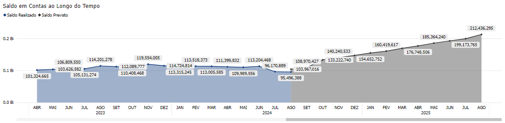
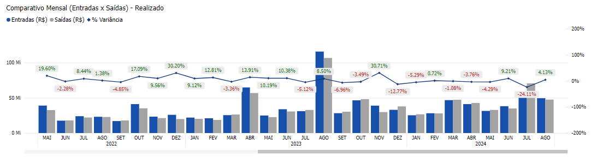

# Painel Financeiro (Home)

  
  <h6>Imagem 1: Painel de Financeira - Home</h6>

Um relatório de Business Intelligence (BI) abrangente e focado em Fluxo Financeiro é essencial para fornecer uma visão clara e detalhada da liquidez e gestão de caixa de uma empresa.

Esse tipo de relatório permite uma análise aprofundada das entradas e saídas de caixa, possibilitando uma gestão eficaz do fluxo de caixa, o monitoramento das posições de caixa e a garantia de que a empresa possui liquidez suficiente para cumprir suas obrigações.

Por meio de visualizações precisas e detalhadas, é possível acompanhar as tendências de fluxo de caixa, identificar potenciais faltas de caixa e tomar decisões informadas para otimizar as operações financeiras, garantindo a estabilidade e a sustentabilidade financeira da empresa.

Na página de Home, você encontrará:

## Saldo em Contas ao Longo do Tempo

  
  <h6>Imagem 2: Saldo em Contas ao Longo do Tempo</h6>

Um gráfico de área mostrando o valor realizado do saldo acumulado da conta ao longo do tempo até o mês atual, com uma linha previsional continuando um ano no futuro que representa o saldo da conta se todas as transações, tanto realizadas quanto provisórias, fossem concluídas.

Este gráfico é essencial para monitorar a evolução do saldo da conta e do crescimento da empresa, permitindo que você visualize o saldo atual, bem como o saldo potencial para o próximo ano.

## Comparativo Mensal (Entradas x Saídas) - Realizado

  
  <h6>Imagem 3: Comparativo Mensal (Entradas x Saídas) - Realizado</h6>

Um gráfico de barras com uma linha, onde as colunas mostram os valores de Entradas e Saídas, e a linha mostra a diferença entre essas duas barras como '% Variância' por mês e ano.

Os rótulos '% Variância' são verdes quando positivos e vermelhos quando negativos. Este gráfico permite que você compare diretamente as entradas e saídas para cada mês e ano, visualizando a diferença percentual entre elas.

A codificação por cores ajuda você a identificar rapidamente se sua empresa está gastando mais do que está ganhando, para que você possa ajustar suas estratégias financeiras conforme necessário.

