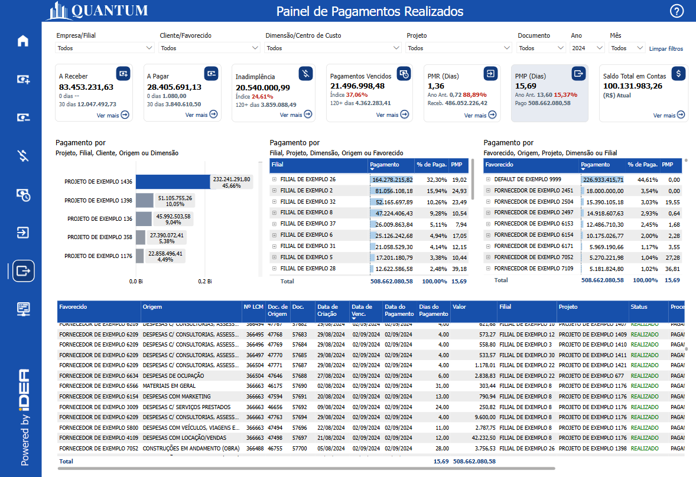
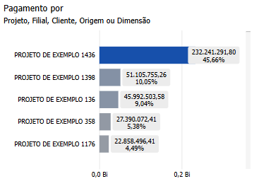
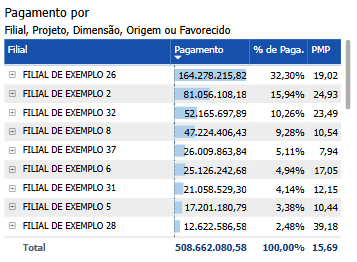
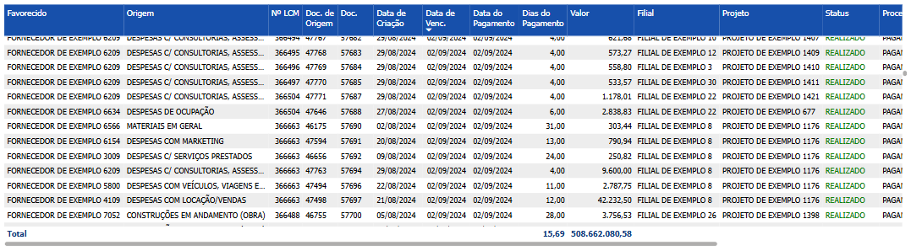

# Painel de Pagamentos Realizados

  
  <h6>Imagem 1: Painel de Pagamentos Realizados</h6>

## Informações no Painel de Pagamentos Realizados

### Valor Pagamento

Valor Pago representa o total de pagamentos realizados por uma empresa durante um período específico, refletindo suas obrigações financeiras cumpridas com fornecedores, funcionários, impostos e outros credores. Esse indicador é fundamental para a gestão financeira, pois ele revela a capacidade da empresa de honrar suas dívidas e compromissos dentro dos prazos estabelecidos, influenciando diretamente o fluxo de caixa e a liquidez disponível. Ao contrário de métricas que tratam de despesas futuras ou valores a pagar, o Valor Pago trata dos montantes que já foram efetivamente desembolsados, oferecendo uma visão clara da eficiência na administração dos passivos.

A importância do Valor Pago está na sua relação direta com a manutenção da saúde financeira e operacional da empresa. Quando a empresa não gerencia bem seus pagamentos, isso pode levar a atrasos, multas e até prejudicar o relacionamento com fornecedores, impactando negativamente a continuidade das operações. Por outro lado, um controle eficaz dos valores pagos ajuda a manter um equilíbrio saudável entre o fluxo de caixa e as necessidades de curto e longo prazo, garantindo que a empresa tenha os recursos necessários para crescer e se adaptar a novas demandas.

Além disso, monitorar o Valor Pago de forma consistente permite que a empresa avalie melhor suas prioridades financeiras, otimize seu cronograma de pagamentos e negocie melhores condições com fornecedores. Ele também oferece insights importantes sobre a alocação de recursos, possibilitando a identificação de áreas onde os gastos podem ser ajustados para melhorar a eficiência operacional.

Em suma, o Valor Pago é um indicador crucial da saúde financeira de uma empresa, pois mostra como os recursos são utilizados para cumprir compromissos financeiros, mantendo o fluxo de caixa controlado e apoiando o desenvolvimento sustentável do negócio.

### % de Pagamentos

A porcentagem (%) de Pagamentos Realizados é uma métrica crucial para a gestão financeira, pois oferece uma visão clara da representatividade de cada categoria (como Filial, Fornecedor, Projeto, Dimensão ou Origem) em relação ao total de valores pagos. Essa métrica permite que as empresas identifiquem quais áreas, fornecedores ou projetos estão demandando mais recursos financeiros, facilitando a análise de desempenho e a otimização do controle de despesas. Além de exibir os valores absolutos, a porcentagem de pagamentos realizados destaca a importância relativa de cada componente, ajudando a tomar decisões estratégicas sobre a alocação de recursos, renegociações com fornecedores e priorização de pagamentos. A análise percentual também é valiosa para monitorar o comportamento dos pagamentos ao longo do tempo, permitindo identificar tendências, como o aumento ou a diminuição da participação de determinados fornecedores ou áreas nos valores pagos, o que ajuda a empresa a planejar melhor suas obrigações financeiras e garantir um controle de caixa mais eficiente.

### Prazo Médio de Pagamento (PMP)

O prazo médio de pagamento (PMP) é um indicador financeiro essencial que calcula o tempo médio que uma empresa leva para liquidar suas obrigações com fornecedores. Calculamos o tempo, em dias, desde a criação do documento até o pagamento de cada transação, somamos esses dias e depois dividimos pela quantidade de transações que foram feitas. Esse cálculo é aplicado a diferentes áreas do negócio, como clientes ou projetos. Esse indicador é crucial para a gestão financeira, pois permite monitorar o desempenho financeiro da empresa, manter o equilíbrio entre entradas e saídas de recursos e evitar contratempos que podem afetar as negociações e a reputação da empresa no mercado.

Alguns dos benefícios de analisar o PMP são:

**Gestão do Fluxo de Caixa:** O PMP permite que a empresa compreenda quanto tempo, em média, mantém o dinheiro em caixa antes de pagar seus fornecedores. Um PMP mais longo pode indicar maior retenção de caixa, o que pode ser benéfico para o fluxo de caixa, mas também pode impactar negativamente o relacionamento com fornecedores;

**Negociação com Fornecedores:** Ao monitorar o PMP, a empresa pode negociar melhores prazos de pagamentos com fornecedores, buscando equilibrar a manutenção do fluxo de caixa com o cumprimento das obrigações financeiras;

**Avaliação da Saúde Financeira:** O PMP reflete a saúde financeira da empresa. Um prazo muito curto pode indicar pressão de fornecedores ou dificuldades em manter o caixa, enquanto um prazo muito longo pode sugerir dificuldades em cumprir prazos ou práticas de pagamento inadequadas;

**Análise Comparativa:** Empresas utilizam o PMP para comparar sua eficiência de pagamento com outras empresas do mesmo setor, ajudando a identificar se está dentro das práticas comuns de mercado ou se são necessários ajustes;

**Tomada de Decisões Financeiras:** Com base no PMP, o gestor financeiro pode tomar decisões estratégicas sobre a melhor alocação de recursos, planejando pagamentos de forma a otimizar o uso do caixa sem comprometer as relações comerciais.

## Visão Principal

### Pagamento por Projeto, Filial, Favorecido, Origem ou Dimensão

  
  <h6>Imagem 2: Pagamento por Projeto, Filial, Favorecido, Origem ou Dimensão</h6>

A organização do gráfico de barras por **Pagamento por Projeto, Filial, Fornecedor, Origem ou Dimensão**, conforme indicado no subtítulo, oferece uma estrutura clara e lógica para analisar os dados de **Pagamentos**, facilitando a compreensão do impacto que diferentes segmentos têm sobre as saídas de caixa da empresa. Essa categorização permite que os tomadores de decisão identifiquem rapidamente quais projetos ou filiais estão gerando mais despesas, quais fornecedores são mais relevantes em termos de valores pagos, e quais origens ou dimensões exercem maior influência sobre os fluxos financeiros. As informações fornecidas pelas etiquetas de % de Pagamentos e pelos tooltips, que exibem o valor exato, a % de Pagamentos e o PMP (Período Médio de Pagamento), são cruciais para o gerenciamento financeiro estratégico.

Esses dados ajudam na priorização de esforços, identificando as áreas mais dispendiosas, como projetos ou fornecedores que requerem maiores recursos, e também destacam aquelas que precisam de mais controle, como fornecedores com faturas em atraso. Além disso, monitorar o **PMP** permite avaliar a eficiência do ciclo de pagamentos, ajustando políticas de desembolso e negociação com fornecedores para otimizar o fluxo de caixa. A análise da % de Pagamentos entre diferentes categorias revela quais filiais, fornecedores ou projetos representam os maiores custos, ajudando os gestores a concentrar esforços na renegociação de contratos e na otimização dos gastos em áreas menos eficientes. A identificação de tendências ao longo do tempo, como mudanças no desempenho de um determinado fornecedor ou projeto, possibilita ajustes estratégicos proativos, garantindo um controle financeiro mais robusto. Em resumo, esse gráfico, com suas informações detalhadas, não só facilita a visualização do desempenho financeiro atual, como também oferece uma base sólida para decisões estratégicas que aprimoram a gestão dos fluxos de caixa e a saúde financeira da empresa no longo prazo.

Além disso, a interação entre os gráficos é **bidirecional**: ao clicar em outro visual na página, como o [Pagamento por Fornecedor, Origem, Projeto, Dimensão ou Filial](https://idea-technology-it.github.io/docs-idea/financeiro/painel_pagamentos_realizados/#pagamento-por-fornecedor-origem-projeto-dimensão-ou-filial), este visual será automaticamente filtrado de acordo com a seleção realizada. Da mesma forma, ao selecionar um item no gráfico de Pagamentos, ele filtrará os outros visuais, criando uma análise interativa e detalhada que facilita a compreensão dos dados e possibilita a tomada de decisões mais informadas. Esse comportamento dinâmico oferece uma experiência integrada, permitindo que os usuários explorem as correlações entre variáveis e compreendam como diferentes categorias afetam os pagamentos realizados.

A **seleção de categoria** na matriz permite criar várias combinações com outros visuais, como o de [Pagamento por Fornecedor, Origem, Projeto, Dimensão ou Filial](https://idea-technology-it.github.io/docs-idea/financeiro/painel_pagamentos_realizados/#pagamento-por-fornecedor-origem-projeto-dimensão-ou-filial) e [Pagamento por Filial, Projeto, Dimensão, Origem ou Fornecedor](https://idea-technology-it.github.io/docs-idea/financeiro/painel_pagamentos_realizados/#pagamento-por-filial-projeto-dimensão-origem-ou-fornecedor), ampliando ainda mais a flexibilidade na análise. A capacidade de selecionar cabeçalhos de linha em cada visual facilita a identificação de combinações relevantes, ajudando a visualizar as relações mais importantes para a análise de pagamentos realizados. Por exemplo, o usuário pode optar por visualizar Filial neste gráfico, Fornecedor no segundo e Projeto no terceiro, ou Projeto neste, Dimensão no segundo e Origem no outro, ajustando a tabela para exibir as informações mais significativas conforme o contexto.

Para navegar entre os níveis, você pode usar os [ícones de cabeçalho](https://idea-technology-it.github.io/docs-idea/financeiro/intro/#ícones_de_cabeçalho) que estão disponíveis quando você passa o mouse ou clica no gráfico.

  
  <h6>Ícones de Cabeçalho</h6>

Aqui, você pode mover para cima ou para baixo entre Project, Filial, Favorecido, Origem ou Dimensão para analisar a área necessária.

### Pagamento por Filial, Projeto, Dimensão, Origem ou Favorecido

  
  <h6>Imagem 3: Pagamento por Filial, Projeto, Dimensão, Origem ou Favorecido</h6>

Uma matriz exibindo os valores de **Pagamentos Realizados** por **Filial, Projeto, Dimensão, Origem ou Fornecedor** é uma ferramenta essencial para a análise financeira e a tomada de decisões estratégicas. Ao organizar os pagamentos conforme essas categorias, a matriz permite que os stakeholders identifiquem de forma rápida e precisa onde os valores pagos estão concentrados e acompanhem as despesas realizadas em diferentes fontes, projetos ou filiais. Essa visualização detalhada é crucial para a gestão eficaz do fluxo de caixa, destacando quais áreas estão consumindo mais recursos, impactando diretamente a saúde financeira da organização.

A matriz exibe o **valor total de Pagamentos Realizados**, a **porcentagem (%) de Pagamentos** em relação ao total, e o **PMP** (Período Médio de Pagamento), proporcionando uma visão clara da contribuição de cada categoria e da eficiência dos ciclos de pagamento. Esses indicadores ajudam a priorizar áreas que precisam de mais atenção ou ajustes em termos de despesas, garantindo uma alocação eficiente dos recursos e monitoramento de pagamentos. As barras de dados em azul claro, posicionadas atrás dos valores na matriz, atuam como um auxílio visual importante para a comparação, fornecendo um contexto imediato para os valores exibidos. Esse contraste visual facilita a percepção das diferenças e semelhanças entre os itens, permitindo que os stakeholders identifiquem rapidamente quais categorias apresentam maiores ou menores pagamentos em comparação ao total. Essa representação visual facilita a detecção de padrões, variações e tendências relevantes, transformando dados complexos em informações acessíveis e intuitivas.

Além disso, a interação entre os gráficos é **bidirecional**: ao clicar em outro visual na página, como o [Pagamento por Projeto, Filial, Fornecedor, Origem ou Dimensão](https://idea-technology-it.github.io/docs-idea/financeiro/painel_pagamentos_realizados/#pagamento-por-projeto-filial-fornecedor-origem-ou-dimensão), esta matriz será automaticamente filtrada de acordo com a seleção realizada. Da mesma forma, ao selecionar um item na visual, ele filtrará os outros visuais, criando uma análise interativa e detalhada que facilita a compreensão dos dados e possibilita a tomada de decisões mais informadas. Esse comportamento dinâmico oferece uma experiência integrada, permitindo que os usuários explorem as correlações entre variáveis e compreendam como diferentes categorias afetam os pagamentos realizados.

A matriz também oferece a funcionalidade de **expandir ou recolher hierarquias**. Ao clicar no sinal de mais (+) ao lado de uma Filial ou Projeto, por exemplo, a tabela se expande para revelar os valores de Pagamentos Realizados associados às **Dimensões, Origens ou Fornecedores** correspondentes. Essa visão hierárquica permite uma análise mais segmentada e detalhada, possibilitando um acompanhamento preciso das contribuições individuais de cada parte. Da mesma forma, os usuários podem recolher a hierarquia ao clicar no sinal de menos (-), facilitando a navegação quando uma visão mais resumida for suficiente.

A **seleção de categoria** na matriz permite criar várias combinações com outro visual, como o de [Pagamento por Fornecedor, Origem, Projeto, Dimensão ou Filial](https://idea-technology-it.github.io/docs-idea/financeiro/painel_pagamentos_realizados/#pagamento-por-fornecedor-origem-projeto-dimensão-ou-filial) e [Pagamento por Projeto, Filial, Fornecedor, Origem ou Dimensão](https://idea-technology-it.github.io/docs-idea/financeiro/painel_pagamentos_realizados/#pagamento-por-projeto-filial-fornecedor-origem-ou-dimensão), ampliando ainda mais a flexibilidade na análise. A capacidade de selecionar cabeçalhos de linha em cada visual facilita a identificação de combinações relevantes, ajudando a visualizar as relações mais importantes para a análise de pagamentos realizados. Por exemplo, o usuário pode optar por visualizar Filial nesta matriz, Fornecedor na segunda e Projeto no terceiro, ou Projeto nesta, Dimensão na segunda e Origem na outra, ajustando a tabela para exibir as informações mais significativas conforme o contexto.

Com a exibição clara dos valores absolutos de Pagamentos Realizados, suas respectivas porcentagens, e o **PMP**, além da possibilidade de explorar hierarquias e combinações de forma interativa, a matriz de Pagamentos por **Filial, Projeto, Dimensão, Origem ou Fornecedor** se torna uma ferramenta essencial para a gestão financeira. Ela permite uma navegação eficiente por grandes volumes de dados e interações entre múltiplos visuais, ajudando os tomadores de decisão a focar nos pontos críticos e otimizar o desempenho financeiro da organização, garantindo uma gestão mais estratégica dos fluxos de caixa e despesas.

Para navegar entre os níveis, você pode usar os [ícones de cabeçalho](https://idea-technology-it.github.io/docs-idea/financeiro/intro/#ícones_de_cabeçalho) que estão disponíveis quando você passa o mouse ou clica no gráfico.

  
  <h6>Ícones de Cabeçalho</h6>

Aqui, você pode navegar entre Filial, Project, Dimensão, Origem ou Favorecido para categorizar as áreas de interesse.

### Pagamento por Favorecido, Origem, Projeto, Dimensão ou Filial

  
  <h6>Imagem 4: Pagamento por Favorecido, Origem, Projeto, Dimensão ou Filial</h6>

Uma matriz exibindo os valores de **Pagamentos por Fornecedor, Origem, Projeto, Dimensão ou Filial** é uma ferramenta essencial para a análise financeira e para decisões estratégicas mais eficazes. Ao organizar os pagamentos por essas categorias, a matriz permite que os stakeholders identifiquem com precisão onde os valores pagos estão concentrados e acompanhem as despesas realizadas por diferentes fornecedores, origens ou projetos. Essa visualização detalhada é crucial para gerenciar o fluxo de caixa de forma eficiente, destacando quais áreas estão demandando mais recursos financeiros e, consequentemente, influenciando a saúde financeira da organização.

A matriz exibe o **valor total de Pagamentos**, a **porcentagem (%) de Pagamentos** em relação ao valor global, e o **PMP** (Período Médio de Pagamento), proporcionando uma visão clara da contribuição de cada categoria e da eficiência dos processos de pagamento. Esses indicadores auxiliam na priorização de áreas que requerem mais atenção ou ajustes, garantindo uma alocação eficaz dos recursos e monitoramento. As barras de dados em azul claro, posicionadas atrás dos valores na matriz, funcionam como uma importante ferramenta visual, oferecendo um contexto imediato para comparação dos valores apresentados. O contraste visual facilita a percepção das diferenças entre as categorias, permitindo que os usuários identifiquem rapidamente aquelas com maiores ou menores pagamentos em relação ao total. Essa representação visual torna os dados mais acessíveis e compreensíveis, simplificando a análise de padrões e tendências relevantes.

Além disso, a interação entre os gráficos é **bidirecional**: ao selecionar outro visual na página, como o [Pagamento por Projeto, Filial, Fornecedor, Origem ou Dimensão](https://idea-technology-it.github.io/docs-idea/financeiro/painel_pagamentos_realizados/#pagamento-por-projeto-filial-fornecedor-origem-ou-dimensão), a matriz será automaticamente filtrada de acordo com a seleção. Da mesma forma, ao selecionar qualquer item dentro da matriz, os outros visuais serão filtrados, criando uma análise interativa e detalhada que permite uma compreensão mais profunda dos dados. Esse comportamento dinâmico proporciona uma experiência integrada, onde os usuários podem explorar os dados de maneira fluida, identificando correlações importantes entre diferentes variáveis e compreendendo como essas categorias afetam os pagamentos realizados.

A matriz também oferece a funcionalidade de **expandir ou recolher hierarquias**. Ao clicar no sinal de mais (+) ao lado de uma categoria, como Fornecedor ou Origem, a tabela se expande para revelar os valores de pagamento correspondentes a Projetos, Dimensões ou Filiais. Essa organização hierárquica possibilita uma análise mais detalhada e segmentada, facilitando o acompanhamento das contribuições individuais de cada parte. Da mesma forma, o usuário pode recolher a hierarquia clicando no sinal de menos (-), facilitando a navegação em uma visão mais simplificada, quando necessário.

Adicionalmente, a **seleção de categoria** nesta matriz oferece a possibilidade de criar várias combinações com outros visuais, como o de [Pagamento por Projeto, Filial, Fornecedor, Origem ou Dimensão](https://idea-technology-it.github.io/docs-idea/financeiro/painel_pagamentos_realizados/#pagamento-por-projeto-filial-fornecedor-origem-ou-dimensão) e [Pagamento por Filial, Projeto, Dimensão, Origem ou Fornecedor](https://idea-technology-it.github.io/docs-idea/financeiro/painel_pagamentos_realizados/#pagamento-por-filial-projeto-dimensão-origem-ou-fornecedor). A capacidade de escolher diferentes cabeçalhos de linha aumenta a flexibilidade da análise, permitindo que o usuário visualize as combinações mais relevantes para suas necessidades. Por exemplo, o usuário pode optar por exibir Fornecedor nesta matriz, Filial na segunda, e Origem na terceira, ou ainda Projetos e Dimensões em outras combinações, ajustando os relatórios para mostrar as informações mais significativas em cada contexto.

Com a exibição clara dos valores absolutos de Pagamentos, suas porcentagens respectivas e o **PMP**, além da capacidade de explorar hierarquias e interagir com outros visuais de forma integrada, a matriz de **Pagamentos por Fornecedor, Origem, Projeto, Dimensão ou Filial** torna-se uma ferramenta indispensável para a gestão financeira. Ela permite uma navegação eficiente em grandes volumes de dados e interações com múltiplos visuais, possibilitando que os tomadores de decisão se concentrem nos pontos mais críticos e otimizem o desempenho financeiro da organização, assegurando uma gestão mais estratégica dos fluxos de caixa e despesas.

Para navegar entre os níveis, você pode usar os [ícones de cabeçalho](https://idea-technology-it.github.io/docs-idea/financeiro/intro/#icones_de_cabeçalho) que estão disponíveis quando você passa o mouse ou clica no gráfico.

  
  <h6>Ícones de Cabeçalho</h6>

Aqui, você pode mover para cima ou para baixo para navegar entre Favorecido, Origem, Project, Dimensão ou Filial para analisar a área necessária.

### Tabela de Detalhes de Pagamentos Realizados

  
  <h6>Imagem 5: Tabela de Detalhes de Pagamentos Realizados</h6>

Este gráfico exibe uma tabela detalhada dos pagamentos, organizada por data de vencimento, oferecendo uma visão completa das transações em ordem cronológica. A tabela inclui várias colunas que fornecem informações cruciais sobre cada pagamento realizado, desde o fornecedor até o status atual e os documentos relacionados. Essa visão tabular permite à empresa analisar minuciosamente cada despesa, fornecendo todas as informações necessárias para o acompanhamento e a gestão eficaz dos pagamentos. Com esta estrutura, a empresa pode monitorar detalhadamente os pagamentos efetuados, identificar padrões de despesas e tomar decisões informadas para gerenciar o fluxo de caixa, garantindo que a saúde financeira da empresa seja mantida. A seguir, explicamos como interpretar cada coluna da tabela.

Esta tabela é essencial quando se busca detalhes sobre pagamentos específicos. É possível aplicar diversos [filtros](https://idea-technology-it.github.io/docs-idea/financeiro/intro/#filtros) para refinar os dados exibidos, permitindo uma análise mais direcionada e personalizada conforme as necessidades.

#### Favorecido
Esta coluna identifica o Favorecido específico que tem um valor a pagar, permitindo que você veja claramente quem são os devedores.
#### Origem
A origem da fatura, como "INSS Retido" ou "Serviço Instalações", é indicada nesta coluna. Isso ajuda a entender a natureza da dívida e a sua fonte dentro das operações da empresa.
#### Nº LCM
Esta coluna mostram o número do lançamento contábil relacionado à fatura. Elas são úteis para rastrear documentos específicos e reconciliar com registros contábeis.
#### Doc.
O número do documento associado à fatura encontra-se aqui. Este é o número mais comumente usado ao pesquisar a transação no banco de dados.
#### Data de Criação
Indica quando a fatura foi criada. Essa informação é importante para entender o histórico da transação e verificar quanto tempo se passou desde a emissão da fatura.
#### Data de Venc.
Esta coluna mostra a data de vencimento da fatura. Comparar esta data com a data atual ajuda a identificar faturas que estão próximas de vencer ou já estão atrasadas.
#### Data do Recebimento
Esta é a data em que o pagamento do documento foi feito.
#### Dias do Recebimento
Para ver quanto tempo levou para o pagamento ser feito, esta coluna mostra a diferença em dias entre a data de criação e a data do pagamento.
#### Valor
Exibe o valor devido em cada fatura. Esta coluna permite uma visão clara dos montantes que estão em aberto.
#### Filial
Indica a filial da empresa responsável pela fatura. Isso é útil para entender a distribuição geográfica dos pagáveis.
#### Projeto
Relaciona cada fatura a um projeto específico. Esta informação é essencial para empresas que gerenciam múltiplos projetos e precisam monitorar os fluxos de caixa associados a cada um deles.
#### Status
O status da fatura que é "Realizado" é mostrado aqui. Este status serve para mostrar que o pagamento ainda está pendente e evita confusão com transações mostradas no [Painel A Pagar](https://idea-technology-it.github.io/docs-idea/financeiro/contas_a_pagar/)
#### Processo
Indica o processo associado ao recebimento, como "Pagamento". Essa coluna auxilia na compreensão do fluxo de trabalho relacionado à fatura.
#### Pesquisa de Documentos
Esta coluna contém informações relacionadas à pesquisa de documentos que podem fornecer detalhes adicionais sobre a fatura ou transação. Isso é útil para obter informações mais detalhadas ou resolver dúvidas sobre um determinado recebível.
#### Dimensão
Esta coluna exibe o nome da dimensão que é relevante para a transação. Embora você possa filtrar por dimensão usando o filtro [Dimensão](https://idea-technology-it.github.io/docs-idea/financeiro/intro/#dimensao), isso facilita a análise ao fornecer uma referência direta aos nomes das dimensões, organizando os dados de uma forma intuitiva para identificar e entender as diferentes áreas de análise.

  
***Aviso Legal:** Os números e informações apresentados nesta documentação são baseados em um conjunto de dados fictício. Eles são destinados exclusivamente para fins educacionais e de demonstração. Os dados não refletem condições do mundo real ou métricas de negócios reais e não devem ser usados ​​para tomada de decisão ou análise. Qualquer semelhança com entidades, eventos ou dados reais é mera coincidência.*
