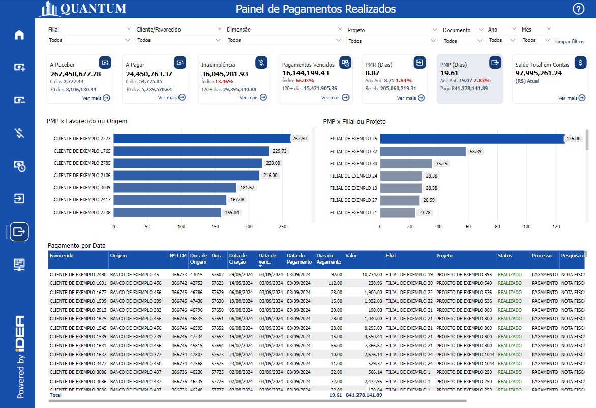
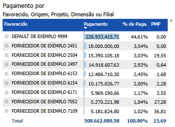
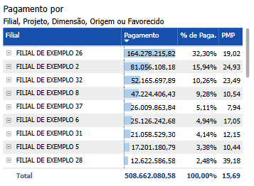
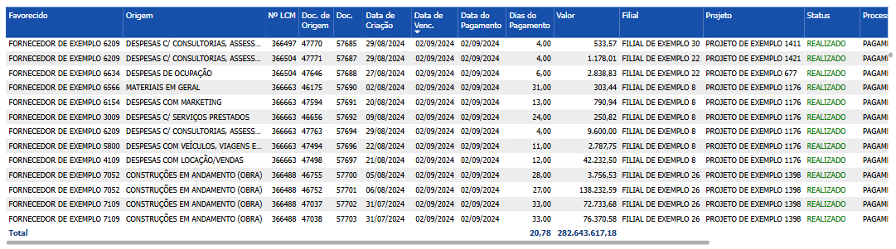

# Painel de Pagamentos Realizados

  
  <h6>Imagem 1: Painel de Pagamentos Realizados</h6>

O Painel de Pagamentos Realizados oferece uma visão abrangente e detalhada das transações financeiras realizadas pela empresa, permitindo um monitoramento preciso do fluxo de caixa relacionado aos pagamentos. Neste painel você encontrará informações sobre o Prazo Médio de Pagamento (PMP) bem como detalhes das transações concluídas.

## Prazo Médio de Pagamento (PMP)

O prazo médio de pagamento (PMP) é um indicador financeiro essencial que calcula o tempo médio que uma empresa leva para liquidar suas obrigações com fornecedores. Calculamos o tempo, em dias, desde a criação do documento até o pagamento de cada transação, somamos esses dias e depois dividimos pela quantidade de transações que foram feitas. Esse cálculo é aplicado a diferentes áreas do negócio, como clientes ou projetos. Esse indicador é crucial para a gestão financeira, pois permite monitorar o desempenho financeiro da empresa, manter o equilíbrio entre entradas e saídas de recursos e evitar contratempos que podem afetar as negociações e a reputação da empresa no mercado.

Alguns dos benefícios de analisar o PMP são:

**Gestão do Fluxo de Caixa:** O PMP permite que a empresa compreenda quanto tempo, em média, mantém o dinheiro em caixa antes de pagar seus fornecedores. Um PMP mais longo pode indicar maior retenção de caixa, o que pode ser benéfico para o fluxo de caixa, mas também pode impactar negativamente o relacionamento com fornecedores.

**Negociação com Fornecedores:** Ao monitorar o PMP, a empresa pode negociar melhores prazos de pagamentos com fornecedores, buscando equilibrar a manutenção do fluxo de caixa com o cumprimento das obrigações financeiras.

**Avaliação da Saúde Financeira:** O PMP reflete a saúde financeira da empresa. Um prazo muito curto pode indicar pressão de fornecedores ou dificuldades em manter o caixa, enquanto um prazo muito longo pode sugerir dificuldades em cumprir prazos ou práticas de pagamento inadequadas.

**Análise Comparativa:** Empresas utilizam o PMP para comparar sua eficiência de pagamento com outras empresas do mesmo setor, ajudando a identificar se está dentro das práticas comuns de mercado ou se são necessários ajustes.

**Tomada de Decisões Financeiras:** Com base no PMP, o gestor financeiro pode tomar decisões estratégicas sobre a melhor alocação de recursos, planejando pagamentos de forma a otimizar o uso do caixa sem comprometer as relações comerciais.

## PMP x Favorecido ou Origem

  
  <h6>Imagem 2: PMP x Favorecido ou Origem</h6>

Esse gráfico compara o Prazo Médio de Pagamento (PMP) entre diferentes favorecidos ou origens das transações da empresa. Ele oferece uma visão clara de como os tempos de pagamento variam conforme o fornecedor ou a origem específica dos pagamentos, ajudando a identificar oportunidades de otimização na gestão financeira. As barras representam o PMP para cada favorecido ou origem, mostrando o número médio de dias que a empresa leva para pagar suas obrigações a cada fornecedor ou em cada categoria de origem.

Analisar o PMP por favorecido é crucial para entender as diferenças nas práticas de pagamento entre os diversos fornecedores com os quais a empresa trabalha. Diferentes fornecedores podem oferecer condições de pagamento distintas, e a forma como a empresa gere esses prazos pode influenciar diretamente seu fluxo de caixa e as relações comerciais. Ao identificar essas variações, a empresa pode negociar melhores termos, priorizar pagamentos estratégicos e melhorar o gerenciamento do capital de giro.

Além disso, visualizar o PMP por origem permite avaliar como diferentes categorias de despesas ou origens de pagamento afetam a liquidez e o cumprimento das obrigações financeiras. Certas origens, como despesas operacionais, investimentos em capital ou custos administrativos, podem ter cronogramas de pagamento únicos que impactam o fluxo de caixa de maneiras distintas. Compreender essas diferenças ajuda a empresa a alinhar suas práticas de pagamento com suas metas financeiras, garantindo uma gestão mais eficiente dos recursos e evitando pressões desnecessárias no caixa.

Para navegar entre os níveis, você pode usar os [ícones de cabeçalho](https://idea-technology-it.github.io/docs-idea/financeiro/intro/#filtros) que estão disponíveis quando você passa o mouse ou clica no gráfico.

  
  <h6>Ícones de Cabeçalho</h6>

Aqui, você pode navegar entre Favorecido e Origem para categorizar as áreas de interesse.

## PMP x Filial ou Projeto

  
  <h6>Imagem 3: PMP x Filial ou Projeto</h6>

Esse gráfico compara o Prazo Médio de Pagamento (PMP) entre diferentes filiais ou projetos da empresa. Ele oferece uma visão clara de como os tempos de pagamento variam conforme a localização ou a iniciativa específica, ajudando a identificar oportunidades de otimização na gestão financeira. As barras representam o PMP para cada filial ou projeto, mostrando o número médio de dias que uma filial ou projeto leva para pagar suas obrigações.

Analisar o PMP por filial é fundamental para entender as diferenças nas práticas de pagamento em várias regiões ou unidades operacionais. Diferentes filiais podem enfrentar condições de mercado distintas, negociar termos de pagamento diferentes com fornecedores ou ter processos internos variados que influenciam o tempo de pagamento. Ao identificar essas variações, a empresa pode padronizar práticas eficazes em todas as filiais, reduzir atrasos e melhorar o relacionamento com fornecedores, assegurando um fluxo de caixa mais consistente.

Além disso, visualizar o PMP por projeto permite avaliar como as condições específicas de cada iniciativa impactam a liquidez e o cumprimento das obrigações financeiras. Projetos de diferentes naturezas, como construção, tecnologia ou pesquisa, podem ter cronogramas de pagamento variados, influenciados pelo ciclo de vida do projeto ou pela natureza dos contratos envolvidos. Compreender essas diferenças ajuda a empresa a planejar melhor suas necessidades de capital de giro, garantir que os projetos sejam financiados de forma adequada e evitar impactos negativos no caixa geral da empresa.

Para navegar entre os níveis, você pode usar os [ícones de cabeçalho](https://idea-technology-it.github.io/docs-idea/financeiro/intro/#filtros) que estão disponíveis quando você passa o mouse ou clica no gráfico.

  
  <h6>Ícones de Cabeçalho</h6>

Aqui, você pode mover para cima ou para baixo para navegar entre Filiais ou Projetos para analisar a área necessária.

## Pagamento por Data

  
  <h6>Imagem 4: Pagamento por Data</h6>

Este gráfico exibe uma tabela detalhada dos pagamentos, organizada por data de vencimento, oferecendo uma visão completa das transações em ordem cronológica. A tabela inclui várias colunas que fornecem informações cruciais sobre cada pagamento realizado, desde o fornecedor até o status atual e os documentos relacionados. Essa visão tabular permite à empresa analisar minuciosamente cada despesa, fornecendo todas as informações necessárias para o acompanhamento e a gestão eficaz dos pagamentos. Com esta estrutura, a empresa pode monitorar detalhadamente os pagamentos efetuados, identificar padrões de despesas e tomar decisões informadas para gerenciar o fluxo de caixa, garantindo que a saúde financeira da empresa seja mantida. A seguir, explicamos como interpretar cada coluna da tabela.

Esta tabela é essencial quando se busca detalhes sobre pagamentos específicos. Ele pode ser filtrado usando [filtros](https://idea-technology-it.github.io/docs-idea/financeiro/intro/#filtros).

### Cliente
Esta coluna identifica o cliente específico que tem um valor a pagar, permitindo que você veja claramente quem são os devedores.
### Origem
A origem da fatura, como "INSS Retido" ou "Serviço Instalações", é indicada nesta coluna. Isso ajuda a entender a natureza da dívida e a sua fonte dentro das operações da empresa.
### Nº LCM
Esta coluna mostram o número do lançamento contábil relacionado à fatura. Elas são úteis para rastrear documentos específicos e reconciliar com registros contábeis.
### Doc.
O número do documento associado à fatura encontra-se aqui. Este é o número mais comumente usado ao pesquisar a transação no banco de dados.
### Data de Criação
Indica quando a fatura foi criada. Essa informação é importante para entender o histórico da transação e verificar quanto tempo se passou desde a emissão da fatura.
### Data de Venc.
Esta coluna mostra a data de vencimento da fatura. Comparar esta data com a data atual ajuda a identificar faturas que estão próximas de vencer ou já estão atrasadas.
### Data do Recebimento
Esta é a data em que o pagamento do documento foi feito.
### Dias do Recebimento
Para ver quanto tempo levou para o pagamento ser feito, esta coluna mostra a diferença em dias entre a data de criação e a data do pagamento.
### Valor
Exibe o valor devido em cada fatura. Esta coluna permite uma visão clara dos montantes que estão em aberto.
### Filial
Indica a filial da empresa responsável pela fatura. Isso é útil para entender a distribuição geográfica dos pagáveis.
### Projeto
Relaciona cada fatura a um projeto específico. Esta informação é essencial para empresas que gerenciam múltiplos projetos e precisam monitorar os fluxos de caixa associados a cada um deles.
### Status
O status da fatura que é "Realizado" é mostrado aqui. Este status serve para mostrar que o pagamento ainda está pendente e evita confusão com transações mostradas no [Painel A Pagar](https://idea-technology-it.github.io/docs-idea/financeiro/contas_a_pagar/)
### Processo
Indica o processo associado ao recebimento, como "Pagamento". Essa coluna auxilia na compreensão do fluxo de trabalho relacionado à fatura.
### Pesquisa de Documentos
Esta coluna contém informações relacionadas à pesquisa de documentos que podem fornecer detalhes adicionais sobre a fatura ou transação. Isso é útil para obter informações mais detalhadas ou resolver dúvidas sobre um determinado recebível.
### Dimensão
Esta coluna exibe o nome da dimensão que é relevante para a transação. Embora você possa filtrar por dimensão usando o filtro [Dimensão](https://idea-technology-it.github.io/docs-idea/financeiro/intro/#dimensao), isso facilita a análise ao fornecer uma referência direta aos nomes das dimensões, organizando os dados de uma forma intuitiva para identificar e entender as diferentes áreas de análise.
