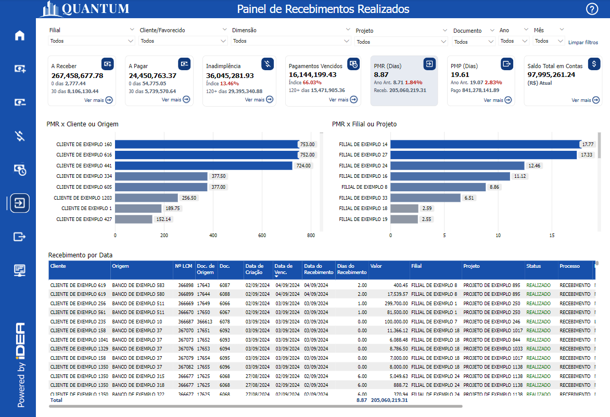
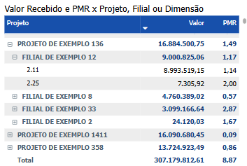
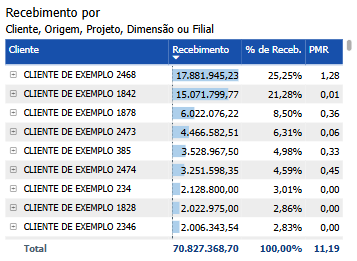
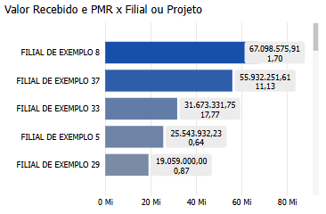
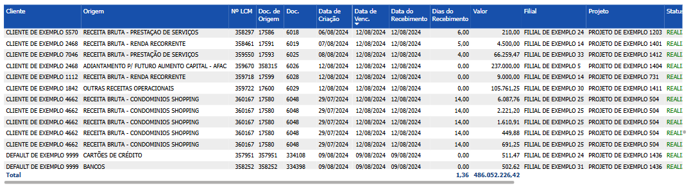

# Painel de Recebimentos Realizados

  
  <h6>Imagem 1: Painel de Recebimentos Realizados</h6>

## Informações no Painel de Recebimentos Realizados

### Valor Recebimento

Valor Recebido representa o montante total de pagamentos efetivamente recebidos por uma empresa durante um período específico, refletindo o sucesso de suas operações de cobrança e a capacidade de transformar vendas ou contratos em fluxo de caixa. Esse indicador é essencial para avaliar a saúde financeira de uma empresa, pois ele reflete a liquidez real disponível, que pode ser usada para financiar operações, pagar despesas e investir em crescimento. Diferente de métricas que se baseiam em receitas futuras ou contas a receber, o Valor Recebido lida diretamente com o dinheiro que já entrou no caixa da empresa, tornando-se um parâmetro claro para mensurar a eficiência das práticas de cobrança e o comportamento de pagamento dos clientes.

A importância do Valor Recebido reside na sua relação direta com o fluxo de caixa, que sustenta a operação diária e o planejamento financeiro. Quando o valor recebido é baixo ou irregular, a empresa pode enfrentar dificuldades para cumprir com suas obrigações financeiras, como pagamento de fornecedores, salários e investimentos em novos projetos. Por isso, monitorar o Valor Recebido em comparação com os valores a receber e os prazos de pagamento acordados ajuda a identificar possíveis gargalos na gestão de recebíveis e a tomar ações corretivas para otimizar a entrada de recursos. Além disso, ele auxilia na avaliação de clientes, permitindo ajustes nas condições de pagamento e estratégias de crédito, de forma a mitigar riscos de inadimplência e manter um fluxo de caixa estável.

Em resumo, o Valor Recebido é um dos indicadores mais concretos e imediatos da saúde financeira de uma empresa, pois reflete sua capacidade de gerar liquidez a partir das suas operações, garantindo a continuidade e a sustentabilidade dos negócios.

### % de Recebimentos

A porcentagem (%) de Recebimentos Realizados é uma métrica fundamental para a gestão financeira, pois oferece uma visão clara da representatividade de cada categoria (como Filial, Cliente, Projeto, Dimensão ou Origem) em relação ao total de valores recebidos. Essa métrica permite que as empresas identifiquem quais áreas ou clientes estão contribuindo mais para os fluxos de caixa positivos, facilitando a análise de desempenho e a otimização da gestão financeira. Além de exibir os valores absolutos, a porcentagem de recebimentos realizados destaca a importância relativa de cada componente, ajudando a tomar decisões estratégicas sobre alocação de recursos, políticas de crédito e priorização de vendas. A análise percentual também é valiosa para monitorar o comportamento dos recebimentos ao longo do tempo, permitindo identificar tendências, como o aumento ou a diminuição da participação de determinados clientes ou áreas nos valores recebidos, o que ajuda a empresa a planejar melhor suas finanças e manter um fluxo de caixa mais saudável.

### Prazo Médio de Recebimento (PMR)

O prazo médio de recebimento (PMR) é um indicador financeiro essencial que calcula o tempo médio que uma empresa leva para receber os pagamentos de seus clientes. Calculamos o tempo, em dias, desde a emissão do documento até o recebimento de cada transação, somamos esses dias e depois dividimos pela quantidade de transações que foram concluídas. Esse cálculo é aplicado a diferentes áreas do negócio, como clientes ou projetos. Esse indicador é crucial para a gestão financeira, pois permite monitorar a eficiência na cobrança, manter o equilíbrio entre entradas e saídas de recursos, e evitar contratempos que podem impactar o fluxo de caixa e a saúde financeira da empresa.

Alguns dos benefícios de analisar o PMR são:

**Gestão do Fluxo de Caixa:** O PMR permite que a empresa compreenda quanto tempo, em média, demora para converter suas vendas em dinheiro disponível. Um PMR mais curto pode indicar uma entrada de caixa mais rápida, o que é benéfico para manter a liquidez da empresa.

**Negociação com Clientes:** Ao monitorar o PMR, a empresa pode negociar melhores condições de pagamento com seus clientes, buscando equilibrar a entrada de caixa com a competitividade das condições de venda oferecidas.

**Avaliação da Saúde Financeira:** O PMR reflete a saúde financeira da empresa. Um prazo muito longo pode indicar dificuldades em receber, o que pode comprometer o fluxo de caixa, enquanto um prazo muito curto pode indicar eficiência na cobrança, mas também possíveis pressões sobre os clientes.

**Análise Comparativa:** Empresas utilizam o PMR para comparar sua eficiência de recebimento com outras empresas do mesmo setor, ajudando a identificar se estão dentro das práticas comuns de mercado ou se são necessários ajustes.

**Tomada de Decisões Financeiras:** Com base no PMR, o gestor financeiro pode tomar decisões estratégicas sobre a melhor alocação de recursos, planejando recebimentos de forma a otimizar o uso do caixa e assegurar que a empresa mantenha uma posição financeira saudável.

## Visão Principal

### Recebimento por Project, Filial, Cliente, Origem ou Dimensão

  
  <h6>Imagem 2: Recebimento por Project, Filial, Cliente, Origem ou Dimensão</h6>

A organização do gráfico de barras por Projeto, Filial, Cliente, Origem ou Dimensão, conforme indicado no subtítulo, oferece uma estrutura clara e lógica para analisar os dados de Recebimentos, facilitando a compreensão do impacto que diferentes segmentos têm sobre o fluxo de caixa da empresa. Essa categorização permite que os tomadores de decisão identifiquem rapidamente quais projetos ou filiais estão gerando mais receitas, quais clientes são mais valiosos em termos de pagamentos realizados, e quais origens ou dimensões exercem maior influência nos fluxos financeiros. As informações fornecidas pelas etiquetas de % de Recebimentos e pelos tooltips, que exibem o valor exato, a % de Recebimentos e o PMR (Período Médio de Recebimento), são cruciais para o gerenciamento financeiro estratégico.

Esses dados ajudam na priorização de esforços, identificando as áreas mais lucrativas, como projetos ou clientes que geram mais receita, e também apontam aquelas que precisam de mais atenção, como clientes com pagamentos atrasados. Além disso, monitorar o PMR permite avaliar a eficiência do ciclo de recebimentos, ajustando políticas de crédito e cobrança para otimizar o fluxo de caixa. A análise da % de Recebimentos entre diferentes categorias também revela quais filiais, clientes ou projetos estão trazendo maior retorno, ajudando os gestores a concentrar esforços nas áreas mais promissoras e a renegociar com clientes menos eficientes. A identificação de tendências ao longo do tempo, como mudanças no desempenho de um determinado projeto ou cliente, possibilita ajustes estratégicos proativos, garantindo um controle financeiro mais robusto. Em resumo, esse gráfico, com suas informações detalhadas, não só facilita a visualização do desempenho financeiro atual, como também proporciona uma base sólida para decisões estratégicas que otimizam os fluxos de caixa e a saúde financeira da empresa no longo prazo.

Além disso, a interação entre os gráficos é **bidirecional**: ao clicar em outro visual na página, como o [Recebimento por Cliente, Origem, Projeto, Dimensão ou Filial](https://idea-technology-it.github.io/docs-idea/financeiro/painel_recebimentos_realizados/#recebimento-por-cliente-origem-projeto-dimensão-ou-filial), esta visual será automaticamente filtrada de acordo com a seleção realizada. Da mesma forma, ao selecionar um item na visual, ele filtrará os outros visuais, criando uma análise interativa e detalhada que facilita a compreensão dos dados e possibilita a tomada de decisões mais informadas. Esse comportamento dinâmico oferece uma experiência integrada, permitindo que os usuários explorem as correlações entre variáveis e compreendam como diferentes categorias afetam os recebimentos realizados.

A **seleção de categoria** na matriz permite criar várias combinações com outra visual, como a de [Recebimento por Cliente, Origem, Projeto, Dimensão ou Filial](https://idea-technology-it.github.io/docs-idea/financeiro/painel_recebimentos_realizados/#recebimento-por-cliente-origem-projeto-dimensão-ou-filial) e [Recebimento por Filial, Project, Dimensão, Origem ou Cliente](https://idea-technology-it.github.io/docs-idea/financeiro/painel_recebimentos_realizados/#recebimento-por-filial-project-dimensão-origem-ou-cliente), aumentando ainda mais a flexibilidade na análise. A capacidade de selecionar cabeçalhos de linha em cada visual facilita a identificação de combinações relevantes, ajudando a visualizar as relações mais importantes para a análise de recebimentos realizados. Por exemplo, o usuário pode optar por visualizar Filial nesta visual, Cliente na segunda e Projeto no terceiro ou Projeto nesta, Dimensão na segunda e Origem na outra, ajustando a tabela para exibir as informações mais significativas conforme o contexto.

Para navegar entre os níveis, você pode usar os [ícones de cabeçalho](https://idea-technology-it.github.io/docs-idea/financeiro/intro/#ícones_de_cabeçalho) que estão disponíveis quando você passa o mouse ou clica no gráfico.

  
  <h6>Ícones de Cabeçalho</h6>

Aqui, você pode mover para cima ou para baixo entre Project, Filial, Cliente, Origem ou Dimensão para analisar a área necessária.

### Recebimento por Filial, Project, Dimensão, Origem ou Cliente

  
  <h6>Imagem 3: Recebimento por Filial, Project, Dimensão, Origem ou Cliente</h6>

Uma matriz exibindo os valores de **Recebimentos Realizados** por **Filial, Projeto, Dimensão, Origem ou Cliente** é uma ferramenta crucial para a análise financeira e a tomada de decisões estratégicas. Ao organizar os recebimentos conforme essas categorias, a matriz permite que os stakeholders identifiquem de forma rápida e precisa onde os valores recebidos estão concentrados e rastreiem os pagamentos realizados de diferentes fontes, projetos ou filiais. Essa visualização detalhada é essencial para uma gestão eficaz do fluxo de caixa, destacando quais áreas estão contribuindo mais significativamente para os recebimentos, impactando diretamente a saúde financeira da organização.

A matriz exibe o **valor total de Recebimentos Realizados**, a **porcentagem (%) de Recebimentos** em relação ao total, e o **PMR** (Período Médio de Recebimento), proporcionando uma visão clara da contribuição de cada categoria e da eficiência dos ciclos de recebimento. Esses indicadores ajudam a priorizar áreas que precisam de mais atenção ou ajustes em termos de recebimentos, garantindo uma alocação eficiente dos esforços de cobrança e acompanhamento. As barras de dados em azul claro, posicionadas atrás dos valores na matriz, atuam como um auxílio visual essencial para a comparação, fornecendo um contexto imediato para os valores exibidos. Esse contraste visual facilita a percepção das diferenças e semelhanças entre os itens, permitindo que os stakeholders identifiquem rapidamente quais categorias apresentam maiores ou menores recebimentos em comparação ao total. Essa representação visual facilita a detecção de padrões, variações e tendências importantes, transformando dados complexos em informações acessíveis e intuitivas.

Além disso, a interação entre os gráficos é **bidirecional**: ao clicar em outro visual na página, como o [Recebimento por Project, Filial, Cliente, Origem ou Dimensão](https://idea-technology-it.github.io/docs-idea/financeiro/painel_recebimentos_realizados/#recebimento-por-project-filial-cliente-origem-ou-dimensão), esta matriz será automaticamente filtrada de acordo com a seleção realizada. Da mesma forma, ao selecionar um item na visual, ele filtrará os outros visuais, criando uma análise interativa e detalhada que facilita a compreensão dos dados e possibilita a tomada de decisões mais informadas. Esse comportamento dinâmico oferece uma experiência integrada, permitindo que os usuários explorem as correlações entre variáveis e compreendam como diferentes categorias afetam os recebimentos realizados.

A matriz também oferece a funcionalidade de **expandir ou recolher hierarquias**. Ao clicar no sinal de mais (+) ao lado de uma Filial ou Projeto, por exemplo, a tabela se expande para revelar os valores de Recebimentos Realizados associados às **Dimensões, Origens ou Clientes** correspondentes. Essa visão hierárquica permite uma análise mais segmentada e detalhada, possibilitando um acompanhamento preciso das contribuições individuais de cada parte. Da mesma forma, os usuários podem recolher a hierarquia ao clicar no sinal de menos (-), facilitando a navegação quando uma visão mais resumida for suficiente.

A **seleção de categoria** na matriz permite criar várias combinações com outra visual, como a de [Recebimento por Cliente, Origem, Projeto, Dimensão ou Filial](https://idea-technology-it.github.io/docs-idea/financeiro/painel_recebimentos_realizados/#recebimento-por-cliente-origem-projeto-dimensão-ou-filial) e [Recebimento por Project, Filial, Cliente, Origem ou Dimensão](https://idea-technology-it.github.io/docs-idea/financeiro/painel_recebimentos_realizados/#recebimento-por-project-filial-cliente-origem-ou-dimensão), aumentando ainda mais a flexibilidade na análise. A capacidade de selecionar cabeçalhos de linha em cada visual facilita a identificação de combinações relevantes, ajudando a visualizar as relações mais importantes para a análise de recebimentos realizados. Por exemplo, o usuário pode optar por visualizar Filial nesta matriz, Cliente na segunda e Projeto no terceiro ou Projeto nesta, Dimensão na segunda e Origem na outra, ajustando a tabela para exibir as informações mais significativas conforme o contexto.

Com a exibição clara dos valores absolutos de Recebimentos Realizados, suas respectivas porcentagens, e o **PMR**, além da possibilidade de explorar hierarquias e combinações de forma interativa, a matriz de Recebimentos por **Filial, Projeto, Dimensão, Origem ou Cliente** se torna uma ferramenta essencial para a gestão financeira. Ela permite uma navegação eficiente por grandes volumes de dados e interações entre múltiplos visuais, ajudando os tomadores de decisão a focar nos pontos críticos e otimizar o desempenho financeiro da organização, garantindo uma gestão mais estratégica dos fluxos de caixa.

Para navegar entre os níveis, você pode usar os [ícones de cabeçalho](https://idea-technology-it.github.io/docs-idea/financeiro/intro/#ícones_de_cabeçalho) que estão disponíveis quando você passa o mouse ou clica no gráfico.

  
  <h6>Ícones de Cabeçalho</h6>

Aqui, você pode mover para cima ou para baixo entre Filial, Project, Dimensão, Origem ou Cliente para analisar a área necessária.

### Recebimento por Cliente, Origem, Project, Dimensão ou Filial

  
  <h6>Imagem 4: Recebimento por Cliente, Origem, Project, Dimensão ou Filial</h6>

Uma matriz exibindo os valores de **Recebimento por Cliente, Origem, Projeto, Dimensão ou Filial** é uma ferramenta vital para a análise financeira e para decisões estratégicas mais assertivas. Ao organizar os recebimentos por essas categorias específicas, a matriz possibilita que os stakeholders identifiquem com precisão onde os valores recebidos estão concentrados e acompanhem os pagamentos realizados por diferentes clientes, origens ou projetos. Essa visualização detalhada é essencial para gerenciar o fluxo de caixa de forma eficaz, evidenciando quais áreas estão contribuindo mais significativamente para os recebimentos e, consequentemente, impactando a saúde financeira da organização.

A matriz exibe o **valor total de Recebimentos**, a **porcentagem (%) de Recebimentos** em relação ao valor global, e o **PMR** (Período Médio de Recebimento), o que proporciona uma visão detalhada da contribuição de cada categoria e da eficiência dos processos de recebimento. Esses indicadores são úteis para priorizar áreas que necessitam de mais atenção ou ajustes, garantindo uma alocação eficaz dos esforços de cobrança e monitoramento. As barras de dados em azul claro, posicionadas atrás dos valores na matriz, funcionam como um importante auxílio visual, oferecendo contexto imediato para a comparação dos valores apresentados. O contraste visual permite que os usuários percebam com facilidade as diferenças entre os valores, facilitando a identificação de categorias que apresentam maiores ou menores recebimentos em relação ao total. Essa representação visual simplifica a interpretação de padrões e tendências importantes, transformando dados complexos em informações compreensíveis e acessíveis.

Além disso, a interação entre os gráficos é **bidirecional**: ao selecionar outro visual na página, como o [Recebimento por Project, Filial, Cliente, Origem ou Dimensão](https://idea-technology-it.github.io/docs-idea/financeiro/painel_recebimentos_realizados/#recebimento-por-project-filial-cliente-origem-ou-dimensão), a matriz será automaticamente filtrada de acordo com a seleção. Da mesma forma, a seleção de qualquer item dentro da matriz filtrará os outros visuais, criando uma análise interativa e detalhada que permite compreender os dados de maneira mais intuitiva e informada. Esse comportamento dinâmico proporciona uma experiência integrada, onde os usuários podem navegar pelos dados de forma fluida e identificar correlações importantes entre diferentes variáveis, ajudando a entender como diferentes categorias influenciam os recebimentos.

A matriz também oferece a funcionalidade de **expandir ou recolher hierarquias**. Ao clicar no sinal de mais (+) ao lado de uma categoria, como Cliente ou Origem, a tabela se expande para revelar os valores de recebimento correspondentes a Projetos, Dimensões ou Filiais. Essa organização hierárquica permite uma análise mais detalhada e segmentada, possibilitando o acompanhamento das contribuições individuais de cada parte. Da mesma forma, o usuário pode recolher a hierarquia clicando no sinal de menos (-), o que facilita a navegação em uma visão mais geral quando necessário.

Adicionalmente, a **seleção de categoria** nesta matriz oferece a possibilidade de criar várias combinações com outros visuais, como o de [Recebimento por Project, Filial, Cliente, Origem ou Dimensão](https://idea-technology-it.github.io/docs-idea/financeiro/painel_recebimentos_realizados/#recebimento-por-project-filial-cliente-origem-ou-dimensão) e [Recebimento por Filial, Project, Dimensão, Origem ou Cliente](https://idea-technology-it.github.io/docs-idea/financeiro/painel_recebimentos_realizados/#recebimento-por-filial-project-dimensão-origem-ou-cliente). A capacidade de escolher diferentes cabeçalhos de linha aumenta a flexibilidade da análise, permitindo ao usuário visualizar as combinações mais relevantes para suas necessidades. Por exemplo, o usuário pode optar por exibir Cliente nesta matriz, Filial na segunda, e Origem na terceira, ou ainda Projetos e Dimensões em outras combinações, ajustando os relatórios para mostrar informações mais significativas em cada contexto.

Com a exibição clara dos valores absolutos de Recebimentos, suas porcentagens respectivas e o **PMR**, além da capacidade de explorar hierarquias e interagir com outros visuais de forma fluida, a matriz de **Recebimento por Cliente, Origem, Projeto, Dimensão ou Filial** se torna uma ferramenta indispensável para a gestão financeira. Ela possibilita uma navegação eficiente em grandes volumes de dados e interações com múltiplos visuais, permitindo que os tomadores de decisão concentrem-se nos pontos mais críticos e otimizem o desempenho financeiro da organização, garantindo um gerenciamento mais estratégico do fluxo de caixa.

Para navegar entre os níveis, você pode usar os [ícones de cabeçalho](https://idea-technology-it.github.io/docs-idea/financeiro/intro/#ícones_de_cabeçalho) que estão disponíveis quando você passa o mouse ou clica no gráfico.

  
  <h6>Ícones de Cabeçalho</h6>

Aqui, você pode mover para cima ou para baixo entre Cliente, Origem, Project, Dimensão ou Filial para analisar a área necessária.

### Tabela de Detalhes de Recebimentos Realizados

  
  <h6>Imagem 5: Tabela de Detalhes de Recebimentos Realizados</h6>

Este gráfico exibe uma tabela detalhada dos recebimentos, organizada por data de vencimento, oferecendo uma visão completa das transações em ordem cronológica. A tabela inclui várias colunas que fornecem informações cruciais sobre cada pagamento recebido, desde o cliente até o status atual e os documentos relacionados. Essa visão tabular permite à empresa analisar minuciosamente cada valor recebido, fornecendo todas as informações necessárias para o acompanhamento e a gestão eficaz dos recebíveis. Com esta estrutura, a empresa pode monitorar detalhadamente os pagamentos realizados, identificar padrões de recebimento e tomar decisões informadas para otimizar o fluxo de caixa, garantindo que a saúde financeira da empresa seja mantida. A seguir, explicamos como interpretar cada coluna da tabela.

Esta tabela é fundamental para obter detalhes precisos sobre recebimentos específicos. É possível aplicar diversos [filtros](https://idea-technology-it.github.io/docs-idea/financeiro/intro/#filtros) para refinar os dados exibidos, permitindo uma análise mais direcionada e personalizada conforme as necessidades.

#### Cliente
Esta coluna identifica o cliente específico que tem um valor a pagar, permitindo que você veja claramente quem são os devedores.
#### Origem
A origem da fatura, como "Encargos Comuns" ou "Aluguel de Imóveis", é indicada nesta coluna. Isso ajuda a entender a natureza da dívida e a sua fonte dentro das operações da empresa.
#### Nº LCM
Esta coluna mostram o número do lançamento contábil relacionado à fatura. Elas são úteis para rastrear documentos específicos e reconciliar com registros contábeis.
#### Doc.
O número do documento associado à fatura encontra-se aqui. Este é o número mais comumente usado ao pesquisar a transação no banco de dados.
#### Data de Criação
Indica quando a fatura foi criada. Essa informação é importante para entender o histórico da transação e verificar quanto tempo se passou desde a emissão da fatura.
#### Data de Venc.
Esta coluna mostra a data de vencimento da fatura. Comparar esta data com a data atual ajuda a identificar faturas que estão próximas de vencer ou já estão atrasadas.
#### Data do Recebimento
Esta é a data em que o pagamento do documento foi feito.
#### Dias do Recebimento
Para ver quanto tempo levou para o pagamento ser feito, esta coluna mostra a diferença em dias entre a data de criação e a data do recebimento.
#### Valor
Exibe o valor devido em cada fatura. Esta coluna permite uma visão clara dos montantes que estão em aberto.
#### Filial
Indica a filial da empresa responsável pela fatura. Isso é útil para entender a distribuição geográfica dos recebíveis.
#### Projeto
Relaciona cada fatura a um projeto específico. Esta informação é essencial para empresas que gerenciam múltiplos projetos e precisam monitorar os fluxos de caixa associados a cada um deles.
#### Status
O status da fatura que é "Realizado" é mostrado aqui. Este status serve para mostrar que o pagamento ainda está pendente e evita confusão com transações mostradas no [Painel A Receber](https://idea-technology-it.github.io/docs-idea/financeiro/contas_a_receber/)
#### Processo
Indica o processo associado ao recebimento, como "Recebimento" ou "Carteira de Recebíveis". Essa coluna auxilia na compreensão do fluxo de trabalho relacionado à fatura.
#### Pesquisa de Documentos
Esta coluna contém informações relacionadas à pesquisa de documentos que podem fornecer detalhes adicionais sobre a fatura ou transação. Isso é útil para obter informações mais detalhadas ou resolver dúvidas sobre um determinado recebível.
#### Dimensão
Esta coluna exibe o nome da dimensão que é relevante para a transação. Embora você possa filtrar por dimensão usando o filtro [Dimensão](https://idea-technology-it.github.io/docs-idea/financeiro/intro/#dimensao), isso facilita a análise ao fornecer uma referência direta aos nomes das dimensões, organizando os dados de uma forma intuitiva para identificar e entender as diferentes áreas de análise.

  
***Aviso Legal:** Os números e informações apresentados nesta documentação são baseados em um conjunto de dados fictício. Eles são destinados exclusivamente para fins educacionais e de demonstração. Os dados não refletem condições do mundo real ou métricas de negócios reais e não devem ser usados ​​para tomada de decisão ou análise. Qualquer semelhança com entidades, eventos ou dados reais é mera coincidência.*
