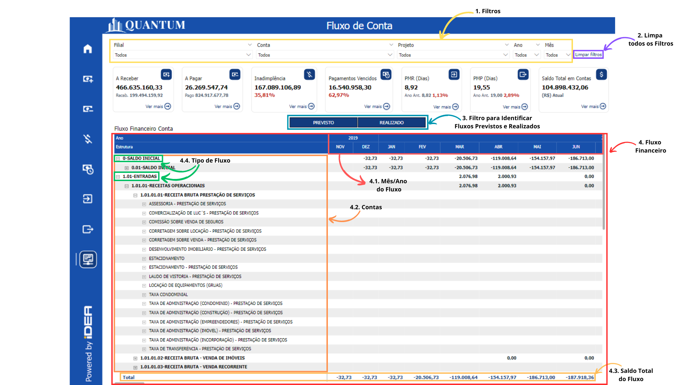

# Visão Saldo de Contas

<h6 align="center">Imagem 1: Visão Saldo de Contas</h6>

Saldo de Contas refere-se ao valor disponível em uma conta financeira em um determinado momento, que pode incluir saldos positivos (créditos) ou negativos (débito). O gerenciamento eficiente dos saldos de contas é crucial para garantir que a empresa tenha recursos suficientes para cumprir suas obrigações financeiras e investir em oportunidades de crescimento.

Manter um saldo de contas adequado é fundamental para a saúde financeira de uma empresa, pois permite que ela pague suas obrigações a tempo, evitando atrasos e multas, e também para aproveitar oportunidades de investimento que possam surgir. Um saldo inadequado pode levar à necessidade de buscar financiamento externo, o que aumenta os custos com juros e pode impactar negativamente a lucratividade da empresa.

Um gerenciamento eficiente do saldo de contas oferece uma série de benefícios, como a melhoria no fluxo de caixa, maior controle sobre as finanças e a capacidade de tomar decisões estratégicas de investimento com mais segurança. Além disso, a manutenção de saldos adequados contribui para a credibilidade da empresa no mercado e melhora o relacionamento com fornecedores e parceiros comerciais.

A visualização adequada do saldo de contas é vital para garantir que a empresa tenha recursos suficientes para suas operações diárias, investimentos e crescimento futuro. Sem uma visualização clara e atualizada, a empresa pode enfrentar dificuldades para monitorar a liquidez, o que pode resultar em problemas para pagar despesas correntes. Isso pode forçar a empresa a contrair dívidas em condições desfavoráveis, comprometendo a estabilidade financeira e a capacidade de tomada de decisões informadas.

A fórmula para calcular o Saldo de Contas é:

**_Saldo de Contas = Créditos - Débitos_**

**Onde:**
- **Créditos:** Soma de todos os valores que entraram na conta (recebimentos, depósitos, etc.).
- **Débitos:** Soma de todos os valores que saíram da conta (pagamentos, retiradas, etc.).

**Exemplo:**
Se uma empresa recebeu R$ 200.000,00 em um mês e pagou R$ 150.000,00 em suas obrigações, o saldo de contas seria calculado assim:

**_Saldo de Contas = 200.000 - 150.000 = R$ 50.000,00_**

Isso significa que, ao final do mês, a empresa teria um saldo positivo de R$ 50.000,00.

<h6 align="center">Imagem 2: Visão Saldo de Contas</h6>

## **Estrutura da Tabela:**
1 - Contas Principais e Subcontas:

- As contas estão organizadas hierarquicamente, com as contas principais em negrito e suas subcontas listadas abaixo.
- Por exemplo, "( - ) CAPITAL A INTEGRALIZAR DE DOMICILIADOS E RESIDENTES NO PAÍS" é uma conta principal, e abaixo dela estão listadas várias subcontas, como "CAIXA GERAL", "CG02 ITA CC 3893/49408-2 - RECURSOS", etc.

2 - Saldo Realizado:

- O saldo realizado é o valor efetivamente registrado ou movimentado em cada uma dessas contas.
- Valores positivos indicam saldo disponível ou crédito, enquanto valores negativos (precedidos por um sinal de menos) indicam débito ou saída de recursos.

## **Análise das Principais Categorias:**
1 - ( - ) CAPITAL A INTEGRALIZAR DE DOMICILIADOS E RESIDENTES NO PAÍS:
- Saldo Realizado Total: R$ 16.490,79
- Subcontas: Incluem "CAIXA GERAL" com R$ 2.649,79, e várias contas do Itaú com saldos menores, totalizando o valor principal.

2 - ( - ) DEVOLUÇÃO MATERIAL USO CONSUMO (OBRAS):
- Saldo Realizado: R$ 3.577,95
- Apenas uma subconta listada: "TFZ SAN CC 1921/13000335-8".

3 - ( - ) DISTRIBUIÇÃO DE LUCROS/DIVIDENDOS AOS SÓCIOS:
- Saldo Realizado Total: -R$ 14.567.141,97
- Subcontas: Incluem "ALG ITA CC 3893/35528-3" com -R$ 50.100,00, e várias outras contas com saldos negativos, indicando a saída de recursos para a distribuição de lucros.

4 - ( - ) ISS:
- Saldo Realizado: -R$ 1,50
- Uma única subconta listada: "GLI ITA CC 3893/41150-8 EMPRESA".

5 - ( - ) REPASSE AOS PROPRIETÁRIOS (ALUGUEIS):
- **Saldo Realizado:** R$ 0,12
- Este é um valor muito pequeno e positivo, indicando talvez uma pequena transação de repasse.

## Total Geral:
- Saldo Total: R$ 102.011.364,06
- Esse valor representa a soma dos saldos realizados em todas as contas listadas na tabela, indicando o total de recursos ou movimentações registradas.
