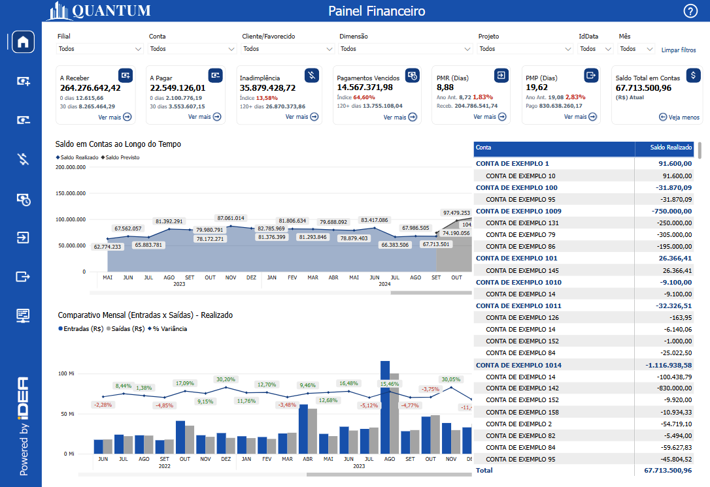

# Visão Saldo Total em Contas

  
  <h6>Imagem 1: Pagína com Saldo Total em Contas</h6>

## Informações no Painel Pagamentos Vencidos

### Saldo Realizado

Saldo Total em Contas refere-se ao valor disponível em uma conta financeira em um determinado momento, que pode incluir saldos positivos (créditos) ou negativos (débito). O gerenciamento eficiente dos saldos de contas é crucial para garantir que a empresa tenha recursos suficientes para cumprir suas obrigações financeiras e investir em oportunidades de crescimento.

Manter um saldo de contas adequado é fundamental para a saúde financeira de uma empresa, pois permite que ela pague suas obrigações a tempo, evitando atrasos e multas, e também para aproveitar oportunidades de investimento que possam surgir. Um saldo inadequado pode levar à necessidade de buscar financiamento externo, o que aumenta os custos com juros e pode impactar negativamente a lucratividade da empresa.

Um gerenciamento eficiente do saldo de contas oferece uma série de benefícios, como a melhoria no fluxo de caixa, maior controle sobre as finanças e a capacidade de tomar decisões estratégicas de investimento com mais segurança. Além disso, a manutenção de saldos adequados contribui para a credibilidade da empresa no mercado e melhora o relacionamento com fornecedores e parceiros comerciais.

A visualização adequada do saldo de contas é vital para garantir que a empresa tenha recursos suficientes para suas operações diárias, investimentos e crescimento futuro. Sem uma visualização clara e atualizada, a empresa pode enfrentar dificuldades para monitorar a liquidez, o que pode resultar em problemas para pagar despesas correntes. Isso pode forçar a empresa a contrair dívidas em condições desfavoráveis, comprometendo a estabilidade financeira e a capacidade de tomada de decisões informadas.

## Visão Principal

### Tabela de Saldo Total em Contas

  
  <h6>Imagem 2: Visão Saldo Total em Contas</h6>

A tabela de saldo de conta, acessível pelo botão [Ver mais](https://idea-technology-it.github.io/docs-idea/financeiro/indicadores_caixas/#botao-ver-mais-e-veja-menos) em cada painel, é um componente crucial para o gerenciamento abrangente do fluxo de caixa. Esta tabela fornece uma visão detalhada dos saldos de conta para todas as contas listadas no plano de conta, incluindo todas as contas financeiras dentro deste plano. Ela serve como um repositório centralizado de informações financeiras, exibindo saldos em várias contas e categorias financeiras.

Esta tabela é importante para o gerenciamento do fluxo de caixa por muitos motivos;

**Visão geral financeira abrangente:** Esta tabela oferece um instantâneo completo do status financeiro atual exibindo os saldos de todas as contas dentro do plano de conta. Ao agregar dados de cada conta financeira, ela permite que você monitore a saúde financeira geral da organização. Esta visão abrangente é essencial para entender como os fundos disponíveis são distribuídos entre diferentes contas e como eles se alinham com estratégias e metas financeiras.

**Controle financeiro aprimorado:** Com saldos de conta detalhados prontamente acessíveis, você obtém melhor controle sobre suas finanças. Esta visibilidade permite que você acompanhe o desempenho de cada conta, identifique discrepâncias ou problemas e tome decisões informadas. A revisão regular desses saldos ajuda a gerenciar o fluxo de caixa de forma mais eficaz, garantindo que fundos suficientes estejam disponíveis para necessidades operacionais, investimentos e outros compromissos financeiros.

**Melhoria no orçamento e na previsão:** ter uma análise detalhada dos saldos das contas oferece suporte a orçamentos e previsões mais precisos. Ao analisar dados históricos e saldos atuais, você pode fazer previsões mais precisas sobre fluxos de caixa futuros e ajustar os orçamentos adequadamente. Essa abordagem proativa ajuda no planejamento de despesas antecipadas, mitigando riscos financeiros e otimizando a alocação de recursos.

**Facilitação de decisões financeiras estratégicas:** a capacidade de acessar e analisar saldos de contas detalhados auxilia na tomada de decisões financeiras estratégicas. Por exemplo, se certas contas apresentarem saldos excedentes, você pode decidir alocar esses fundos para oportunidades de crescimento ou redução de dívidas. Por outro lado, se outras contas apresentarem déficits, você pode tomar ações corretivas, como ajustar gastos ou buscar financiamento adicional.

**Monitoramento eficaz do fluxo de caixa:** a tabela oferece suporte ao monitoramento eficaz do fluxo de caixa, fornecendo uma visão em tempo real ou quase em tempo real dos saldos das contas. Isso ajuda a rastrear entradas e saídas de caixa, garantindo que a liquidez seja gerenciada adequadamente. Ao entender como diferentes contas contribuem para o fluxo de caixa geral, você pode gerenciar melhor as operações financeiras do dia a dia e responder rapidamente a quaisquer problemas de fluxo de caixa.

**Transparência e responsabilidade:** relatórios detalhados de saldo de conta aumentam a transparência e a responsabilidade dentro da organização. Eles permitem que as partes interessadas vejam onde os fundos são alocados e como estão sendo utilizados, o que é crucial para auditorias internas e revisões financeiras. Essa transparência promove a confiança e garante que as práticas financeiras estejam alinhadas com as políticas e regulamentações organizacionais.

Ao aproveitar esta tabela, você pode obter insights valiosos sobre o status financeiro da sua organização, levando a uma tomada de decisão mais informada e ao gerenciamento eficaz do fluxo de caixa.
