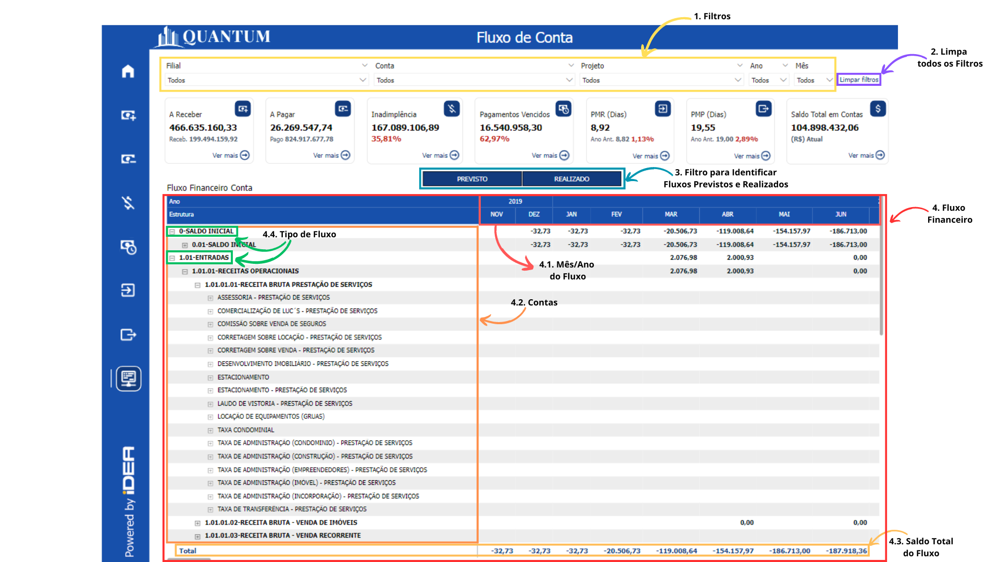

# Saldo de Contas

## O que é Saldo de Contas?

O saldo de contas refere-se ao valor financeiro disponível em uma conta ou conjunto de contas em um determinado momento. Este valor é calculado com base nas entradas (depósitos, receitas) e saídas (pagamentos, despesas) durante um período específico, ajustado pelo saldo inicial. O saldo de contas é um indicador crucial da liquidez e da capacidade financeira da empresa para cumprir suas obrigações.

## Impactos da Falta da Visualização de um Saldo de Contas

A visualização adequada do saldo de contas é vital para garantir que a empresa tenha recursos suficientes para suas operações diárias, investimentos e crescimento futuro. Sem uma visualização clara e atualizada, a empresa pode enfrentar dificuldades para monitorar a liquidez, o que pode resultar em problemas para pagar despesas correntes. Isso pode forçar a empresa a contrair dívidas em condições desfavoráveis, comprometendo a estabilidade financeira e a capacidade de tomada de decisões informadas.

## Objetivo do Relatório de Saldo de Contas
Para proporcionar uma visão clara e detalhada do saldo de contas, a IDEA TECHNOLOGY desenvolveu um relatório utilizando o Power BI. Este relatório foi projetado para monitorar o saldo das contas em tempo real, permitindo que os gestores avaliem a saúde financeira da empresa e tomem decisões informadas sobre alocação de recursos.

### Benefícios 

- **Tomada de Decisões Informadas:** Permite que os gestores avaliem rapidamente a posição de liquidez da empresa e ajustem as estratégias financeiras conforme necessário.
- **Monitoramento Contínuo:** Oferece uma visão contínua e atualizada dos saldos das contas, permitindo ações rápidas em caso de desequilíbrios.
- **Personalização de Análises:** Oferece a flexibilidade de aplicar filtros para identificar e analisar quais contas, filiais ou projetos estão alocando ou consumindo recursos. Além disso, permite a análise detalhada dos saldos ao longo de períodos específicos, adaptando-se perfeitamente às diversas necessidades e níveis de gestão dentro da organização.

<h6 align = "center"> Imagem 1: Descrição visual de cada indicador.</h6>

## Principais Perguntas que o Relatório Responde
- **Como posso filtrar as informações para visualizar o saldo de contas por ano, mês, filial, conta ou projeto específico?**
    - **Seção 1:** Filtros.
        - **Resposta:** O relatório permite aplicar filtros por ano, mês, filial, conta ou projeto, facilitando a análise de saldos financeiros em segmentos específicos ou períodos selecionados.
- **Como limpar todos os filtros aplicados para retornar à visão geral dos dados?**
    - **Seção 2:** Limpar Filtros.
        - **Resposta:** Um botão de "Limpar filtros" permite remover todos os filtros aplicados, voltando à visualização completa dos dados financeiros.
- **Como posso visualizar mais detalhadamente o saldo total em contas?**
    - **Seção 3:** Expande a Tabela de Saldo de Contas.
        - **Resposta:** O relatório permite expandir a tabela de saldo de contas para mostrar uma visão mais detalhada dos valores, incluindo as contas individuais e seus saldos.
- **Qual é o detalhamento do saldo total nas contas?**
    - **Seção 3.1:** Detalhamento Saldo Total em Contas.
        - **Resposta:** O relatório detalha o saldo total das contas, mostrando como cada grupo de contas contribui para o valor agregado.
- **Quais são os grupos de contas e como eles estão distribuídos?**
    - **Seção 3.2:** Grupo de Contas.
        - **Resposta:** O relatório agrupa as contas por categorias, permitindo uma análise estruturada dos saldos financeiros por diferentes tipos de contas.
- **Quais contas específicas estão contribuindo para o saldo atual?**
    - **Seção 3.3:** Contas.
        - **Resposta:** O relatório lista as contas específicas, detalhando quais têm os maiores ou menores saldos e como cada uma está contribuindo para o saldo total da empresa.
- **Qual é o saldo atual de cada conta listada?**
    - **Seção 3.4:** Saldo das Contas.
        - **Resposta:** A tabela exibe o saldo de cada conta individualmente, ajudando a entender a distribuição de recursos entre diferentes contas.
- **Qual é o saldo total de todas as contas?**
    - **Seção 3.5:** Saldo Total das Contas.
        - **Resposta:** O relatório fornece o saldo total acumulado de todas as contas, indicando o montante global disponível ou em débito.

## Importância do Monitoramento Regular do Saldo de Contas

### Monitoramento Contínuo

Monitorar regularmente o saldo de contas utilizando relatórios como este no Power BI é crucial para garantir a visibilidade financeira da empresa e mitigar riscos potenciais. O uso eficiente desses relatórios permite identificar e resolver discrepâncias de saldos antes que se tornem problemas maiores, assegurando assim a estabilidade e a precisão das finanças da empresa.
