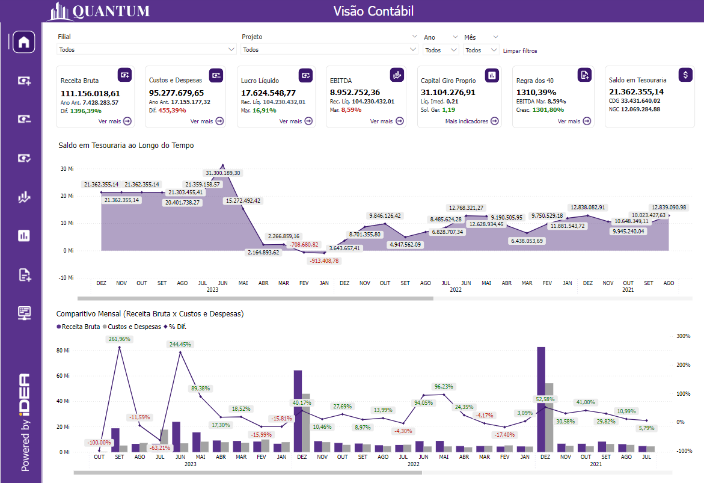
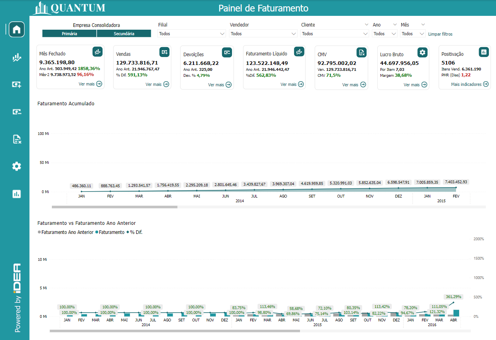

# Idea Finance

**O pacote Finance -> Três relatórios imediatos para suas necessidades financeiras**

Por 15 anos, a Idea Technology vem se especializando em extrair Inteligência de Negócio a partir de dados. Trabalhando em soluções coorporativas que auxiliam no controle e entrega estratégica de informação, permitindo tomadas de decisões ágeis e orientadas a dados confiáveis. Como um parceiro Microsoft, utilizamos o Power BI para tornar esses relatóros possíveis, trazendo muita interatividade e qualidade de informação.

Desenvolvemos então uma suíte de relatórios financeiro que trazem entendimento e fácil acesso aos dados do SAP Business One, nesta suíte estão incluídos:

- Relatório de Contabilidade
  - Receita, despesas, Indicadores Financeiros
- Fluxo de Caixa
  - Balancetes, Movimentações, Transações pendentes
- Contas
  - Contas Anuais e Mensais, Comparações, áreas empresariais

  

    
  

  

    
  

  

    
  

 

  
  
  

