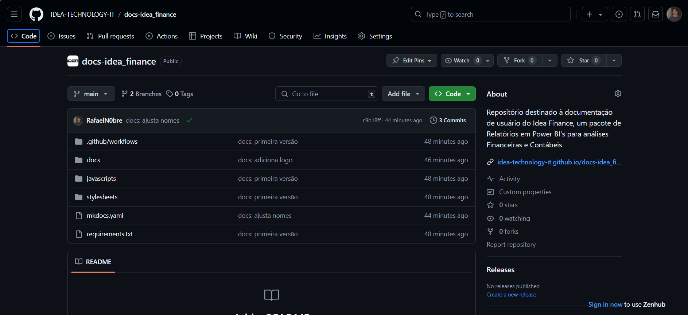
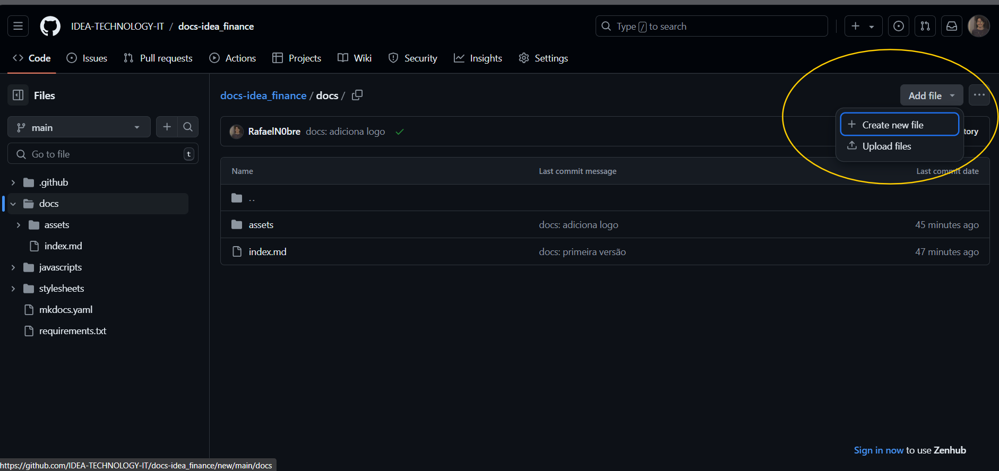
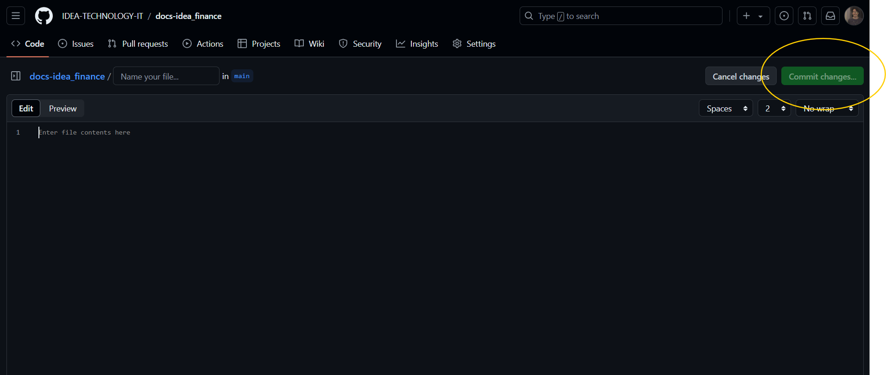
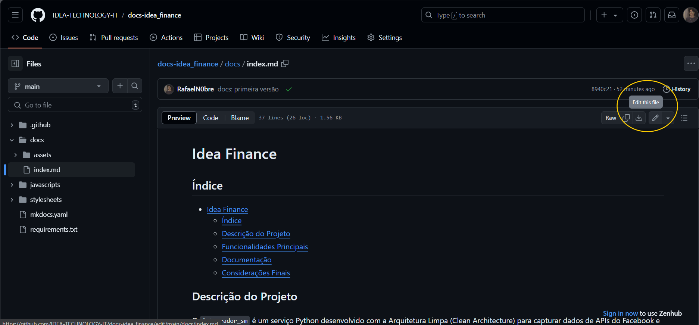

# Guia de Contribuição para documentação do git

Esse serviço está usando o mkdocs, que é um framework para criação de sites a partir de Markdown.

Para mais detalhes sobre o markdown, acesse o [Guia De Markdown](./guia_markdown.md)

## Contribuindo pela interface do Github

Acesse o endereço deste repositório no github -> [LINK](https://github.com/IDEA-TECHNOLOGY-IT/docs-idea_finance), caso não tenha acesso, solicite para o membro mais próximo da sua equipe. Você deve visualizar uma página parecida com esta:



A documentação está na pasta `docs`.

### Criar arquivo

Para criar um novo arquivo, clique na pasta onde deseja criar o arquivo e clique em `Add file` ou `Criar arquivo`:



Escolha a opção de Criar arquivo ou fazer upload.

Adicione um nome para o arquivo e depois clique no botão `Commit Changes` no canto superior direito. Você também pode ter um preview de seu código markdown clicando em Preview.



### Editar arquivo

Para editar um arquivo já existente, clique no botão editar para acessar a edição:



### Desvantagens
- Não é possível a adição de imagens utilizando essa interface. Para maior controle do código, siga o [Guia de Contribuição pelo git](#contribuind-pelo-git)
- A saída do preview é a renderização do markdown, não necessariamente da saída do mkdocs, que adiciona diversas features

### Vantagens
- Mais simplicidade, não sendo necessário utilizar o git
- Recomendado para alterações pontuais no texto, correções rápidas

## Contribuindo pelo git

Primeiramente clone o repositório na sua máquina local, garanta que tenha o [git](https://git-scm.com/downloads) instalado

```sh
git clone https://github.com/IDEA-TECHNOLOGY-IT/docs-idea_finance.git
```

Abra o repositório com a sua IDE de preferência e edite o código em markdown. Algumas IDE's possuem extensões para previews.

Para rodar uma versão local do mkdocs, é necessário ter o [Python](https://www.python.org/downloads/) instalado. Acesse o repositório pelo terminal e instale as dependências com o comando:

```sh
pip install -r requirements.txt
```

Para servir a documentação localmente, rode o comando no terminal:

```sh
mkdocs serve
```

O serviço estará disponível na porta 8000 do seu localhost, acesse e edite o documento para feedback em tempo real

### Commitando suas alterações

Sempre que iniciar qualquer trabalho no git, realize um git pull para atualizar o seu repositório:

```sh
git pull origin main
```

Para mandar suas alterações para o git, execute os seguintes comandos no terminal

```sh
git add .
```

```sh
git commit -m 'mensagem do que seu commit está inserindo'
```

```sh
git push origin main
```
