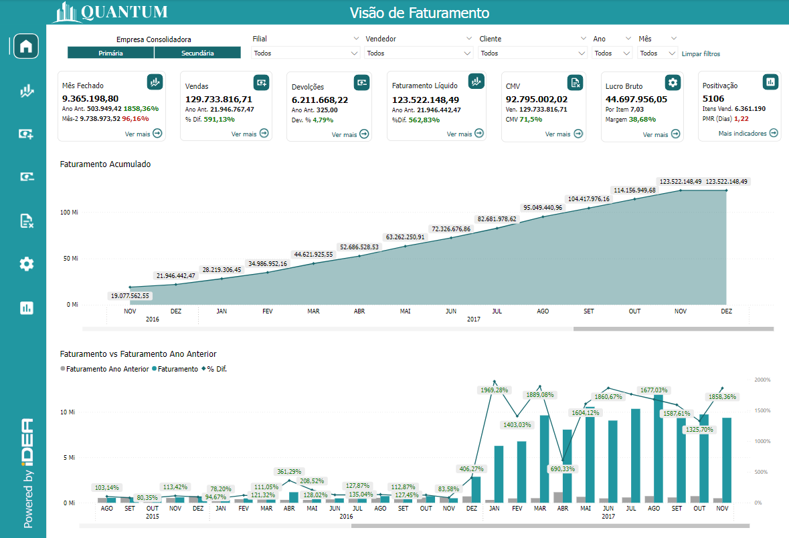
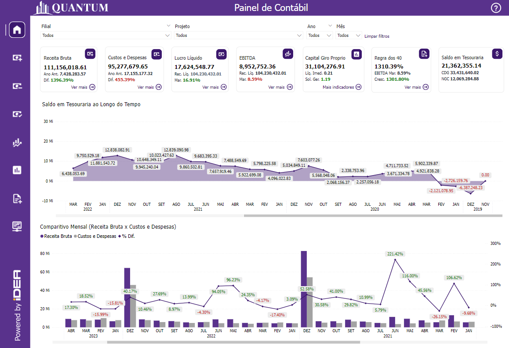

# Introdução

Bem-vindo à seção de demonstração do Idea Analytics! Aqui você terá a oportunidade de explorar e testar nossas soluções de Business Intelligence (BI). Utilize os recursos interativos disponíveis para experimentar como cada solução pode ajudar a sua empresa a tomar decisões baseadas em dados.

À esquerda, você encontrará um menu que permite navegar para cada solução analítica. 

Para começar, clique em um dos links abaixo para acessar a demonstração de cada área:

  
  

    <strong><a href="https://idea-technology-it.github.io/docs-idea/faturamento/demo/" target="_blank">Idea Sales</a></strong> (BI de Vendas): Experimente como nossa solução analítica pode fornecer uma visão detalhada sobre o desempenho de vendas, análise de receita por produto, desempenho de vendedores, devoluções e muito mais. Use esta demonstração para identificar oportunidades de crescimento e ajustar suas estratégias de vendas.
  

  
  

    <strong><a href="https://idea-technology-it.github.io/docs-idea/financeiro/demo/" target="_blank">Idea Finance</a></strong> (BI Financeiro): Explore a demonstração que apresenta métricas e relatórios detalhados sobre o fluxo de caixa, inadimplência, gestão de despesas e receitas, análise de lucratividade e outros indicadores financeiros importantes. Teste como nossa solução pode ajudar a monitorar a saúde financeira da empresa e tomar decisões informadas.
  

  
  

    <strong><a href="https://idea-technology-it.github.io/docs-idea/contabilidade/demo/" target="_blank">Idea Accounting</a></strong> (BI Contábil): Descubra a funcionalidade focada em processos contábeis, como receita bruta, custos e despesas, liquidez, giro e solvência. Utilize esta demonstração para acompanhar as operações financeiras e garantir a conformidade com as normas e boas práticas contábeis.
  

